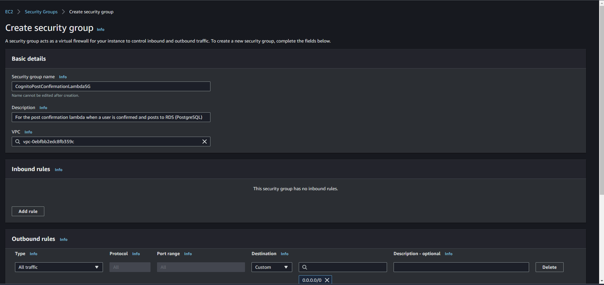
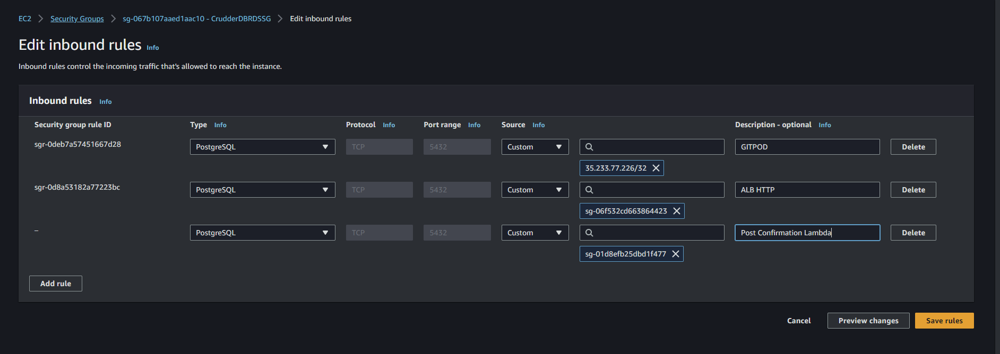
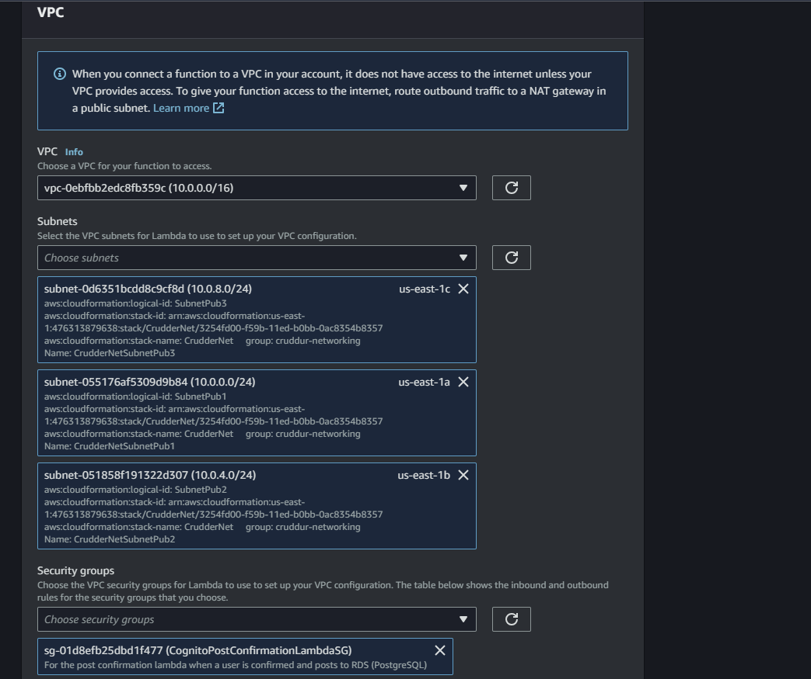

# Snyc tool for static website hosting

**Resource video**: [Wee X Sync tool for static website hosting](https://www.youtube.com/watch?v=0nDBqZGu4rI&list=PLBfufR7vyJJ7k25byhRXJldB5AiwgNnWv&index=115)

Follow the instructions [here](https://github.com/teacherseat/aws-s3-website-sync) on how to install the **AWS S3 Website Sync** tool and use it to sync the directory for static webhosting with **AWS S3**

## Create Gemfile and install
Create a `Gemfile` that installs the gem:

```rb
source 'https://rubygems.org'

git_source(:github) do |repo_name|
  repo_name = "#{repo_name}/#{repo_name}" unless repo_name.include?("/")
  "https://github.com/#{repo_name}.git"
end

gem 'rake'
gem 'aws_s3_website_sync', tag: '1.0.1'
gem 'dotenv', groups: [:development, :test]
```

The proceed to install the required gems:

```sh
bundle install
```


Remember to have the following environment variables set

```
AWS_ACCESS_KEY_ID
AWS_SECRET_ACCESS_KEY
AWS_DEFAULT_REGION
SYNC_S3_BUCKET
SYNC_CLOUDFRONT_DISTRUBTION_ID
SYNC_BUILD_DIR
SYNC_OUTPUT_CHANGESET_PATH
SYNC_AUTO_APPROVE
```

For this project, we can generate the `SYNC` environment variables with the command

```sh
ruby "$THEIA_WORKSPACE_ROOT/bin/frontend/generate-env"
```

Now run static build and sync to AWS S3 and follow the prompts to complete the sync.

```sh
./bin/frontend/static-build
```

```sh
./bin/frontend/sync
```

## Create GithubOidc Identity Provider and Cruddur Sync Role

See cloudformation template [here](../aws/cfn/sync/template.yaml)

To create provider and role, run the deploy script as below

```sh
./bin/cfn/sync-deploy
```

## Reconnect Database and Post Confirmation Lambda

Get the new `Security GroupID` for the PostgreSQL RDS Ssecurity group and the new `Database Security Rule ID` created for access to the database from GitPod

```sh
export DB_SG_ID=sg-067b107aaed1aac10
export DB_SG_RULE_ID=sgr-0deb7a57451667d28
```

Then update the database security group ID to allow connection from `GITPOD`

```sh
export GITPOD_IP=$(curl ifconfig.me)
gp env GITPOD_IP="${GITPOD_IP}"
source  "$THEIA_WORKSPACE_ROOT/bin/rds/update-sg-rule" GITPOD
```

Re-connecto to the production database to confirm that the connection works well

```sh
./bin/db/connect prod
```

Re-load the production database schema and perform a simple database migration to add the `bio` column to the `users` table.

```sh
./bin/db/schema-load prod
DATABASE_URL=$PROD_CONNECTION_URL ./bin/db/migrate
./bin/db/connect prod
```

**Sample Output**

```
gitpod /workspace/aws-bootcamp-cruddur-2023 (week-x) $ ./bin/db/connect prod
Running in production mode
psql (13.11 (Ubuntu 13.11-1.pgdg22.04+1), server 15.2)
WARNING: psql major version 13, server major version 15.
         Some psql features might not work.
SSL connection (protocol: TLSv1.2, cipher: ECDHE-RSA-AES256-GCM-SHA384, bits: 256, compression: off)
Type "help" for help.

cruddur=> \dt
                  List of relations
 Schema |        Name        | Type  |     Owner      
--------+--------------------+-------+----------------
 public | activities         | table | cmdcruddurroot
 public | schema_information | table | cmdcruddurroot
 public | users              | table | cmdcruddurroot
(3 rows)
```

```
cruddur=> \d users;
                                   Table "public.users"
     Column      |            Type             | Collation | Nullable |      Default       
-----------------+-----------------------------+-----------+----------+--------------------
 uuid            | uuid                        |           | not null | uuid_generate_v4()
 display_name    | text                        |           | not null | 
 handle          | text                        |           | not null | 
 email           | text                        |           | not null | 
 cognito_user_id | text                        |           | not null | 
 created_at      | timestamp without time zone |           | not null | CURRENT_TIMESTAMP
 bio             | text                        |           |          | 
Indexes:
    "users_pkey" PRIMARY KEY, btree (uuid)

cruddur=> 
```

> **TODO**: Automate the above process with code deploy


Added Custom error responses in the [frontend template](../aws/cfn/frontend/template.yaml) to enable successful redirection

```yaml
CustomErrorResponses:
  - ErrorCode: 403
    ResponseCode: 200
    ResponsePagePath: /index.html
```

Re-deploy the frontend cloudformation stack

```sh
./bin/cfn/frontend-deploy
```

Reset the `Post-Confirmation` lambda function configuration to point to the new `VPC` created via `Cloudformation` and connectiing to the public subnets. Also create new security group for the lambda function



Also edit the `inbound rules` of the security group for the `PostgreSQL RDS` database to allow inbound connection from the `post-confirmation lambda` to write data to the PostgreSQL database.





Also reset the `PROD_CONNECTION_URL` environment variable form the `Post-Confirmation` lambda function.

Reset the users in `AWS Cognito User Pool` and register them and confirming their emails to confirm that `Post Confirmation Lambda` is working.

Perform a `CRUD` action to confirm that the database connection is working as it's supposed to.

