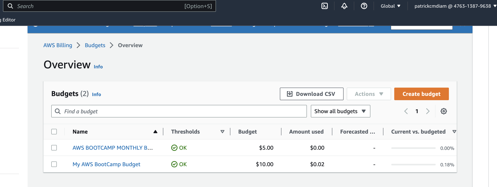

# Week 0 — Billing and Architecture

## Required Homework/Tasks
### Getting the AWS CLI Working

After activating my AWS free tier account, I proceeded to make AWS CLI working both on my local machine environment and the gitpod environment following the steps below.

#### Install AWS CLI

- I set to install the AWS CLI when my Gitpod enviroment lanuches.
- I Set AWS CLI to use partial autoprompt mode to make it easier to debug CLI commands.
- The bash commands I used are the same as the [AWS CLI Install Instructions](https://docs.aws.amazon.com/cli/latest/userguide/getting-started-install.html)

I updated my `.gitpod.yml` to include the following task.

```
tasks:
  - name: aws-cli
    env:
      AWS_CLI_AUTO_PROMPT: on-partial
    init: |
      cd /workspace
      curl "https://awscli.amazonaws.com/awscli-exe-linux-x86_64.zip" -o "awscliv2.zip"
      unzip awscliv2.zip
      sudo ./aws/install
      cd $THEIA_WORKSPACE_ROOT
```

Also I ran the commands indivually to perform the install manually

```sh
cd /workspace
curl "https://awscli.amazonaws.com/awscli-exe-linux-x86_64.zip" -o "awscliv2.zip"
unzip awscliv2.zip
sudo ./aws/install
cd $THEIA_WORKSPACE_ROOT
```

### Create a new User and Generate AWS Credentials

- Go to  (IAM Users Console](https://us-east-1.console.aws.amazon.com/iamv2/home?region=us-east-1#/users) and created a new user
- I enabled console access for the user
- I created a new Admin Group and apply AdministratorAccess
- I created the user and go find and click into the user
- Click on Security Credentials and Create Access Key
- Choose AWS CLI Access
- Download the CSV with the credentials

#### Set Env Vars
I set these credentials for the current bash terminal

```sh
export AWS_ACCESS_KEY_ID="<YOUR_AWS_ACCESS_KEY_ID>"
export AWS_SECRET_ACCESS_KEY="<YOUR_AWS_SECRET_ACCESS_KEY>"
export AWS_DEFAULT_REGION="<YOUR_AWS_DEFAULT_REGION>"
```

See example below

```sh
export AWS_ACCESS_KEY_ID="AKIAWXXXXXXXXXXX"
export AWS_SECRET_ACCESS_KEY="Rw7Ah1X5fXXXXXXXXXXXXXXXXXXXXXXXXXXX"
export AWS_DEFAULT_REGION="us-east-1"
```

You can tell Gitpod to remember these credentials if you relaunch your workspaces

```sh
gp env AWS_ACCESS_KEY_ID="<YOUR_AWS_ACCESS_KEY_ID>"
gp env AWS_SECRET_ACCESS_KEY="<YOUR_AWS_SECRET_ACCESS_KEY>"
gp env AWS_DEFAULT_REGION="<YOUR_AWS_DEFAULT_REGION"
```

See example below

```sh
gp env AWS_ACCESS_KEY_ID="AKIAWXXXXXXXXXXX"
gp env AWS_SECRET_ACCESS_KEY="Rw7Ah1X5fXXXXXXXXXXXXXXXXXXXXXXXXXXX"
gp env AWS_DEFAULT_REGION="us-east-1"
```

You can check that the AWS CLI is working and you are the expected user

```sh
aws sts get-caller-identity
```

You should see something like this:

```json
{
    "UserId": "AIDAW5ZUFARLXXXXXXXX",
    "Account": "47631387XXXXXXXX",
    "Arn": "arn:aws:iam::47631387XXXXXXXX:user/patrickcmdiam"
}
```

### Enable Billing

To turn on Billing Alerts to recieve alerts, I followed the steps below.

- In the Root Account go to the [Billing Page](https://console.aws.amazon.com/billing/)
- Under `Billing Preferences` Choose `Receive Billing Alerts`
- Save Preferences

### Creating a Billing Alarm
#### Create SNS Topic
- You need an SNS topic before you create an alarm.
- The SNS topic is what will deliver us an alert when we get overbilled
- See example at [aws sns create-topic](https://docs.aws.amazon.com/cli/latest/reference/sns/create-topic.html)

Create a SNS Topic

```sh
aws sns create-topic --name billing-alarm
```

And will return a TopicARN
```json
{
    "TopicArn": "arn:aws:sns:us-east-1:476313XXXXXX:billing-alarm"
}
```

Create a subscription supply the TopicARN and our Email

```sh
aws sns subscribe \
    --topic-arn="arn:aws:sns:us-east-1:476313XXXXXX:billing-alarm" \
    --protocol=email \
    --notification-endpoint=your@gmail.com
```

Check your email and confirm the subscription

#### Create Alarm
- See aws [cloudwatch put-metric-alarm](https://docs.aws.amazon.com/cli/latest/reference/cloudwatch/put-metric-alarm.html)
- Create an [Alarm via AWS CLI](https://aws.amazon.com/premiumsupport/knowledge-center/cloudwatch-estimatedcharges-alarm/)
- Create the configuration json script with the TopicARN you generated earlier. See example in [alarm_config.json](../aws/json/alarm_config.json)
- Use a json file because --metrics is is required for expressions and so its easier to us a JSON file.

```sh
aws cloudwatch put-metric-alarm --cli-input-json file://aws/json/alarm_config.json
```


### Create an AWS Budget

See [aws budgets create-budget](https://docs.aws.amazon.com/cli/latest/reference/budgets/create-budget.html) for reference

Get your AWS Account ID

```sh
aws sts get-caller-identity --query Account --output text
```

- Supply your AWS Account ID

Your can export it as an environment variable or persist in the gitpod environment

```sh
export AWS_ACCOUNT_ID=$(aws sts get-caller-identity --query Account --output text)
gp env AWS_ACCOUNT_ID=$AWS_ACCOUNT_ID
```

- Create the budjet json files. See folder [aws/json](../aws/json/)
- This is another case with AWS CLI its just much easier to json files due to lots of nested json

```sh
aws budgets create-budget \
    --account-id $AWS_ACCOUNT_ID \
    --budget file://aws/json/budget.json \
    --notifications-with-subscribers file://aws/json/budget-notifications-with-subscribers.json
```


Screen shoots of budgets I created in AWS, one of $5 using the AWS CLI and the other of $10 using the AWS console web UI. You can only have maximum of two budgets under the free-tier AWS account.




### Recreate Logical Architectural Deisgn


[Link to Cluddur Logical Diagram](https://lucid.app/lucidchart/f7f6549f-8782-4b2e-bd8d-7426db11ebf8/edit?viewport_loc=-1369%2C-823%2C1600%2C867%2C0_0&invitationId=inv_8ab1fb6d-5a3a-450a-9c22-470ffb3cb5c7)
