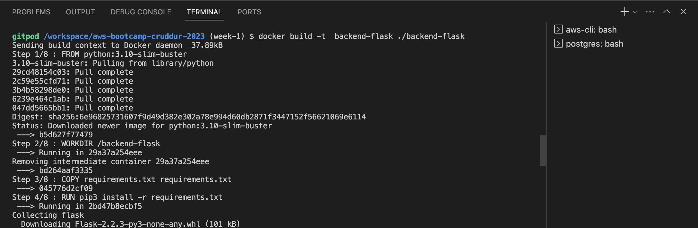
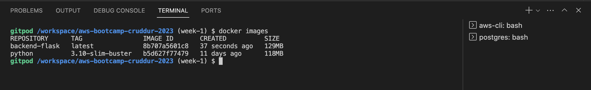
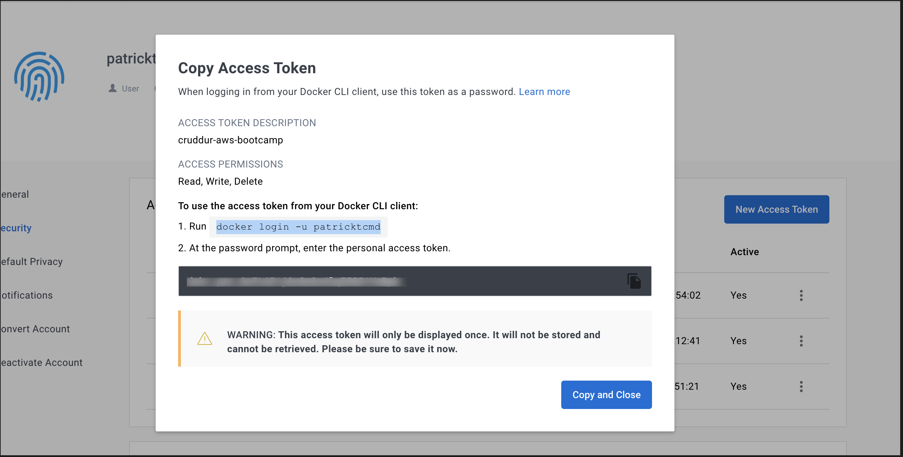
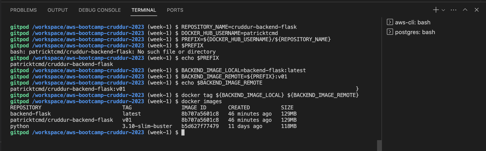

# Week 1 — App Containerization

## Push and tag a images to DockerHub
### Build backend container
```sh
docker build -t  backend-flask ./backend-flask
```





### Tag and push backend-flask image to remote repository on docker hub

- Create an account on [docker hub](https://hub.docker.com/) and generate an access token. Go to `account settings` and then `security`. I use this access token to login to docker hub via `CLI`.



Export your access token as an environment variable in gitpod
Remember to replace the `DOCKER_ACCESS_TOKEN` with your generated access token

```sh
export DOCKER_ACCESS_TOKEN="dckr_xxxxxxxxxxxxxxxxxxxxxxxxx_nRpk"
gp env DOCKER_ACCESS_TOKEN=$DOCKER_ACCESS_TOKEN
```

I use the commands below to tag the backend flask image to my remote docker hub registry and push

```sh
REPOSITORY_NAME=cruddur-backend-flask
DOCKER_HUB_USERNAME=patricktcmd
PREFIX=${DOCKER_HUB_USERNAME}/${REPOSITORY_NAME}

BACKEND_IMAGE_LOCAL=backend-flask:latest
BACKEND_IMAGE_REMOTE=${PREFIX}:v01
docker tag ${BACKEND_IMAGE_LOCAL} ${BACKEND_IMAGE_REMOTE}

echo $DOCKER_ACCESS_TOKEN | docker login -u patricktcmd --password-stdin

docker push ${BACKEND_IMAGE_REMOTE}
```




