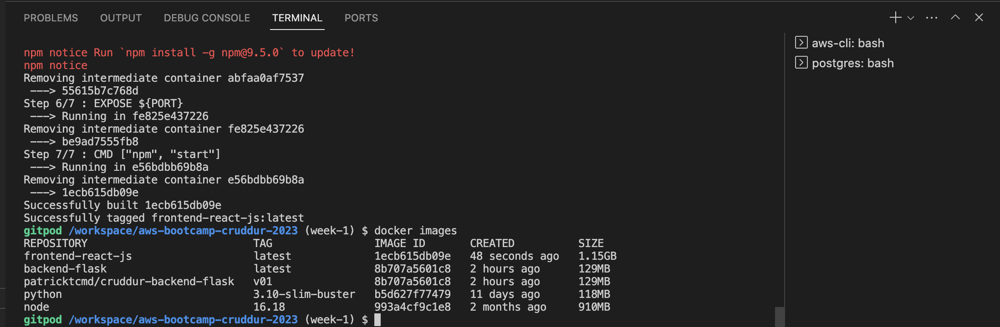
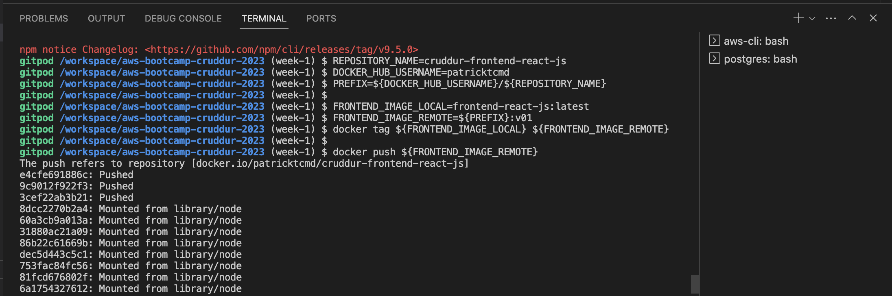
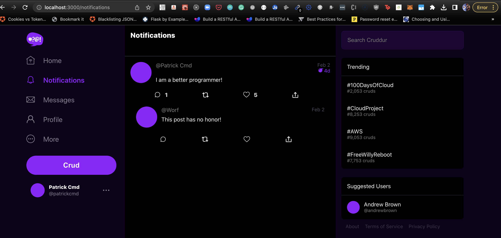
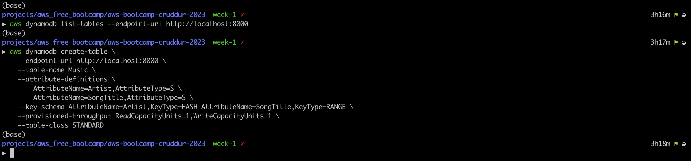

# Week 1 — App Containerization

## Homework Challenges

I used the [organizer's repo](https://github.com/omenking/aws-bootcamp-cruddur-2023/blob/week-1/journal/week1.md) as a refernce for my homework challenges.

## Push and tag a images to DockerHub
### Build backend container
```sh
docker build -t  backend-flask ./backend-flask
```


### Tag and push backend-flask image to remote repository on docker hub

- Create an account on [docker hub](https://hub.docker.com/) and generate an access token. Go to `account settings` and then `security`. I use this access token to login to docker hub via `CLI`.


Export your access token as an environment variable in gitpod
Remember to replace the `DOCKER_ACCESS_TOKEN` with your generated access token

```sh
export DOCKER_ACCESS_TOKEN="dckr_xxxxxxxxxxxxxxxxxxxxxxxxx_nRpk"
gp env DOCKER_ACCESS_TOKEN=$DOCKER_ACCESS_TOKEN
```

I use the commands below to tag the backend flask image to my remote docker hub registry and push

```sh
REPOSITORY_NAME=cruddur-backend-flask
DOCKER_HUB_USERNAME=patricktcmd
PREFIX=${DOCKER_HUB_USERNAME}/${REPOSITORY_NAME}

BACKEND_IMAGE_LOCAL=backend-flask:latest
BACKEND_IMAGE_REMOTE=${PREFIX}:v01
docker tag ${BACKEND_IMAGE_LOCAL} ${BACKEND_IMAGE_REMOTE}

echo $DOCKER_ACCESS_TOKEN | docker login -u patricktcmd --password-stdin

docker push ${BACKEND_IMAGE_REMOTE}
```


### Build frontend container
```sh
cd frontend-react-js
npm i
cd ../
docker build -t frontend-react-js ./frontend-react-js
```




### Tag and push frontend-react image to remote repository on docker hub
I use the commands below to tag the frontend react image to my remote docker hub registry and push. I don't do docker login via CLI since I did the same in the above steps

```sh
REPOSITORY_NAME=cruddur-frontend-react-js
DOCKER_HUB_USERNAME=patricktcmd
PREFIX=${DOCKER_HUB_USERNAME}/${REPOSITORY_NAME}

FRONTEND_IMAGE_LOCAL=frontend-react-js:latest
FRONTEND_IMAGE_REMOTE=${PREFIX}:v01
docker tag ${FRONTEND_IMAGE_LOCAL} ${FRONTEND_IMAGE_REMOTE}

docker push ${FRONTEND_IMAGE_REMOTE}
```




## Install Docker on your local machine and get the same containers running outside of Gitpod / Codespaces

I was able to have docker run on my local machine and run the image containers outside of Gitpod environment. I did change the URL environment variables `BACKEND_URL` and `FRONTEND_URL` to reflect the local urls

```
version: "3.8"
services:
  backend-flask:
    environment:
      FRONTEND_URL: "http://localhost:3000"
      BACKEND_URL: "http://localhost:4567
```

```
frontend-react-js:
    environment:
      REACT_APP_BACKEND_URL: "http://localhost:4567"
```

See full file [docker-compose.local.yml](../docker-compose.local.yml) at the root of project.

```sh
docker-compose -f docker-compose.local.yml up -d --build
docker-compose ps -a
```




I could also access the postgres database on my local machine

```sh
docker-compose exec db psql --username=postgres
```


I tested out dynamodb-local on my local machine and was working perfectly. See this [repo link for 00DaysOfCloud challenge-dynamodb-local](https://github.com/100DaysOfCloud/challenge-dynamodb-local) for the commands executed below in the screen shots




## Use multi-stage building for a Dockerfile build

I was able to test out multi-stage build for a backend flask application with minimal failures. See the [backend-flask/Dockerfile.prod](../backend-flask/Dockerfile.prod) and [docker-compose.prod.yml](../docker-compose.prod.yml). I created duplicates for both `Dockerfile` and `docker-compose.yml` for demostration purposes.

#### Resources used:
- [Dockerizing Flask with Postgres, Gunicorn, and Nginx on testdriven.io](https://testdriven.io/blog/dockerizing-flask-with-postgres-gunicorn-and-nginx/#production-dockerfile)
- [Docker multi-stage builds Testdriven.io](https://testdriven.io/tips/6ef63d0e-f3b6-41f3-8127-ca5f0a55c43f/)

```sh
docker build -f ./backend-flask/Dockerfile.prod -t backend-flask-prod ./backend-flask/
```


Run backend multistage build containers with `docker compose`

```sh
docker compose -f docker-compose.prod.yml up -d --build
```

Backend endpoint worked fine.


I did get a CORS on the frontend and at this moment I was still troubleshooting why the error.


Tag and pushed the `multi-stage build` as `backend-flask-prod` to  docker hub repository

```sh
REPOSITORY_NAME=cruddur-backend-flask-prod
DOCKER_HUB_USERNAME=patricktcmd
PREFIX=${DOCKER_HUB_USERNAME}/${REPOSITORY_NAME}

BACKEND_IMAGE_LOCAL=backend-flask-prod:latest
BACKEND_IMAGE_REMOTE=${PREFIX}:v01
docker tag ${BACKEND_IMAGE_LOCAL} ${BACKEND_IMAGE_REMOTE}

echo $DOCKER_ACCESS_TOKEN | docker login -u patricktcmd --password-stdin

docker push ${BACKEND_IMAGE_REMOTE}
```


## Implement a healthcheck in the V3 Docker compose file

### Health Check for postgres service

I did implement the healthcheck for the postgres service.
```
healthcheck:
  test: ["CMD", "pg_isready"]
  interval: 10s
  timeout: 5s
  retries: 3
```

The healthcheck section specifies a test command, interval, timeout, and number of retries. The db service uses `pg_isready` to check if the Postgres server is accepting connections.

Healthcheck for dynamodb-local
```
healthcheck:
  test: ["CMD-SHELL", "curl -f http://localhost:8000/shell/ || exit 1"]
  interval: 1s
  timeout: 10s
  retries: 3
```

- Here the test command uses `curl` to fetch the `/shell` endpoint from the DynamoDB Local service. This endpoint returns a bash shell that can be used to interact with the database. The `CMD-SHELL` instruction allows us to run a shell command in the container, which is used to execute the `curl` command.

- The `healthcheck` section can be customized to check for different endpoints or responses depending on the specifics of your DynamoDB Local setup. For example, you might check that a certain table or index exists, or that a specific query returns the expected results.

