# Week 1 — App Containerization

## Homework Challenges

I used the [organizer's repo](https://github.com/omenking/aws-bootcamp-cruddur-2023/blob/week-1/journal/week1.md) as a refernce for my homework challenges.

## Push and tag a images to DockerHub
### Build backend container
```sh
docker build -t  backend-flask ./backend-flask
```


### Tag and push backend-flask image to remote repository on docker hub

- Create an account on [docker hub](https://hub.docker.com/) and generate an access token. Go to `account settings` and then `security`. I use this access token to login to docker hub via `CLI`.


Export your access token as an environment variable in gitpod
Remember to replace the `DOCKER_ACCESS_TOKEN` with your generated access token

```sh
export DOCKER_ACCESS_TOKEN="dckr_xxxxxxxxxxxxxxxxxxxxxxxxx_nRpk"
gp env DOCKER_ACCESS_TOKEN=$DOCKER_ACCESS_TOKEN
```

I use the commands below to tag the backend flask image to my remote docker hub registry and push

```sh
REPOSITORY_NAME=cruddur-backend-flask
DOCKER_HUB_USERNAME=patricktcmd
PREFIX=${DOCKER_HUB_USERNAME}/${REPOSITORY_NAME}

BACKEND_IMAGE_LOCAL=backend-flask:latest
BACKEND_IMAGE_REMOTE=${PREFIX}:v01
docker tag ${BACKEND_IMAGE_LOCAL} ${BACKEND_IMAGE_REMOTE}

echo $DOCKER_ACCESS_TOKEN | docker login -u patricktcmd --password-stdin

docker push ${BACKEND_IMAGE_REMOTE}
```


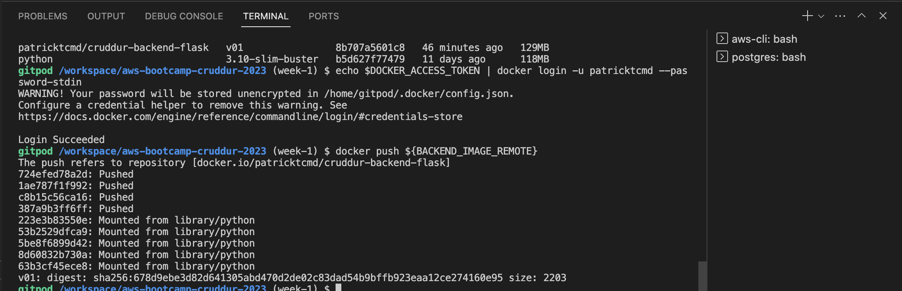


### Build frontend container
```sh
cd frontend-react-js
npm i
cd ../
docker build -t frontend-react-js ./frontend-react-js
```


### Tag and push frontend-react image to remote repository on docker hub
I use the commands below to tag the frontend react image to my remote docker hub registry and push. I don't do docker login via CLI since I did the same in the above steps

```sh
REPOSITORY_NAME=cruddur-frontend-react-js
DOCKER_HUB_USERNAME=patricktcmd
PREFIX=${DOCKER_HUB_USERNAME}/${REPOSITORY_NAME}

FRONTEND_IMAGE_LOCAL=frontend-react-js:latest
FRONTEND_IMAGE_REMOTE=${PREFIX}:v01
docker tag ${FRONTEND_IMAGE_LOCAL} ${FRONTEND_IMAGE_REMOTE}

docker push ${FRONTEND_IMAGE_REMOTE}
```


## Install Docker on your local machine and get the same containers running outside of Gitpod / Codespaces

I was able to have docker run on my local machine and run the image containers outside of Gitpod environment. I did change the URL environment variables `BACKEND_URL` and `FRONTEND_URL` to reflect the local urls

```
version: "3.8"
services:
  backend-flask:
    environment:
      FRONTEND_URL: "http://localhost:3000"
      BACKEND_URL: "http://localhost:4567
```

```
frontend-react-js:
    environment:
      REACT_APP_BACKEND_URL: "http://localhost:4567"
```

See full file [docker-compose.local.yml](../docker-compose.local.yml) at the root of project.

```sh
docker-compose -f docker-compose.local.yml up -d --build
docker-compose ps -a
```

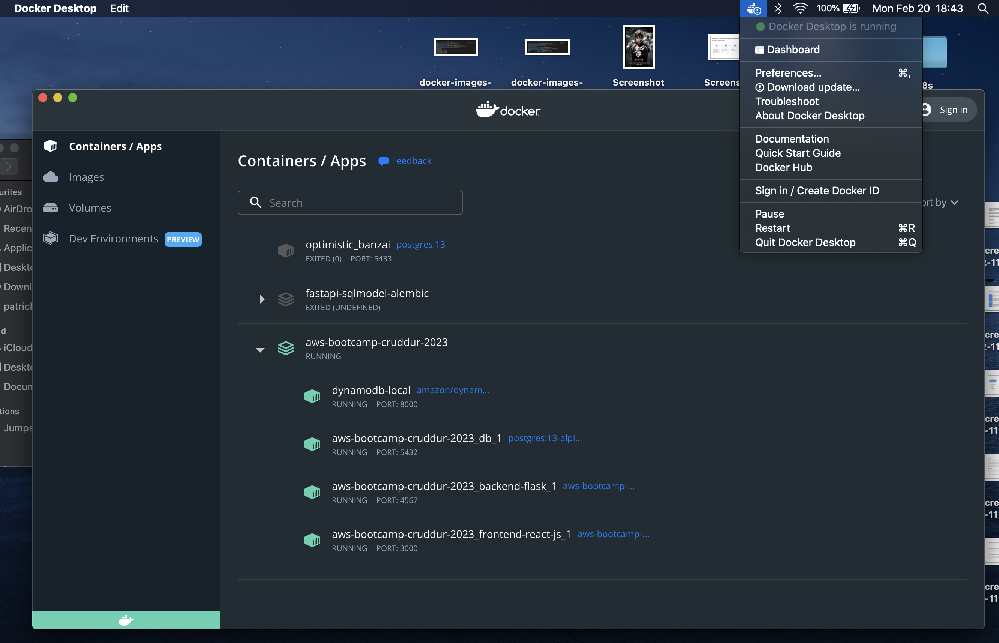


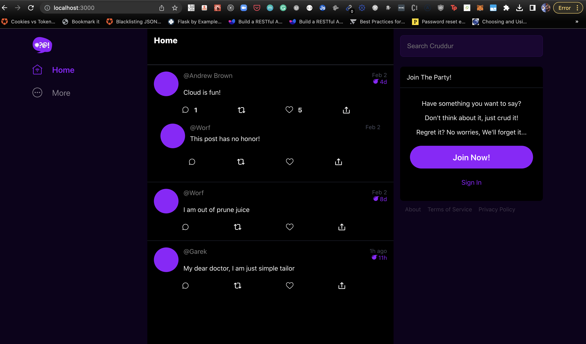


I could also access the postgres database on my local machine

```sh
docker-compose exec db psql --username=postgres
```


I tested out dynamodb-local on my local machine and was working perfectly. See this [repo link for 00DaysOfCloud challenge-dynamodb-local](https://github.com/100DaysOfCloud/challenge-dynamodb-local) for the commands executed below in the screen shots


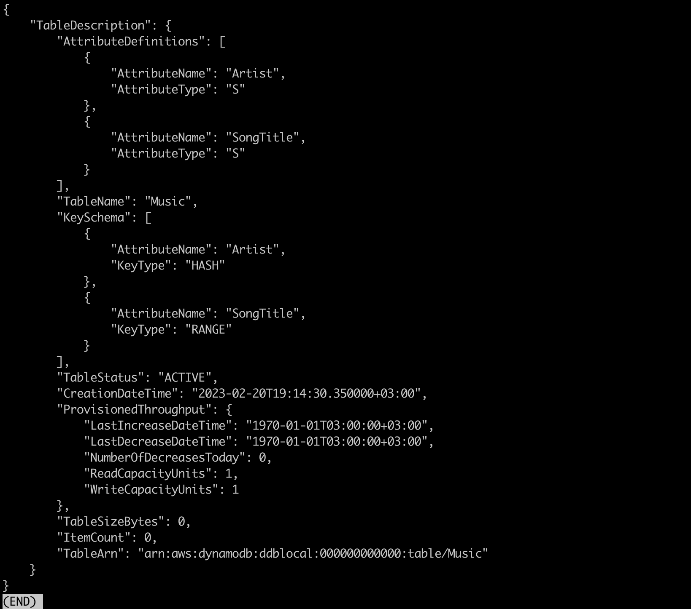


## Use multi-stage building for a Dockerfile build

I was able to test out multi-stage build for a backend flask application with minimal failures. See the [backend-flask/Dockerfile.prod](../backend-flask/Dockerfile.prod) and [docker-compose.prod.yml](../docker-compose.prod.yml). I created duplicates for both `Dockerfile` and `docker-compose.yml` for demostration purposes.

#### Resources used:
- [Dockerizing Flask with Postgres, Gunicorn, and Nginx on testdriven.io](https://testdriven.io/blog/dockerizing-flask-with-postgres-gunicorn-and-nginx/#production-dockerfile)
- [Docker multi-stage builds Testdriven.io](https://testdriven.io/tips/6ef63d0e-f3b6-41f3-8127-ca5f0a55c43f/)

```sh
docker build -f ./backend-flask/Dockerfile.prod -t backend-flask-prod ./backend-flask/
```

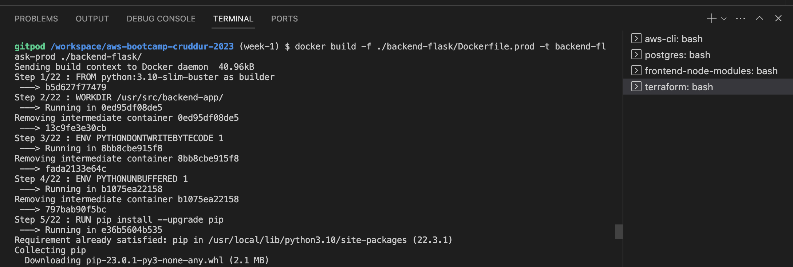


Run backend multistage build containers with `docker compose`

```sh
docker compose -f docker-compose.prod.yml up -d --build
```

Backend endpoint worked fine.


I did get a CORS on the frontend and at this moment I was still troubleshooting why the error.


Tag and pushed the `multi-stage build` as `backend-flask-prod` to  docker hub repository

```sh
REPOSITORY_NAME=cruddur-backend-flask-prod
DOCKER_HUB_USERNAME=patricktcmd
PREFIX=${DOCKER_HUB_USERNAME}/${REPOSITORY_NAME}

BACKEND_IMAGE_LOCAL=backend-flask-prod:latest
BACKEND_IMAGE_REMOTE=${PREFIX}:v01
docker tag ${BACKEND_IMAGE_LOCAL} ${BACKEND_IMAGE_REMOTE}

echo $DOCKER_ACCESS_TOKEN | docker login -u patricktcmd --password-stdin

docker push ${BACKEND_IMAGE_REMOTE}
```


## Implement a healthcheck in the V3 Docker compose file

### Health Check for postgres service

I did implement the healthcheck for the postgres service.
```
healthcheck:
  test: ["CMD", "pg_isready"]
  interval: 10s
  timeout: 5s
  retries: 3
```

The healthcheck section specifies a test command, interval, timeout, and number of retries. The db service uses `pg_isready` to check if the Postgres server is accepting connections.

### Healthcheck for dynamodb-local

See resource [here](https://github.com/amazon-archives/dynamodb-janusgraph-storage-backend/blob/master/src/test/resources/docker-compose.yml)

```
healthcheck:
  test: ["CMD-SHELL", "curl -f http://localhost:8000/shell/ || exit 1"]
  interval: 1s
  timeout: 10s
  retries: 3
```

- Here the test command uses `curl` to fetch the `/shell` endpoint from the DynamoDB Local service. This endpoint returns a bash shell that can be used to interact with the database. The `CMD-SHELL` instruction allows us to run a shell command in the container, which is used to execute the `curl` command.

- The `healthcheck` section can be customized to check for different endpoints or responses depending on the specifics of your DynamoDB Local setup. For example, you might check that a certain table or index exists, or that a specific query returns the expected results.


### Healthcheck for backend-flask service
```
healthcheck:
  test: ["CMD", "curl", "-f", "${BACKEND_URL}/api/healthcheck"]
  interval: 5s
  timeout: 10s
  retries: 3
```

The test command uses `curl` to check if the Flask application is responding to requests at the `/healthcheck` endpoint. This assumes that the Flask application has implemented the `/healthcheck` endpoint to return the response.

My healthcheck endpoint in [app.py](../backend-flask/app.py)
```python
@app.route("/api/healthcheck", methods=["GET"])
def healthcheck():
    # add precise checks
    try:
        cur = conn.cursor()
        cur.execute("SELECT 1;")
        cur.close()
        resp = jsonify(health="healthy")
        resp.status_code = 200
    except Exception as e:
        resp = jsonify(health="unhealthy")
        resp.status_code = 500
    return resp
```

Just checks if the application can make a connection to the postgres database and make a simple `SELECT` query. The response is successfully if app can connect to the database and fails if no connection is made.

See full implementation of healthchecks for the three services in [docker-compose.yml](../docker-compose.yml)


## Launch an EC2 instance that has docker installed, and pull a container to demonstrate you can run your own docker processes

I launched an EC2 using terraform.

See links below for the resources I referenced.

- [Hashicorp AWS install terraform docs](https://developer.hashicorp.com/terraform/tutorials/aws-get-started/install-cli)
- [Hashicorp AWS terraform build infrastructure](https://developer.hashicorp.com/terraform/tutorials/aws-get-started/aws-build)
- [How to launch an EC2 instance using Terraform - TechTarget](https://www.techtarget.com/searchcloudcomputing/tip/How-to-launch-an-EC2-instance-using-Terraform)

### Why choose Terraform as a developer
- Developers need to use their time wisely. As a result, they aim to minimize repetitive and manual processes.
- Terraform also lets developers write tests, including unit and integration tests, store those tests in source control and collaborate on them with others.
- Terraform also lets developers clean up resources easily once are nolonger needed.

### Create an EC2 instance with Terraform

#### Prerequisites:

- AWS account;
- AWS Identify and Access Management (IAM) credentials and programmatic access. The IAM credentials that you need for EC2 can be found [here](https://aws.amazon.com/blogs/security/granting-permission-to-launch-ec2-instances-with-iam-roles-passrole-permission/);
- setting up AWS credentials locally with aws configure in the AWS Command Line Interface (CLI). You can find further details [here](https://docs.aws.amazon.com/cli/latest/userguide/cli-chap-configure.html);

#### Create key pair to use to SSH into instance once created

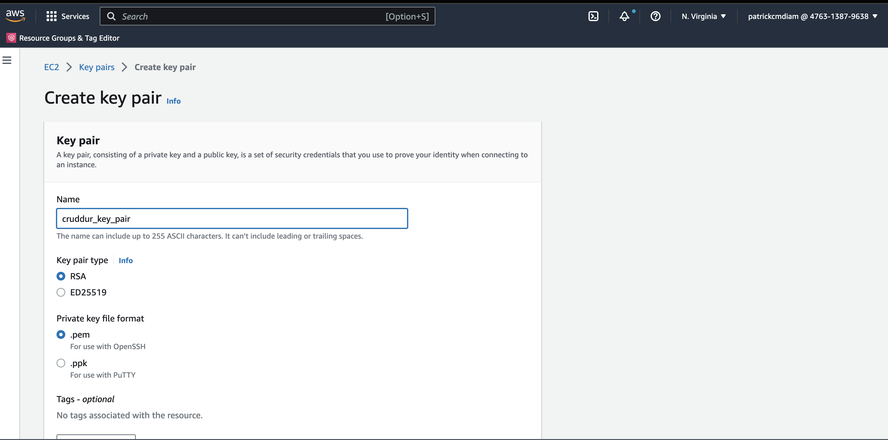


- This downloads a permission file which I move to my `~/.ssh/ directory`
- Change file permissions to avoid `permission denied` error.

```sh
mv cruddur_key_pair.pem ~/.ssh/
chmod 400 ~/.ssh/cruddur_key_pair.pem
```

#### Step 1. Create the main.tf file
Open my text/code editor and create a new directory [aws/infrastructure](../aws/infrastructure/). Make a file called `main.tf`. When setting up the `main.tf` file, you will create and use the Terraform AWS [provider](https://www.terraform.io/cdktf/concepts/providers-and-resources) -- a plugin that enables Terraform to communicate with the AWS platform -- and the EC2 instance.

First, add the provider code to ensure you use the AWS provider.
```tf
terraform {
  required_providers {
    aws = {
      source = "hashicorp/aws"
    }
  }
}
```

Next, set up Terraform [resource](https://www.terraform.io/language/resources), which describes an infrastructure object, for the EC2 instance.  This will create the instance. Define the instance type and configure the security group. See [/aws/infrastructure/main.tf](../aws/infrastructure/main.tf)

```tf
resource "aws_security_group" "cruddur_security_group" {
  name_prefix = "cruddur_security_group"
  ingress {
    from_port   = 22
    to_port     = 22
    protocol    = "tcp"
    cidr_blocks = ["0.0.0.0/0"]
  }
  ingress {
    from_port   = 80
    to_port     = 80
    protocol    = "tcp"
    cidr_blocks = ["0.0.0.0/0"]
  }

  egress {
    from_port   = 0
    to_port     = 0
    protocol    = "-1"
    cidr_blocks = ["0.0.0.0/0"]
  }
}

resource "aws_instance" "cruddur_ec2_instance" {
  ami                    = var.ami
  instance_type          = var.instance_type
  key_name               = "cruddur_key_pair"
  vpc_security_group_ids = [aws_security_group.cruddur_security_group.id]

  user_data = "linux.sh"

  tags = {
    Name        = "cruddur_ec2_instancee"
    "Terraform" = "Yes"
  }

}
```

This Terraform code creates a security group, and EC2 instance.

#### Step 2. Create the variables.tf file
Once the `main.tf` file is created, it's time to set up the necessary variables. These variables let you pass in values, and ensure the code is repeatable. With variables, you can use your code within any EC2 environment.

When setting up the `variables.tf` file, include the following three variables:

- The Amazon Machine Image (AMI) of an instance. In the code snippet below, the AMI defaults to Ubuntu.
- The type of the instance. In the code snippet below, the instance type defaults to a t2 Micro instance size.

See [aws/infrastructure/variables.tf](../aws/infrastructure/variables.tf)

```tf
variable "ami" {
  type    = string
  default = "ami-0dfcb1ef8550277af"
}

variable "instance_type" {
  type    = string
  default = "t2.micro"
}
```

#### Step 3. Create the EC2 environment
To deploy the EC2 environment, I ensure I am in the Terraform module/directory [aws/infrastructure](../aws/infrastructure/) in which I write the Terraform code, and run the following commands:

- `terraform init`. Initializes the environment and pulls down the AWS provider.
- `terraform plan`. Creates an execution plan for the environment and confirm no bugs are found.
- `terraform apply --auto-approve`. Creates and automatically approves the environment.

```sh
cd aws/infrastructure
terraform init
terraform plan
terraform apply --auto-approve
```

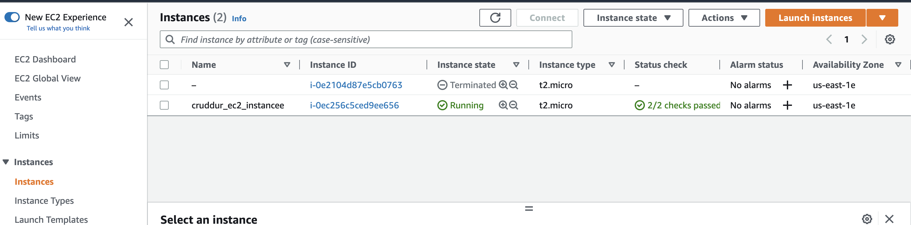


#### SSH into the EC2 instance

Once the instance is created, I SSH into the instance to test out the backend-flask image from my dockerhub repository.

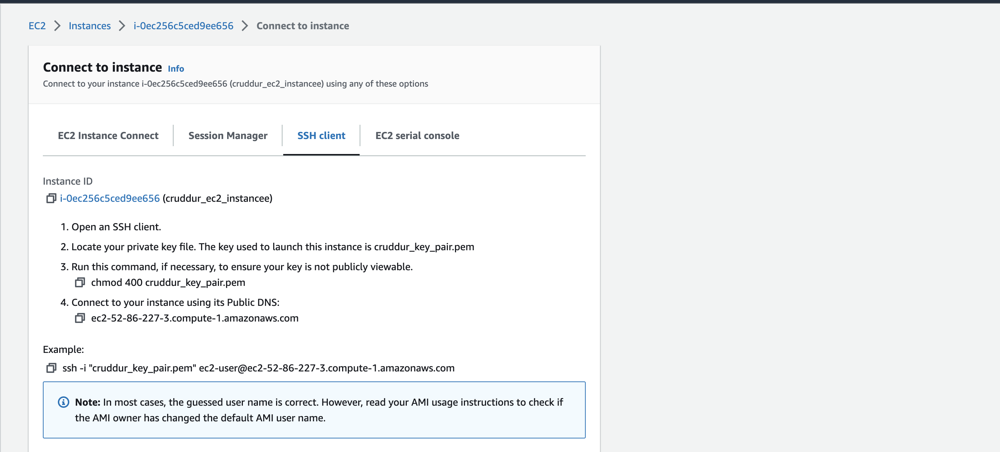

```sh
ssh -i "~/.ssh/cruddur_key_pair.pem" ec2-user@ec2-52-86-227-3.compute-1.amazonaws.com
```


#### Run backend-flask image on EC2 instance

I run and test out the backend-flask image from the docker hub repository on the launched EC2 instance.

```sh
docker run --rm -p 4567:4567 -it -e FRONTEND_URL='*' -e BACKEND_URL='*' -d patricktcmd/cruddur-backend-flask:v01
```


#### Remote SSH into my EC2 instance with vscode. 

See [link](https://code.visualstudio.com/docs/remote/ssh) on how to do this.

After running the backend-flask container on EC2 instance, I need to test out the endpoints from a browser. To be able to do that I forward ports from the `vscode` editor once I remote ssh into the ec2 instance.

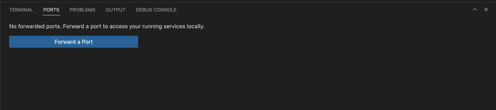

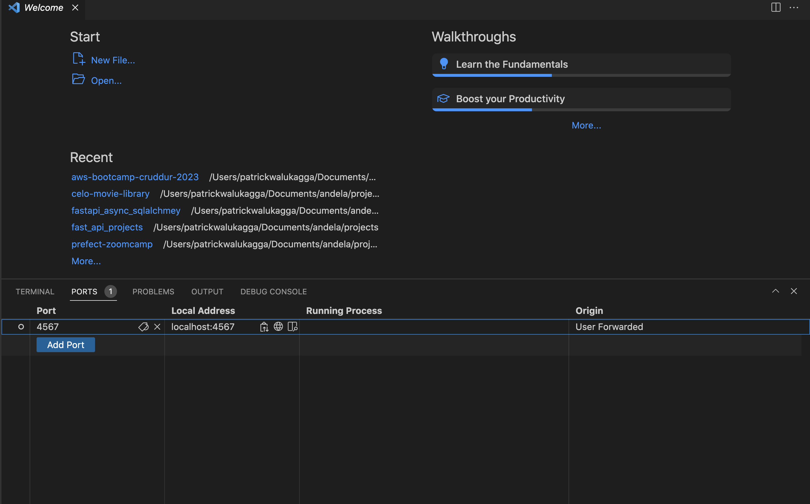

I successfully tested out the `/api/activities/home` endpoint from the browse. Browse to url `http://localhost:4567/api/activities/home`


#### Step 4. Clean up the environment
To destroy all Terraform environments, ensure that you're in the Terraform module/directory that you used to create the EC2 instance and run `terraform destroy.`

```sh
terraform destroy --auto-approve
```

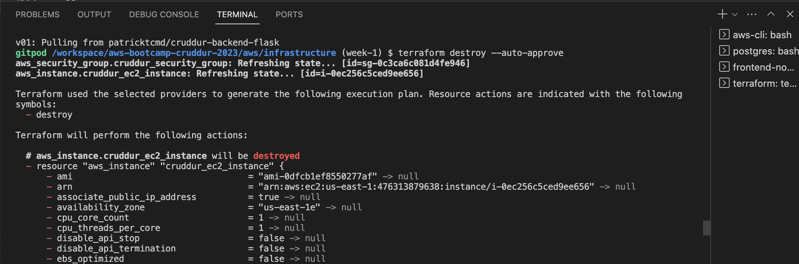

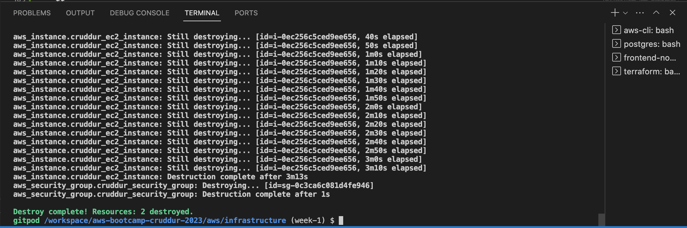


## Research best practices of Dockerfiles

I did read and research on the docker best practices for python development. See [link](https://testdriven.io/blog/docker-best-practices/) and some of the best practices include;

- Use Multi-stage Builds
- Order Dockerfile Commands Appropriately
- Use Small Docker Base Images
- Minimize the Number of Layers
- Use Unprivileged Containers
- Prefer COPY Over ADD
- Cache Python Packages to the Docker Host
- Run Only One Process Per Container
- Prefer Array Over String Syntax
- Understand the Difference Between ENTRYPOINT and CMD
- Include a HEALTHCHECK Instruction
