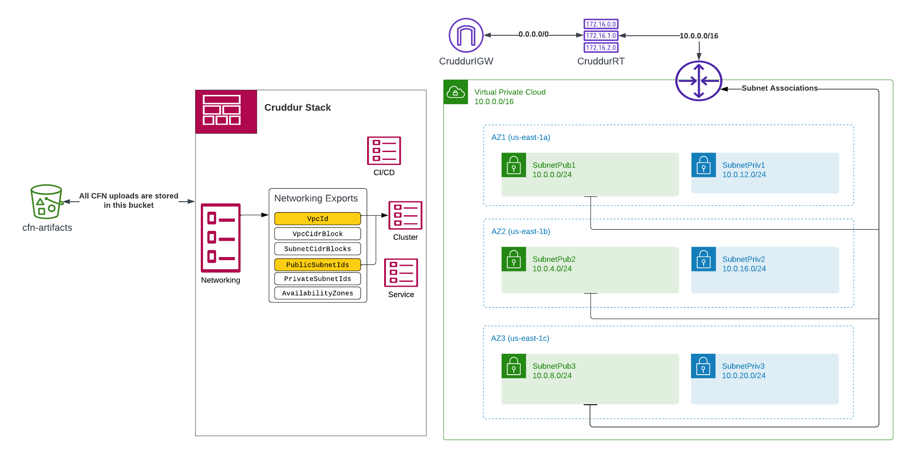
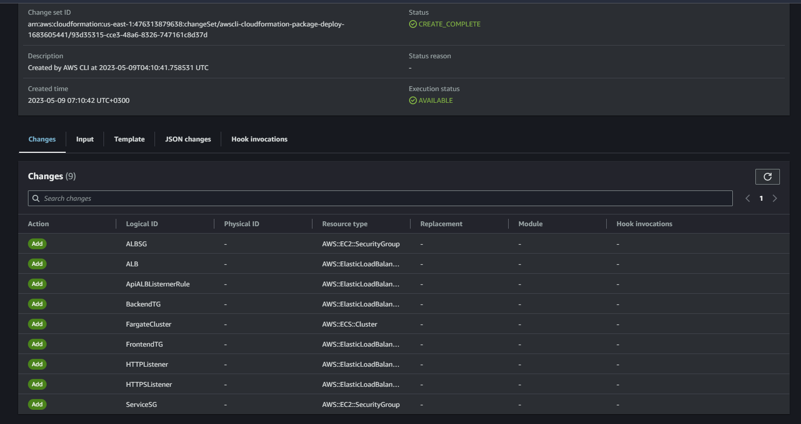

# Week 10 — CloudFormation Part 1

## What is AWS CloudFormation?


AWS CloudFormation is a service provided by Amazon Web Services (AWS) that allows you to model and provision AWS resources and infrastructure in an automated and scalable manner. 

Using CloudFormation, you can define and manage infrastructure as code, which allows you to declare your desired configuration in a template, and CloudFormation takes care of provisioning and configuring the necessary resources in your AWS account. 

This helps simplify the process of creating and managing infrastructure and reduces the potential for human error. CloudFormation templates can be written in `YAML` or `JSON` and can be stored in version control for easy management and collaboration. 

With CloudFormation, you can create and manage a variety of AWS resources including EC2 instances, RDS databases, S3 buckets, IAM roles, and more. You can also use CloudFormation to create, update, and delete entire stacks of resources as a single unit. 

Overall, CloudFormation helps make the process of creating and managing infrastructure more efficient and less error-prone, while also enabling greater automation and scalability in your AWS environment.

### AWS CloudFormation Templates
- [AWS CloudFormation Templates](https://aws.amazon.com/cloudformation/resources/templates/)
- [Amazon Elastic Container Service template snippets](https://docs.aws.amazon.com/AWSCloudFormation/latest/UserGuide/quickref-ecs.html#quickref-ecs-example-1.yaml)

### Deploy CloudFormation template
See instructions in the [README.md](../aws/cfn/Readme.md) first.

#### Sample ECS CFN template
```yml
AWSTemplateFormatVersion: 2010-09-09
Description: |
  Setup ECS Cluster
Resources:
  ECSCluster: #LogicalName
    Type: 'AWS::ECS::Cluster'
```

This CloudFormation template is written in `YAML` and is used to create an AWS ECS cluster. Here is a breakdown of the different elements in the template:

- `AWSTemplateFormatVersion: 2010-09-09`: This specifies the format version of the CloudFormation template, which is required at the top of every CloudFormation template.

- `Description: |`: This is a description of the CloudFormation stack. The pipe symbol indicates that the description spans multiple lines.

- `Setup ECS Cluster`: This is the text of the description. It indicates that the CloudFormation stack is being used to set up an ECS cluster.

- `Resources:`: This is the start of the CloudFormation resources section, which lists the AWS resources that will be created when the stack is created.

- `ECSCluster:`: This is a logical name for the ECS cluster resource. Logical names are used within the CloudFormation template to refer to specific resources.

- `Type: 'AWS::ECS::Cluster'`: This specifies the type of resource that will be created, in this case, an AWS ECS cluster. The `AWS::ECS::Cluster` type is used to create a logical grouping of container instances that can be used to run tasks and services.

In summary, this CloudFormation template defines an AWS ECS cluster resource with the logical name `ECSCluster`. When the CloudFormation stack is created, this resource will be provisioned in the AWS account.

#### Cluster deploy

```sh
./bin/cfn/cluster-deploy
```


#### Test Modifying cluster name and deploy

```yml
AWSTemplateFormatVersion: 2010-09-09
Description: |
  Setup ECS Cluster
Resources:
  ECSCluster: #LogicalName
    Type: 'AWS::ECS::Cluster'
    Properties:
      ClusterName: CruddurCluster
```


#### Checking deployment errors
IF errors do occur or a deployment fails when change set is executed, do check out `cloudtrail Event History` to track down the error.

#### CloudFormation Linting - Validate CFN template for errors
We can validate a cloudformation template for errors.

```sh
aws cloudformation validate-template --template-body file:///workspace/aws-bootcamp-cruddur-2023/aws/cfn/template.yaml
```

**Sample output  with no errors**
```json
{
    "Parameters": [],
    "Description": "Setup ECS Cluster\n"
}
```

OR: We can also use cfn-lint. See how to setup `cfn-lint` [here - cfn-lint](https://github.com/aws-cloudformation/cfn-lint)

#### Install
#### Pip
```sh
pip install cfn-lint. 
```

If pip is not available, run python setup.py clean --all then python setup.py install.

#### Homebrew (macOS)
```sh
brew install cfn-lint
```

#### Basic Usage
- `cfn-lint template.yaml`
- `cfn-lint -t template.yaml`

Test linting with our cfn template

```sh
cfn-lint /workspace/aws-bootcamp-cruddur-2023/aws/cfn/template.yaml
```

No output if there is no error

### AWS CloudFormation Integration & Automation
A deep dive into testing with TaskCat
- [TaskCat Github](https://github.com/aws-ia/taskcat)
- [TaskCat Documentation](https://aws-ia.github.io/taskcat/)

### AWS CloudFormation Guard - Policy-as-code
- [AWS CloudFormation Guard Docs](https://docs.aws.amazon.com/cfn-guard/latest/ug/what-is-guard.html)
- [AWS CloudFormation Guard - Github](https://github.com/aws-cloudformation/cloudformation-guard)

**Validate Cloud Environments with Policy-as-Code**

AWS CloudFormation Guard is an open-source general-purpose policy-as-code evaluation tool. It provides developers with a simple-to-use, yet powerful and expressive domain-specific language (DSL) to define policies and enables developers to validate JSON- or YAML- formatted structured data with those policies.

#### Setting up AWS CloudFormation Guard
See resources here
- [AWS](https://docs.aws.amazon.com/cfn-guard/latest/ug/setting-up.html)
- [AWS CloudFormation Guard - Github](https://github.com/aws-cloudformation/cloudformation-guard#guard-cli)

```sh
curl --proto '=https' --tlsv1.2 -sSf https://raw.githubusercontent.com/aws-cloudformation/cloudformation-guard/main/install-guard.sh | sh
export PATH=~/.guard/bin:$PATH
cfn-guard --version
gem install cfn-toml
```

#### [How does Guard CLI work?](https://github.com/aws-cloudformation/cloudformation-guard#how-does-guard-cli-work)
The two common Guard CLI commands are `validate` and `test`.

**Generate rule**
- Autogenerate rules from an existing JSON- or YAML- formatted data. (Currently works with only CloudFormation templates)

```sh
cfn-guard rulegen --template /workspace/aws-bootcamp-cruddur-2023/aws/cfn/template.yaml > /workspace/aws-bootcamp-cruddur-2023/aws/cfn/ecs-cluster.guard
```

**Validate**
- Validate command is used when you need to assess the compliance or security posture as defined by a set of policy files against incoming JSON/YAML data. Common data payloads used are CloudFormation Templates, CloudFormation ChangeSets, Kubernetes Pod policies, Terraform Plan/Configuration in JSON format, and more. 

```sh
cfn-guard validate -r /workspace/aws-bootcamp-cruddur-2023/aws/cfn/ecs-cluster.guard
```

**Test**
- Test command is used during the development of guard policy rules files. Test provides a simple integrated unit-test frameworks that allows authors to individually test each policy file for different types of inputs. Unit testing helps authors gain confidence that the rule does indeed conform to expectations. It can also be used as regression tests for rules.

```sh
cfn-guard test -r /workspace/aws-bootcamp-cruddur-2023/aws/cfn/ecs-cluster.guard -t /workspace/aws-bootcamp-cruddur-2023/aws/cfn/template.yaml
```

## AWS CloudFormation Networking
- VPC
- IGW
- Route Tables
- Subnets
  - Subnet A
  - Submet B
  - Subnet C

  

  See Lucidchart diagram [here](https://lucid.app/lucidchart/db55c666-f3fb-4573-bd94-21e6b7a31da6/edit?viewport_loc=489%2C-1243%2C2219%2C1043%2C0_0&invitationId=inv_46cab791-136a-4af2-9250-7575ed6584b0)

### An interactive IP address and CIDR range visualizer
- [CIDR.xyz](https://cidr.xyz/)


**Create a VPC**

### [AWS VPC](https://docs.aws.amazon.com/vpc/latest/userguide/what-is-amazon-vpc.html)
With Amazon Virtual Private Cloud (Amazon VPC), you can launch AWS resources in a logically isolated virtual network that you've defined. This virtual network closely resembles a traditional network that you'd operate in your own data center, with the benefits of using the scalable infrastructure of AWS.

```yml
AWSTemplateFormatVersion: 2010-09-09
Description: |
  The base networking components for our stack:
  - VPC
    - sets DNS hostnames for EC2 instances
    - Only IPV4, IPV6 is disabled
  - InternetGateway
  - Route Table
    - route to the IGW
    - route to Local
  - 6 Subnets Explicity Associated to Route Table
    - 3 Public Subnets numbered 1 to 3
    - 3 Private Subnets numbered 1 to 3

Parameters:
  VpcCidrBlock:
    Type: String
    Default: 10.0.0.0/16

Resources:
  VPC:
    # https://docs.aws.amazon.com/AWSCloudFormation/latest/UserGuide/aws-resource-ec2-vpc.html
    Type: AWS::EC2::VPC
    Properties:
      CidrBlock: !Ref VpcCidrBlock
      EnableDnsHostnames: true
      EnableDnsSupport: true
      InstanceTenancy: default
      Tags:
        - Key: Name
          Value: !Sub "${AWS::StackName}VPC"
```

This is an AWS CloudFormation template that defines a base networking infrastructure for an AWS stack, including a Virtual Private Cloud (VPC), an Internet Gateway (IGW), a route table with routes to the IGW and to the local network, and six subnets associated with the route table, three of which are public and three of which are private.

The template takes a single parameter, `VpcCidrBlock`, which specifies the IPv4 CIDR block for the VPC. The default value for this parameter is `10.0.0.0/16`.

The `Resources` section of the template defines the AWS resources that will be created. The `VPC` resource is defined using the `AWS::EC2::VPC` type, and its properties include the CIDR block specified by the `VpcCidrBlock` parameter, and tags that include the stack name.

The other resources defined in the template include an `InternetGateway`, a `RouteTable` with routes to the IGW and to the local network, and six subnets, three public and three private, explicitly associated with the route table. The subnets are numbered from 1 to 3 for both the public and private subnets. The specific properties for these resources are not defined in this template excerpt.

In this CloudFormation template, the `Tags` section is used to apply metadata to the VPC resource that will be created. Metadata is simply additional information that is attached to resources, such as name, owner, purpose, etc. 

The `Tags` section contains a list of tag objects. Each tag object has two properties: `Key` and `Value`. `Key` is the name of the metadata item, and `Value` is the value of the metadata item.

In this specific example, the `Tags` section applies a single tag to the VPC resource. The tag's `Key` is "Name" and the `Value` is set using a `!Sub` intrinsic function, which substitutes values from other parts of the CloudFormation template.

`${AWS::StackName}` is a pre-defined parameter in AWS CloudFormation that represents the name of the stack that is being created. By using `${AWS::StackName}` in the `!Sub` function, we are able to dynamically set the name of the VPC resource to be created to be `${AWS::StackName}VPC`. This allows us to create a unique name for the VPC based on the name of the stack, which makes it easier to manage and identify resources in AWS.


**Under resources we create an Internet Gateway and attach it to a VPC**.

```yml
Resources:
  VPC:
    # https://docs.aws.amazon.com/AWSCloudFormation/latest/UserGuide/aws-resource-ec2-vpc.html
    Type: AWS::EC2::VPC
    Properties:
      CidrBlock: !Ref VpcCidrBlock
      EnableDnsHostnames: true
      EnableDnsSupport: true
      InstanceTenancy: default
      Tags:
        - Key: Name
          Value: !Sub "${AWS::StackName}VPC"
  IGW:
    # https://docs.aws.amazon.com/AWSCloudFormation/latest/UserGuide/aws-resource-ec2-internetgateway.html
    Type: AWS::EC2::InternetGateway
    Properties:
      Tags:
        - Key: Name
          Value: !Sub "${AWS::StackName}IGW"
  AttachIGW:
    Type: AWS::EC2::VPCGatewayAttachment
    Properties:
      VpcId: !Ref VPC
      InternetGatewayId: !Ref IGW
```

The resource section above defines the Internet Gateway (IGW) resource and the attachment of the Internet Gateway to the VPC.

The Internet Gateway is a horizontally scaled, redundant, and highly available VPC component that allows communication between instances in a VPC and the internet. It's an essential component to allow traffic to flow from a VPC to the internet and vice versa.

In this CloudFormation template, the Internet Gateway is created by defining a resource of type `AWS::EC2::InternetGateway`. The `Tags` property is an optional property used to tag the resource with metadata. In this case, the tag `Name` is defined, and its value is set using the `!Sub` intrinsic function. `!Sub` is used to substitute a string with variable values at runtime. In this case, `${AWS::StackName}` refers to the name of the CloudFormation stack, and the string `"IGW"` is appended to it to create a unique name for the Internet Gateway.

The resource `AttachIGW` is of type `AWS::EC2::VPCGatewayAttachment`. It's used to attach the previously created Internet Gateway resource to the VPC. The `VpcId` property is set to `!Ref VPC`, which refers to the `VPC` resource defined earlier in the template. The `InternetGatewayId` property is set to `!Ref IGW`, which refers to the `IGW` resource defined earlier. This resource will create a route table with an internet route to the IGW, which allows resources within the public subnets to access the internet.


**Create Route table and attache route to an InternetGateway (Again under resources)**

```yml
RouteTable:
    # https://docs.aws.amazon.com/AWSCloudFormation/latest/UserGuide/aws-resource-ec2-routetable.html
    Type: AWS::EC2::RouteTable
    Properties:
      VpcId:  !Ref VPC
      Tags:
        - Key: Name
          Value: !Sub "${AWS::StackName}RT"
  RouteToIGW:
    # https://docs.aws.amazon.com/AWSCloudFormation/latest/UserGuide/aws-resource-ec2-route.html
    Type: AWS::EC2::Route
    DependsOn: AttachIGW
    Properties:
      RouteTableId: !Ref RouteTable
      GatewayId: !Ref IGW
      DestinationCidrBlock: 0.0.0.0/0
```

This CloudFormation template creates an EC2 route table for the VPC. The template defines two resources: a route table and a route to the Internet Gateway.

The first resource, `RouteTable`, creates an EC2 route table and attaches it to the VPC specified in the `VpcId` property, which is set to the `!Ref VPC` function. The `Tags` property allows you to add metadata to your resources for easier identification. In this case, it sets the name of the route table to the name of the CloudFormation stack.

The second resource, `RouteToIGW`, creates a route from the route table to the Internet Gateway specified by the `GatewayId` property, which is set to the `!Ref IGW` function. The `DependsOn` property ensures that the Internet Gateway attachment is complete before the route is added to the route table. The `DestinationCidrBlock` property specifies that all traffic not destined for the VPC should be routed to the Internet Gateway.


**Associate subnets with the VPC both public and private. Public subnets can associated with Internet Gateway**.

See full template implementation [here](../aws/cfn/networking/template.yaml)


### YAML Tutorial Tutorials and Cheatsheets

- [YAML Tutorial: Everything You Need to Get Started in Minutes Written by: Erik Francis](https://www.cloudbees.com/blog/yaml-tutorial-everything-you-need-get-started)
- [YAML Cheat Sheet - LZone](https://lzone.de/cheat-sheet/YAML)
- [YAML cheatsheet - Quickref](https://quickref.me/yaml.html)


## AWS CloudFormation Cluster Layer

See full implementation of the cloudformation template [here](../aws/cfn/cluster/template.yaml)

This is a CloudFormation template, which describes the infrastructure that's to be created on AWS. The template describes a network and cluster configuration to support Fargate containers. The template creates various AWS resources, including an ECS Fargate Cluster, an Application Load Balancer (ALB), an ALB security group, HTTPS and HTTP listeners, Backend and Frontend Target Groups, and other components required for networking.

Here is an overview of what the different parts of the template do:

- AWSTemplateFormatVersion: This defines the CloudFormation template version used in this configuration.
- Description: This provides a brief description of the resources that will be created.
- Parameters: This defines input parameters that can be used to customize the CloudFormation stack.
- Resources: This section defines the AWS resources that will be created as part of the CloudFormation stack.
  - FargateCluster: This creates an ECS Fargate Cluster to run Fargate containers.
  - ALB: This creates an Application Load Balancer that is internet-facing and accepts only IPv4 traffic. A certificate attached from the Amazon Certification Manager is also attached to this ALB.
  - HTTPSListener: This creates an HTTPS listener for the ALB that sends naked domain traffic to a Frontend Target Group and api subdomain traffic to a Backend Target Group.
  - HTTPListener: This creates an HTTP listener for the ALB that redirects to the HTTPS listener.
  - Backend Target Group: This defines the Backend Target Group used by the ALB.
  - Frontend Target Group: This defines the Frontend Target Group used by the ALB. 

The Parameters section defines input parameters used by the template. These include the NetworkingStack parameter, which defines the base layer of networking components (e.g. VPC, subnets), and the CertificateArn parameter, which defines the Amazon Certification Manager (ACM) certificate ARN. The Frontend and Backend parameters define the port, health check interval, health check path, health check port, health check protocol, health check timeout, healthy threshold count, and unhealthy threshold count for the Frontend and Backend Target Groups. 

Overall, this CloudFormation template provides a robust network and cluster configuration to support Fargate containers and load balancing traffic between frontend and backend Target Groups.

**CFN-Toml**

Extracting environment variables and parsing parameter configurations using [`TOML`](https://www.w3schools.io/file/toml-introduction/) for cloudformation templates.

```sh
gem install cfn-toml
```

See the configs for [cluster](../aws/cfn/cluster/config.toml) and [network](../aws/cfn/networking/config.toml) using `toml`.


**Deploying the Cluster layer**

```sh
./bin/cfn/cluster-deploy
```

Cloudfromation cluster stack change set



Resources created after executing change-set


Exported outputs to be referenced by other cloudformation stacks when needed.

