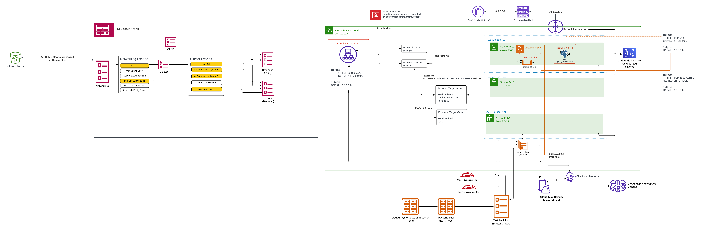
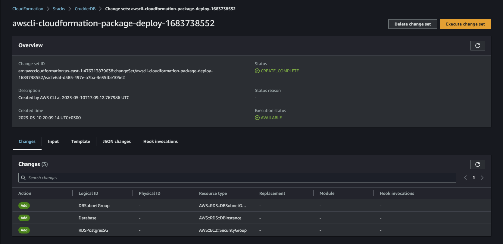
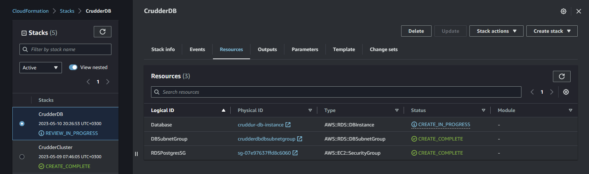
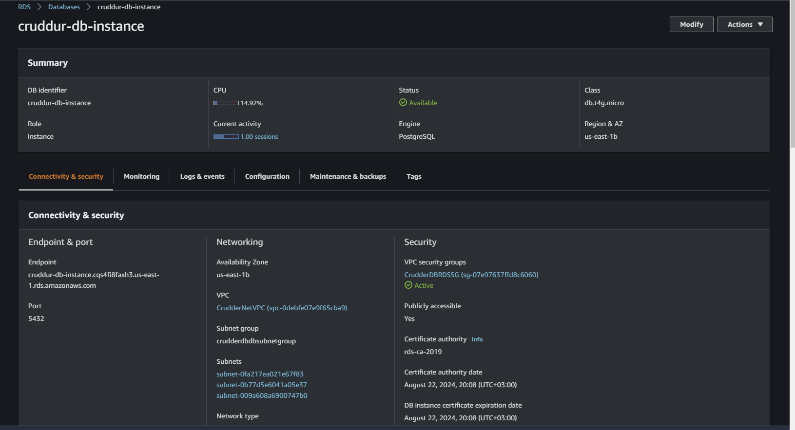
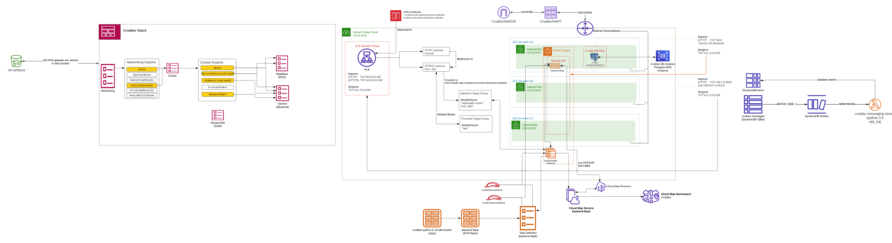
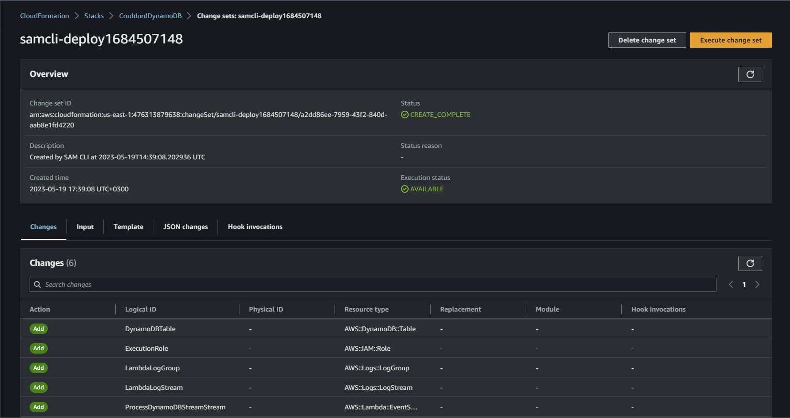
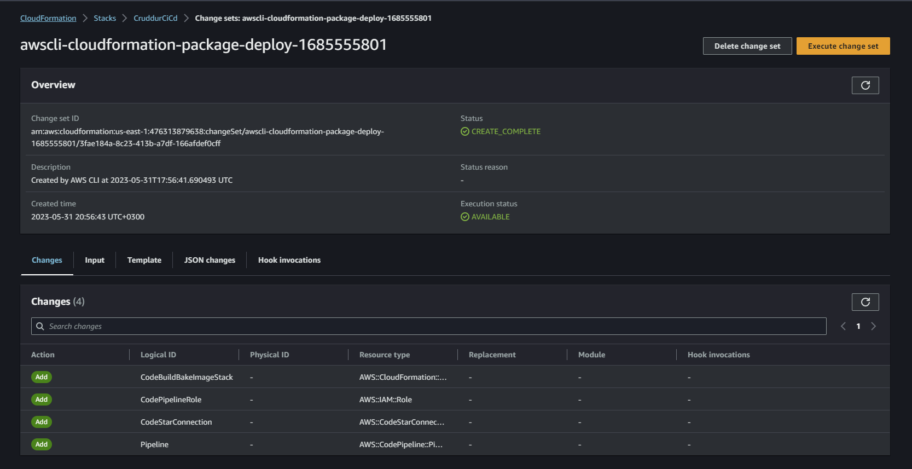

# Week 11 — CloudFormation Part 2



See link [here](https://lucid.app/lucidchart/32e756b5-d4e5-4e4a-baa8-788640c65804/edit?viewport_loc=465%2C-1005%2C2219%2C1040%2C0_0&invitationId=inv_42be5a05-2325-4126-aca4-4d54675d1896)

## AWS CloudFormation Database (RDS) Layer

See the cloudformation implementation for the database layer [here](../aws/cfn/rds/template.yaml)

This is an AWS CloudFormation template for creating a Postgres RDS Database in AWS. 

The first part of the template is the description section where the purpose of the template is explained. It creates an RDS instance, database security group, and a database subnet group. 

The `Parameters` section defines the input parameters that will be used when the stack is created. These parameters include the base layer of networking components like VPC and subnets, the Fargate cluster, backup retention period, DB instance class, DB instance identifier, DB name, deletion protection, engine version, master username, and master user password. 

The `Resources` section defines the AWS resources that will be created. It includes a security group, subnet group, and an RDS instance. The `RDSPostgresSG` resource creates a security group that allows incoming traffic from the Fargate cluster on port 5432. The `DBSubnetGroup` resource creates a subnet group that includes the public subnets of the networking stack. Finally, the `Database` resource creates the actual RDS instance. It uses the parameters defined earlier to specify the database settings like the allocated storage, backup retention period, DB instance class, DB instance identifier, DB name, deletion protection, engine version, master username, and master user password. 

Overall, this template can be used to create a Postgres RDS database with the specified settings in AWS.

**Parameter's Section**

```yaml
Parameters:
  NetworkingStack:
    Type: String
    Description: This is our base layer of networking components eg. VPC, Subnets
    Default: CrudderNet
  ClusterStack:
    Type: String
    Description: This is our FargateCluster
    Default: CrudderCluster
  BackupRetentionPeriod:
    Type: Number
    Default: 0
  DBInstanceClass:
    Type: String
    Default: db.t4g.micro
  DBInstanceIdentifier:
    Type: String
    Default: cruddur-instance
  DBName:
    Type: String
    Default: cruddur
  DeletionProtection:
    Type: String
    AllowedValues:
      - true
      - false
    Default: true
  EngineVersion:
    Type: String
    #  DB Proxy only supports very specific versions of Postgres
    #  https://stackoverflow.com/questions/63084648/which-rds-db-instances-are-supported-for-db-proxy
    Default: '15.2'
  MasterUsername:
    Type: String
  MasterUserPassword:
    Type: String
    NoEcho: true
```

The `Parameters` section in the CloudFormation database template defines input parameters for the template. These parameters allow users to pass values into the CloudFormation stack at the time of stack creation or stack update. 

In the template shown, there are several input parameters defined:
- `NetworkingStack`: This parameter is of type string and represents the name of the networking stack that contains the VPC and subnets that this database instance should be deployed into. The default value is `CrudderNet`.
- `ClusterStack`: This parameter is of type string and represents the name of the Fargate cluster stack that will access this database instance. The default value is `CrudderCluster`.
- `BackupRetentionPeriod`: This parameter is of type number and represents the number of days that automated backups of the database should be retained. The default value is `0`, meaning no automated backups will be retained.
- `DBInstanceClass`: This parameter is of type string and represents the size of the RDS instance to be created. The default value is `db.t4g.micro`.
- `DBInstanceIdentifier`: This parameter is of type string and represents the unique identifier for the RDS instance. The default value is `cruddur-instance`.
- `DBName`: This parameter is of type string and represents the name of the initial database to be created on the RDS instance. The default value is `cruddur`.
- `DeletionProtection`: This parameter is of type string and represents whether or not the RDS instance should have deletion protection enabled. The default value is `true`.
- `EngineVersion`: This parameter is of type string and represents the version of the PostgreSQL engine that will be used. The default value is `15.2`.
- `MasterUsername`: This parameter is of type string and represents the username for the master user of the RDS instance.
- `MasterUserPassword`: This parameter is of type string and represents the password for the master user of the RDS instance. The `NoEcho` attribute is set to `true` to prevent the password from being displayed in plain text in the CloudFormation console or logs. 

Each parameter is given a default value, but these can be overridden when the stack is created or updated by the user.

**RDSPostgresSG Resource**

```yaml
RDSPostgresSG:
    # https://docs.aws.amazon.com/AWSCloudFormation/latest/UserGuide/aws-properties-ec2-security-group.html
    Type: AWS::EC2::SecurityGroup
    Properties:
      GroupName: !Sub "${AWS::StackName}RDSSG"
      GroupDescription: Public Facing SG for our Cruddur ALB
      VpcId:
        Fn::ImportValue:
          !Sub ${NetworkingStack}VpcId
      SecurityGroupIngress:
        - IpProtocol: tcp
          SourceSecurityGroupId:
            Fn::ImportValue:
              !Sub ${ClusterStack}ServiceSecurityGroupId
          FromPort: 5432
          ToPort: 5432
          Description: ALB HTTP
```

The `RDSPostgresSG` resource in the CloudFormation template is an AWS EC2 Security Group that will be created as part of the CloudFormation stack deployment. 

The purpose of this security group is to allow inbound traffic from the ALB (Application Load Balancer) to access the Postgres RDS (Relational Database Service) instance that will be created in this template.

Here are the key properties of the `RDSPostgresSG` resource:

- `Type`: AWS::EC2::SecurityGroup
- `GroupName`: A unique name for the security group, which is formed by concatenating the CloudFormation stack name with the string "RDSSG".
- `GroupDescription`: A description for the security group.
- `VpcId`: The ID of the VPC (Virtual Private Cloud) where the security group will be created.
- `SecurityGroupIngress`: A list of ingress rules that control inbound traffic to the security group. In this case, there is only one rule, which allows inbound traffic from the ALB security group on port 5432 (the default port for Postgres). 

Note that the ALB security group is referenced using the `Fn::ImportValue` function to import the ID of the security group. This is because the ALB security group is created in a separate CloudFormation stack (which is assumed to have been deployed prior to this stack) and its ID is exported using the `Export` attribute. 

By allowing inbound traffic only from the ALB security group, this security group follows the principle of least privilege, which helps to minimize the attack surface of the RDS instance.


**DBSubnetGroup Resource**

```yaml
DBSubnetGroup:
    # https://docs.aws.amazon.com/AWSCloudFormation/latest/UserGuide/aws-resource-rds-dbsubnetgroup.html
    Type: AWS::RDS::DBSubnetGroup
    Properties:
      DBSubnetGroupName: !Sub "${AWS::StackName}DBSubnetGroup"
      DBSubnetGroupDescription: !Sub "${AWS::StackName}DBSubnetGroup"
      SubnetIds: { 'Fn::Split' : [ ','  , { "Fn::ImportValue": { "Fn::Sub": "${NetworkingStack}PublicSubnetIds" }}] }
```

The `DBSubnetGroup` resource in the CloudFormation template is used to create a database subnet group for the Amazon RDS DB instance. A DB subnet group is a collection of subnets that you can choose to use when you create a DB instance in a VPC. 

The `DBSubnetGroup` resource has the following properties:

- `DBSubnetGroupName`: A name for the DB subnet group. It must be unique within the account and region. The name should be descriptive of the purpose of the subnet group.
- `DBSubnetGroupDescription`: A description for the DB subnet group.
- `SubnetIds`: A comma-separated list of subnet IDs that are used to create the DB subnet group. These subnets should be in different Availability Zones.

In this CloudFormation template, the `DBSubnetGroup` resource is defined with the properties to use the subnets created in the Networking stack. Specifically, the subnet IDs are retrieved from the `NetworkingStack` Parameter and the list of subnet IDs is created using the `Fn::Split` function and the `ImportValue` function to get the subnet IDs from the Networking stack's output.


**Database Resource**

```yaml
Database:
    # https://docs.aws.amazon.com/AWSCloudFormation/latest/UserGuide/aws-resource-rds-dbinstance.html
    Type: AWS::RDS::DBInstance
    # https://docs.aws.amazon.com/AWSCloudFormation/latest/UserGuide/aws-attribute-deletionpolicy.html
    DeletionPolicy: 'Snapshot'
    # https://docs.aws.amazon.com/AWSCloudFormation/latest/UserGuide/aws-attribute-updatereplacepolicy.html
    UpdateReplacePolicy: 'Snapshot'
    Properties:
      AllocatedStorage: '20'
      AllowMajorVersionUpgrade: true
      AutoMinorVersionUpgrade: true
      BackupRetentionPeriod: !Ref  BackupRetentionPeriod
      DBInstanceClass: !Ref DBInstanceClass
      DBInstanceIdentifier: !Ref DBInstanceIdentifier
      DBName: !Ref DBName
      DBSubnetGroupName: !Ref DBSubnetGroup
      DeletionProtection: !Ref DeletionProtection
      EnablePerformanceInsights: true
      Engine: postgres
      EngineVersion: !Ref EngineVersion

      MasterUsername:  !Ref MasterUsername
      # Constraints: Must contain from 8 to 128 characters.
      MasterUserPassword: !Ref MasterUserPassword
      PubliclyAccessible: true
      VPCSecurityGroups:
        - !GetAtt RDSPostgresSG.GroupId
```

The `Database` resource in the CloudFormation template represents the RDS (Relational Database Service) instance that will be created. It defines the instance's properties, such as the allocated storage, DB instance class, DB name, DB subnet group, engine, engine version, master username and password, and the publicly accessible attribute.

Here's a breakdown of the properties:

- `AllocatedStorage`: Specifies the storage size in GB for the database. The minimum storage size is 20 GB.
- `AllowMajorVersionUpgrade`: Specifies whether major version upgrades are allowed for the database.
- `AutoMinorVersionUpgrade`: Specifies whether minor version upgrades are applied automatically to the database during the maintenance window.
- `BackupRetentionPeriod`: Specifies the number of days to retain automated backups. If set to 0, backups are disabled.
- `DBInstanceClass`: Specifies the instance class for the database.
- `DBInstanceIdentifier`: Specifies a unique identifier for the database instance.
- `DBName`: Specifies the name of the database to create on the instance.
- `DBSubnetGroupName`: Specifies the DB subnet group to associate with the database instance.
- `DeletionProtection`: Specifies whether deletion protection is enabled for the database. If enabled, the database cannot be deleted.
- `EnablePerformanceInsights`: Specifies whether performance insights are enabled for the database.
- `Engine`: Specifies the name of the database engine.
- `EngineVersion`: Specifies the version of the database engine.
- `MasterUsername`: Specifies the name of the master user for the database.
- `MasterUserPassword`: Specifies the password for the master user. The value is passed as a parameter with `NoEcho` attribute set to `true`.
- `PubliclyAccessible`: Specifies whether the database instance is publicly accessible or not.
- `VPCSecurityGroups`: Specifies the list of security groups to associate with the database instance.

The `Database` resource also includes two important attributes: `DeletionPolicy` and `UpdateReplacePolicy`. The `DeletionPolicy` specifies what happens to the resource when the stack is deleted. In this case, it's set to 'Snapshot', which means the instance is deleted, but a final snapshot of the database is retained. The `UpdateReplacePolicy` specifies what happens to the resource when its properties are changed. In this case, it's set to 'Snapshot', which means a new instance is created and data from the old instance is copied to the new instance.


**Deploying the Database layer**

```sh
./bin/cfn/db-deploy
```

Cloudfromation Database stack change set



Resources created after executing change-set


Database instance created after executing change-set



## AWS CloudFormation Backend-Flask Service Layer

See the cloudformation implementation for the service template [here](../aws/cfn/service/template.yaml)


This is a CloudFormation service template for deploying an AWS Fargate service. It defines various parameters and resources necessary for creating the service. Let's go through the template:

- The `AWSTemplateFormatVersion` specifies the CloudFormation version to use for the template.
- The `Description` provides a brief description of the template and its components.
- The `Parameters` section defines input parameters for the template that can be passed in at deployment time. These include networking and cluster stacks, service CPU and memory, container and task names, environment variables, and secrets.
- The `Resources` section defines the AWS resources to be created. In this case, it creates an ECS Fargate service and a task definition.
- The `FargateService` resource defines the ECS service configuration. It specifies the ECS cluster, Fargate launch type, desired count, and load balancer target group. It also defines the network configuration for the service, including subnets and security groups. Additionally, it specifies the service discovery configuration, including the service name, port name, and client aliases.
- The `TaskDefinition` resource defines the task definition for the ECS service. It specifies the task family, execution role, and task role. It also defines the container definitions, including the image, name, and essentiality. 

This template is just an example and may require modifications based on the specific requirements of the application being deployed.

**Parameters Section**

```yaml
Parameters:
  NetworkingStack:
    Type: String
    Description: This is our base layer of networking components eg. VPC, Subnets
    Default: CrudderNet
  ClusterStack:
    Type: String
    Description: This is our cluster layer eg. ECS Cluster, ALB
    Default: CrudderCluster
  ContainerPort:
    Type: Number
    Default: 4567
  ServiceCpu:
    Type: String
    Default: "256"
  ServiceMemory:
    Type: String
    Default: "512"
  ServiceName:
    Type: String
    Default: backend-flask
  ContainerName:
    Type: String
    Default: backend-flask
  TaskFamily:
    Type: String
    Default: backend-flask
  EcrImage:
    Type: String
    Default: "476313879638.dkr.ecr.us-east-1.amazonaws.com/backend-flask"
  EnvOtelServiceName:
    Type: String
    Default: backend-flask
  EnvOtelExporterOtlpEndpoint:
    Type: String
    Default: https://api.honeycomb.io
  EnvAWSCognitoUserPoolId:
    Type: String
    Default: us-east-1_Wp3vLvqrG
  EnvCognitoUserPoolClientId:
    Type: String
    Default: 46kqto49s5t8rabgl8gneburbu
  EnvFrontendUrl:
    Type: String
    Default: "https://cruddurcorecodecmdsystems.website"
  EnvBackendUrl:
    Type: String
    Default: "https://api.cruddurcorecodecmdsystems.website"
  SecretsAWSAccessKeyId:
    Type: String
    Default: "arn:aws:ssm:us-east-1:476313879638:parameter/cruddur/backend-flask/AWS_ACCESS_KEY_ID"
  SecretsSecretAccessKey:
    Type: String
    Default: "arn:aws:ssm:us-east-1:476313879638:parameter/cruddur/backend-flask/AWS_SECRET_ACCESS_KEY"
  SecretsDatabaseUrl:
    Type: String
    Default: "arn:aws:ssm:us-east-1:476313879638:parameter/cruddur/backend-flask/DATABASE_URL"
  SecretsRollbarAccessToken:
    Type: String
    Default: "arn:aws:ssm:us-east-1:476313879638:parameter/cruddur/backend-flask/ROLLBAR_ACCESS_TOKEN"
  SecretsOtelExporterOltpHeaders:
    Type: String
    Default: "arn:aws:ssm:us-east-1:476313879638:parameter/cruddur/backend-flask/OTEL_EXPORTER_OTLP_HEADERS"
```

The `Parameters` section in the provided CloudFormation template defines a set of configurable parameters that can be customized at the time of stack creation or update. The section includes several key-value pairs where each key corresponds to a unique identifier for a specific parameter, and the value specifies the default value for that parameter.

Here is a detailed explanation of each parameter in the `Parameters` section:

- `NetworkingStack`: This parameter specifies the name of the stack containing networking resources like VPC, subnets, and other components. The default value is set to `CrudderNet`, but it can be overridden at the time of stack creation or update.

- `ClusterStack`: This parameter specifies the name of the stack containing ECS cluster resources like ECS cluster and ALB. The default value is set to `CrudderCluster`, but it can be overridden at the time of stack creation or update.

- `ContainerPort`: This parameter specifies the port number used by the container to receive traffic. The default value is set to `4567`, but it can be overridden at the time of stack creation or update.

- `ServiceCpu`: This parameter specifies the CPU units to be allocated for the Fargate service. The default value is set to `256`, but it can be overridden at the time of stack creation or update.

- `ServiceMemory`: This parameter specifies the memory units to be allocated for the Fargate service. The default value is set to `512`, but it can be overridden at the time of stack creation or update.

- `ServiceName`: This parameter specifies the name of the Fargate service. The default value is set to `backend-flask`, but it can be overridden at the time of stack creation or update.

- `ContainerName`: This parameter specifies the name of the container used in the Fargate task definition. The default value is set to `backend-flask`, but it can be overridden at the time of stack creation or update.

- `TaskFamily`: This parameter specifies the family name of the Fargate task definition. The default value is set to `backend-flask`, but it can be overridden at the time of stack creation or update.

- `EcrImage`: This parameter specifies the ECR image to be used by the container in the Fargate task definition. The default value is set to `476313879638.dkr.ecr.us-east-1.amazonaws.com/backend-flask`, but it can be overridden at the time of stack creation or update.

- `EnvOtelServiceName`: This parameter specifies the name of the OpenTelemetry service. The default value is set to `backend-flask`, but it can be overridden at the time of stack creation or update.

- `EnvOtelExporterOtlpEndpoint`: This parameter specifies the OTLP endpoint for the OpenTelemetry exporter. The default value is set to `https://api.honeycomb.io`, but it can be overridden at the time of stack creation or update.

- `EnvAWSCognitoUserPoolId`: This parameter specifies the ID of the AWS Cognito user pool. The default value is set to `us-east-1_Wp3vLvqrG`, but it can be overridden at the time of stack creation or update.

- `EnvCognitoUserPoolClientId`: This parameter specifies the client ID of the AWS Cognito user pool. The default value is set to `46kqto49s5t8rabgl8gneburbu`, but it can be overridden at the time of stack creation or update.

- `EnvFrontendUrl`: This parameter specifies the URL of the frontend. The default value is set to `https://cruddurcorecodecmdsystems.website`, but it can be overridden at the time of stack creation or update.

- `EnvBackendUrl`: This parameter specifies the URL of the backend application. The default value is `https://api.cruddurcorecodecmdsystems.website`.

- `SecretsAWSAccessKeyId`: This parameter specifies the SSM parameter name for the AWS access key ID. The default value is `arn:aws:ssm:us-east-1:476313879638:parameter/cruddur/backend-flask/AWS_ACCESS_KEY_ID`.

- `SecretsSecretAccessKey`: This parameter specifies the SSM parameter name for the AWS secret access key. The default value is `arn:aws:ssm:us-east-1:476313879638:parameter/cruddur/backend-flask/AWS_SECRET_ACCESS_KEY`.

- `SecretsDatabaseUrl`: This parameter specifies the SSM parameter name for the database URL. The default value is `arn:aws:ssm:us-east-1:476313879638:parameter/cruddur/backend-flask/DATABASE_URL`.

- `SecretsRollbarAccessToken`: This parameter specifies the SSM parameter name for the Rollbar access token. The default value is `arn:aws:ssm:us-east-1:476313879638:parameter/cruddur/backend-flask/ROLLBAR_ACCESS_TOKEN`

- `SecretsOtelExporterOltpHeaders`: This parameter specifies the SSM parameter name for the OpenTelemetry exporter headers. The default value is `arn:aws:ssm:us-east-1:476313879638:parameter/cruddur/backend-flask/OTEL_EXPORTER_OTLP_HEADERS`

**FargetService Resource**

```yaml
FargateService:
    # https://docs.aws.amazon.com/AWSCloudFormation/latest/UserGuide/aws-resource-ecs-service.html
    Type: AWS::ECS::Service
    Properties:
      Cluster:
        Fn::ImportValue: !Sub "${ClusterStack}ClusterName"
      DeploymentController:
        Type: ECS
      DesiredCount: 1
      EnableECSManagedTags: true
      EnableExecuteCommand: true
      HealthCheckGracePeriodSeconds: 0
      LaunchType: FARGATE
      LoadBalancers:
        - TargetGroupArn:
            Fn::ImportValue: !Sub "${ClusterStack}BackendTGArn"
          ContainerName: "backend-flask"
          ContainerPort: !Ref ContainerPort
      NetworkConfiguration:
        AwsvpcConfiguration:
          AssignPublicIp: ENABLED
          SecurityGroups:
            - Fn::ImportValue: !Sub "${ClusterStack}ServiceSecurityGroupId"
          Subnets:
            Fn::Split:
              - ","
              - Fn::ImportValue: !Sub "${NetworkingStack}PublicSubnetIds"
      PlatformVersion: LATEST
      PropagateTags: SERVICE
      ServiceConnectConfiguration:
        Enabled: true
        Namespace: "cruddur"
        # TODO - If you want to log
        # LogConfiguration
        Services:
          - DiscoveryName: backend-flask
            PortName: backend-flask
            ClientAliases:
              - Port: !Ref ContainerPort
      #ServiceRegistries:
      #  - RegistryArn: !Sub 'arn:aws:servicediscovery:${AWS::Region}:${AWS::AccountId}:service/srv-cruddur-backend-flask'
      #    Port: !Ref ContainerPort
      #    ContainerName: 'backend-flask'
      #    ContainerPort: !Ref ContainerPort
      ServiceName: !Ref ServiceName
      TaskDefinition: !Ref TaskDefinition
```

The `FargateService` section under resources defines an Amazon ECS service using the Fargate launch type. 

Here is a breakdown of the properties defined in this section:

- `Type: AWS::ECS::Service`: This indicates that the resource being defined is an Amazon ECS service.

- `Cluster: Fn::ImportValue: !Sub "${ClusterStack}ClusterName"`: This specifies the Amazon ECS cluster name where the service should be deployed. The cluster name is retrieved from the output of another CloudFormation stack by using the `Fn::ImportValue` function.

- `DeploymentController: Type: ECS`: This specifies the type of deployment controller to use for the service. In this case, it is set to `ECS`.

- `DesiredCount: 1`: This sets the number of tasks that should be running in the service. In this case, it is set to 1.

- `EnableECSManagedTags: true`: This enables Amazon ECS to manage the resource tags for the service.

- `EnableExecuteCommand: true`: This enables the use of the ECS ExecuteCommand feature to run commands in a container.

- `HealthCheckGracePeriodSeconds: 0`: This sets the grace period for the health check of the container. In this case, it is set to 0.

- `LaunchType: FARGATE`: This specifies the launch type to use for the service. In this case, it is set to `FARGATE`.

- `LoadBalancers: ...`: This specifies the load balancer to use for the service. It includes the Target Group ARN, container name, and container port.

- `NetworkConfiguration: ...`: This specifies the network configuration to use for the service. It includes the VPC subnets and security group to use.

- `PlatformVersion: LATEST`: This specifies the latest version of the Fargate platform to use for the service.

- `PropagateTags: SERVICE`: This specifies that the service tags should be propagated to tasks and containers.

- `ServiceConnectConfiguration: ...`: This specifies the service discovery settings for the service. It includes the namespace, discovery name, and client aliases.

- `ServiceName: !Ref ServiceName`: This specifies the name of the service.

- `TaskDefinition: !Ref TaskDefinition`: This specifies the task definition to use for the service. It references the `TaskDefinition` resource defined earlier in the CloudFormation template.

**TaskDefinition Resource**

```yaml
TaskDefinition:
    # https://docs.aws.amazon.com/AWSCloudFormation/latest/UserGuide/aws-resource-ecs-taskdefinition.html
    Type: "AWS::ECS::TaskDefinition"
    Properties:
      Family: !Ref TaskFamily
      ExecutionRoleArn: !GetAtt ExecutionRole.Arn
      TaskRoleArn: !GetAtt TaskRole.Arn
      NetworkMode: "awsvpc"
      Cpu: !Ref ServiceCpu
      Memory: !Ref ServiceMemory
      RequiresCompatibilities:
        - "FARGATE"
      ContainerDefinitions:
        - Name: "xray"
          Image: "public.ecr.aws/xray/aws-xray-daemon"
          Essential: true
          User: "1337"
          PortMappings:
            - Name: "xray"
              ContainerPort: 2000
              Protocol: "udp"
        - Name: "backend-flask"
          Image: !Ref EcrImage
          Essential: true
          HealthCheck:
            Command:
              - "CMD-SHELL"
              - "python /backend-flask/bin/health-check"
            Interval: 30
            Timeout: 5
            Retries: 3
            StartPeriod: 60
          PortMappings:
            - Name: !Ref ContainerName
              ContainerPort: !Ref ContainerPort
              Protocol: "tcp"
              AppProtocol: "http"
          LogConfiguration:
            LogDriver: "awslogs"
            Options:
              awslogs-group: "cruddur"
              awslogs-region: !Ref AWS::Region
              awslogs-stream-prefix: !Ref ServiceName
          Environment:
            - Name: "OTEL_SERVICE_NAME"
              Value: !Ref EnvOtelServiceName
            - Name: "OTEL_EXPORTER_OTLP_ENDPOINT"
              Value: !Ref EnvOtelExporterOtlpEndpoint
            - Name: "AWS_COGNITO_USER_POOL_ID"
              Value: !Ref EnvAWSCognitoUserPoolId
            - Name: "AWS_COGNITO_USER_POOL_CLIENT_ID"
              Value: !Ref EnvCognitoUserPoolClientId
            - Name: "FRONTEND_URL"
              Value: !Ref EnvFrontendUrl
            - Name: "BACKEND_URL"
              Value: !Ref EnvBackendUrl
            - Name: "AWS_DEFAULT_REGION"
              Value: !Ref AWS::Region
          Secrets:
            - Name: "AWS_ACCESS_KEY_ID"
              ValueFrom: !Ref SecretsAWSAccessKeyId
            - Name: "AWS_SECRET_ACCESS_KEY"
              ValueFrom: !Ref SecretsSecretAccessKey
            - Name: "DATABASE_URL"
              ValueFrom: !Ref SecretsDatabaseUrl
            - Name: "ROLLBAR_ACCESS_TOKEN"
              ValueFrom: !Ref SecretsRollbarAccessToken
            - Name: "OTEL_EXPORTER_OTLP_HEADERS"
              ValueFrom: !Ref SecretsOtelExporterOltpHeaders
  ExecutionRole:
    # https://docs.aws.amazon.com/AWSCloudFormation/latest/UserGuide/aws-resource-iam-role.html
    Type: AWS::IAM::Role
    Properties:
      RoleName: CruddurServiceExecutionRole
      AssumeRolePolicyDocument:
        Version: "2012-10-17"
        Statement:
          - Effect: "Allow"
            Principal:
              Service: "ecs-tasks.amazonaws.com"
            Action: "sts:AssumeRole"
      Policies:
        - PolicyName: "cruddur-execution-policy"
          PolicyDocument:
            Version: "2012-10-17"
            Statement:
              - Sid: "VisualEditor0"
                Effect: "Allow"
                Action:
                  - "ecr:GetAuthorizationToken"
                  - "ecr:BatchCheckLayerAvailability"
                  - "ecr:GetDownloadUrlForLayer"
                  - "ecr:BatchGetImage"
                  - "logs:CreateLogStream"
                  - "logs:PutLogEvents"
                Resource: "*"
              - Sid: "VisualEditor1"
                Effect: "Allow"
                Action:
                  - "ssm:GetParameters"
                  - "ssm:GetParameter"
                Resource: !Sub "arn:aws:ssm:${AWS::Region}:${AWS::AccountId}:parameter/cruddur/${ServiceName}/*"
      ManagedPolicyArns:
        - arn:aws:iam::aws:policy/CloudWatchLogsFullAccess
```

The `TaskDefinition` section under `Resources` in this AWS CloudFormation template defines the task definition for the Fargate service that is being created. A task definition is a blueprint that describes the container and task configuration required to run a single instance of a task in Amazon ECS. 

The `Type` property specifies the type of AWS resource, which in this case is an `AWS::ECS::TaskDefinition`.

The `Properties` section contains various properties that define the task definition. 

- `Family`: Specifies the name of the family to which the task definition belongs, which is a string value and is specified in the `TaskFamily` parameter. 
- `ExecutionRoleArn`: Specifies the Amazon Resource Name (ARN) of the task execution role that grants the Amazon ECS container agent permission to make AWS API calls on your behalf. The ARN is obtained by calling the `!GetAtt` intrinsic function with the logical ID of the `ExecutionRole` resource, which is defined later in the CloudFormation template.
- `TaskRoleArn`: Specifies the ARN of the IAM role that the task requires to execute. The ARN is obtained by calling the `!GetAtt` intrinsic function with the logical ID of the `TaskRole` resource, which is defined later in the CloudFormation template.
- `NetworkMode`: Specifies the network mode to use for the task. In this case, `awsvpc` is specified, which is the recommended network mode for Fargate tasks.
- `Cpu`: Specifies the number of CPU units to reserve for the container. The value is obtained from the `ServiceCpu` parameter.
- `Memory`: Specifies the amount of memory (in MiB) to allocate to the container. The value is obtained from the `ServiceMemory` parameter.
- `RequiresCompatibilities`: Specifies the compatibility requirements for the task. In this case, `FARGATE` is specified, which means that the task can only run on AWS Fargate.
- `ContainerDefinitions`: Specifies an array of container definitions for the task. In this case, there is only one container definition, which is for the `backend-flask` container. 

  - `Name`: Specifies the name of the container, which is `backend-flask`.
  - `Image`: Specifies the Docker image to use for the container. The value is obtained from the `EcrImage` parameter.
  - `Essential`: Specifies whether the container is essential. In this case, `true` is specified, which means that if the container fails, the task fails.
  - `PortMappings`: Specifies an array of port mappings for the container. In this case, there is only one port mapping, which maps the container port to the host port. The container port is obtained from the `ContainerPort` parameter.
  - `Environment`: Specifies an array of environment variables for the container. In this case, there are several environment variables, such as `EnvOtelServiceName` and `EnvAWSCognitoUserPoolId`, which are obtained from the corresponding CloudFormation parameters.
  - `Secrets`: Specifies an array of secrets for the container. In this case, there are several secrets, such as `SecretsAWSAccessKeyId` and `SecretsSecretAccessKey`, which are obtained from the corresponding AWS Secrets Manager parameters.


**ExecutionRole Resource**

```yaml
ExecutionRole:
    # https://docs.aws.amazon.com/AWSCloudFormation/latest/UserGuide/aws-resource-iam-role.html
    Type: AWS::IAM::Role
    Properties:
      RoleName: CruddurServiceExecutionRole
      AssumeRolePolicyDocument:
        Version: "2012-10-17"
        Statement:
          - Effect: "Allow"
            Principal:
              Service: "ecs-tasks.amazonaws.com"
            Action: "sts:AssumeRole"
      Policies:
        - PolicyName: "cruddur-execution-policy"
          PolicyDocument:
            Version: "2012-10-17"
            Statement:
              - Sid: "VisualEditor0"
                Effect: "Allow"
                Action:
                  - "ecr:GetAuthorizationToken"
                  - "ecr:BatchCheckLayerAvailability"
                  - "ecr:GetDownloadUrlForLayer"
                  - "ecr:BatchGetImage"
                  - "logs:CreateLogStream"
                  - "logs:PutLogEvents"
                Resource: "*"
              - Sid: "VisualEditor1"
                Effect: "Allow"
                Action:
                  - "ssm:GetParameters"
                  - "ssm:GetParameter"
                Resource: !Sub "arn:aws:ssm:${AWS::Region}:${AWS::AccountId}:parameter/cruddur/${ServiceName}/*"
      ManagedPolicyArns:
        - arn:aws:iam::aws:policy/CloudWatchLogsFullAccess
```

The `ExecutionRole` section under `Resources` in this AWS CloudFormation service template defines an IAM role that will be assumed by the ECS task execution IAM role to grant permissions required for running the ECS task. The ECS task execution IAM role is used by the Amazon ECS service to run the containers in the task definition.

The `ExecutionRole` resource has a type of `AWS::IAM::Role`. It has a `Path` property that specifies the path for the role's ARN. The `AssumeRolePolicyDocument` property is used to define the permissions that allow the ECS task execution IAM role to assume this role. The `PolicyDocument` property defines the permissions that are granted to this role. 

In this template, the `ExecutionRole` resource has a `Path` property set to `/`. The `AssumeRolePolicyDocument` property is defined using an AWS policy language that allows the ECS task execution IAM role to assume this role. Specifically, the policy allows any AWS service to assume this role if the service includes `ecs-tasks.amazonaws.com` in its `Service` field.

The `PolicyDocument` property of the `ExecutionRole` resource defines permissions for the execution role. This policy allows the ECS task to write logs to CloudWatch Logs, pull Docker images from the Amazon ECR repository, and perform Amazon SSM operations to retrieve secrets from the AWS Systems Manager Parameter Store. It also includes permissions to allow the ECS task to send tracing information to AWS X-Ray.

In summary, the `ExecutionRole` section in this template is creating an IAM role that grants permissions to the ECS task execution IAM role to assume the role, and to perform necessary actions like writing logs, pulling Docker images, and retrieving secrets.


**TaskRole Resource**

```yaml
TaskRole:
    # https://docs.aws.amazon.com/AWSCloudFormation/latest/UserGuide/aws-resource-iam-role.html
    Type: AWS::IAM::Role
    Properties:
      RoleName: CruddurServiceTaskRole
      AssumeRolePolicyDocument:
        Version: "2012-10-17"
        Statement:
          - Effect: "Allow"
            Principal:
              Service: "ecs-tasks.amazonaws.com"
            Action: "sts:AssumeRole"
      Policies:
        - PolicyName: "cruddur-task-policy"
          PolicyDocument:
            Version: "2012-10-17"
            Statement:
              - Sid: "VisualEditor0"
                Effect: "Allow"
                Action:
                  - ssmmessages:CreateControlChannel
                  - ssmmessages:CreateDataChannel
                  - ssmmessages:OpenControlChannel
                  - ssmmessages:OpenDataChannel
                Resource: "*"
      ManagedPolicyArns:
        - arn:aws:iam::aws:policy/CloudWatchLogsFullAccess
        - arn:aws:iam::aws:policy/AWSXRayDaemonWriteAccess
```

In the provided CloudFormation service template, the `TaskRole` section under `Resources` defines an AWS Identity and Access Management (IAM) role that is used by the tasks launched by the ECS service to perform specific operations or access specific resources during their execution. 

Here is a breakdown of the properties and their functions:

- `Type`: The AWS CloudFormation resource type being created, which is `AWS::IAM::Role`.

- `Properties`: The properties for the `AWS::IAM::Role` resource.

  - `AssumeRolePolicyDocument`: A required property that specifies the permissions that the task role grants to the ECS task execution role to assume the task role. 

  - `Path`: An optional property that specifies the path in the IAM hierarchy where the role is created.

  - `Policies`: An optional property that specifies the policies that are attached to the role. 

    - `PolicyName`: The name of the policy. 

    - `PolicyDocument`: A JSON document that contains the permissions that are granted to the role.

In this template, the `TaskRole` resource allows the ECS tasks launched by the Fargate service to access the AWS Systems Manager (SSM) parameters that contain sensitive information, such as access keys and secrets, without granting them permissions to access the SSM service itself. The policy attached to the `TaskRole` resource grants permissions to read the specific SSM parameters containing the sensitive information. 

Overall, the `TaskRole` resource plays an important role in ensuring the security and integrity of the AWS resources accessed by the ECS tasks launched by the Fargate service.


**Deploying the Service layer**

```sh
./bin/cfn/service-deploy
```

Cloudfromation Service stack change set


Resources created after executing change-set


## AWS Serverless Application Model (AWS SAM)

[**What is the AWS Serverless Application Model (AWS SAM)?**](https://docs.aws.amazon.com/serverless-application-model/latest/developerguide/what-is-sam.html)

AWS SAM (Serverless Application Model) is an open-source framework provided by Amazon Web Services (AWS) that simplifies the development, deployment, and management of serverless applications on AWS. It extends the capabilities of AWS CloudFormation, which is AWS's infrastructure-as-code service, to enable developers to define serverless applications using a simplified syntax.

With AWS SAM, you can define your serverless application's resources, such as AWS Lambda functions, Amazon API Gateway APIs, Amazon DynamoDB tables, and other AWS services, in a template file written in YAML or JSON. The template describes the application's architecture and the resources required to run it.

AWS SAM provides a set of additional features and abstractions that make it easier to work with serverless applications. Some key features of AWS SAM include:

1. Lambda Function Templates: AWS SAM provides a simplified syntax for defining Lambda functions, including event sources, environment variables, and resource requirements.

2. Local Development and Testing: You can use AWS SAM CLI (Command Line Interface) to locally develop and test your serverless applications before deploying them to AWS.

3. Deployment and Packaging: AWS SAM CLI helps package and deploy your serverless applications to AWS. It automatically manages the creation and updating of CloudFormation stacks based on your SAM templates.

4. Resource Policies and Permissions: AWS SAM simplifies the configuration of resource policies and permissions for your serverless application. You can define fine-grained access control using AWS Identity and Access Management (IAM) policies.

5. Application Lifecycle Management: AWS SAM provides capabilities for managing the lifecycle of your serverless applications, including easy updating and deletion of resources.

By using AWS SAM, developers can accelerate their serverless application development and benefit from the scalability, cost-effectiveness, and operational ease of AWS Lambda and other AWS serverless services.


### SAM CFN For DynanoDB and DynamoDB Streams Lambda



See Lucid diagram [here](https://lucid.app/lucidchart/b815e3ce-b761-4b6e-ae2a-952c6f1f239a/edit?viewport_loc=2991%2C-1155%2C2219%2C1040%2C0_0&invitationId=inv_abbb8100-9818-4c4c-98d3-0785e0051d2a)

**template.yaml**

```yaml
AWSTemplateFormatVersion: '2010-09-09'
Transform: AWS::Serverless-2016-10-31
Description: | 
  - DynamoDB Table
  - DynamoDB Stream
Parameters:
  PythonRuntime:
    Type: String
    Default: python3.9
  MemorySize:
    Type: String
    Default:  128
  Timeout:
    Type: Number
    Default: 3
  DeletionProtectionEnabled:
    Type: String
    Default: false
Resources:
  DynamoDBTable:
    # https://docs.aws.amazon.com/AWSCloudFormation/latest/UserGuide/aws-resource-dynamodb-table.html
    Type: AWS::DynamoDB::Table
    Properties: 
      AttributeDefinitions: 
        - AttributeName: message_group_uuid
          AttributeType: S
        - AttributeName: pk
          AttributeType: S
        - AttributeName: sk
          AttributeType: S
      TableClass: STANDARD 
      KeySchema: 
        - AttributeName: pk
          KeyType: HASH
        - AttributeName: sk
          KeyType: RANGE
      ProvisionedThroughput: 
        ReadCapacityUnits: 5
        WriteCapacityUnits: 5
      BillingMode: PROVISIONED
      DeletionProtectionEnabled: !Ref DeletionProtectionEnabled
      GlobalSecondaryIndexes:
        - IndexName: message-group-sk-index
          KeySchema:
            - AttributeName: message_group_uuid
              KeyType: HASH
            - AttributeName: sk
              KeyType: RANGE
          Projection:
            ProjectionType: ALL
          ProvisionedThroughput: 
            ReadCapacityUnits: 5
            WriteCapacityUnits: 5
      StreamSpecification:
        StreamViewType: NEW_IMAGE
  ProcessDynamoDBStream:
    # https://docs.aws.amazon.com/serverless-application-model/latest/developerguide/sam-resource-function.html
    Type: AWS::Serverless::Function
    Properties:
      CodeUri: cruddur-messaging-stream
      PackageType: Zip
      Handler: lambda_handler
      Runtime: !Ref PythonRuntime
      Role: !GetAtt ExecutionRole.Arn
      MemorySize: !Ref MemorySize
      Timeout: !Ref Timeout
      Events:
        Stream:
          Type: DynamoDB
          Properties:
            Stream: !GetAtt DynamoDBTable.StreamArn
            # TODO - Does our Lambda handle more than record?
            BatchSize: 1
            # https://docs.aws.amazon.com/serverless-application-model/latest/developerguide/sam-property-function-dynamodb.html#sam-function-dynamodb-startingposition
            # TODO - This this the right value?
            StartingPosition: LATEST
  LambdaLogGroup:
    Type: "AWS::Logs::LogGroup"
    Properties:
      LogGroupName: "/aws/lambda/cruddur-messaging-stream00"
      RetentionInDays: 14
  LambdaLogStream:
    Type: "AWS::Logs::LogStream"
    Properties:
      LogGroupName: !Ref LambdaLogGroup
      LogStreamName: "LambdaExecution"
  ExecutionRole:
    # https://docs.aws.amazon.com/AWSCloudFormation/latest/UserGuide/aws-resource-iam-role.html
    Type: AWS::IAM::Role
    Properties:
      RoleName: CruddurDdbStreamExecRole
      AssumeRolePolicyDocument:
        Version: '2012-10-17'
        Statement:
          - Effect: 'Allow'
            Principal:
              Service: 'lambda.amazonaws.com'
            Action: 'sts:AssumeRole'
      Policies:
        - PolicyName: "LambdaExecutionPolicy"
          PolicyDocument:
            Version: "2012-10-17"
            Statement:
              - Effect: "Allow"
                Action: "logs:CreateLogGroup"
                Resource: !Sub "arn:aws:logs:${AWS::Region}:${AWS::AccountId}:*"
              - Effect: "Allow"
                Action:
                  - "logs:CreateLogStream"
                  - "logs:PutLogEvents"
                Resource: !Sub "arn:aws:logs:${AWS::Region}:${AWS::AccountId}:log-group:${LambdaLogGroup}:*"
              - Effect: "Allow"
                Action:
                  - "ec2:CreateNetworkInterface"
                  - "ec2:DeleteNetworkInterface"
                  - "ec2:DescribeNetworkInterfaces"
                Resource: "*"
              - Effect: "Allow"
                Action:
                  - "lambda:InvokeFunction"
                Resource: "*"
              - Effect: "Allow"
                Action:
                  - "dynamodb:DescribeStream"
                  - "dynamodb:GetRecords"
                  - "dynamodb:GetShardIterator"
                  - "dynamodb:ListStreams"
                Resource: "*"
```

The provided SAM (Serverless Application Model) template is used to define and deploy AWS resources for a serverless application that involves a DynamoDB table, a Lambda function, and associated logging configurations. Let's break down the template into its different sections:

1. `AWSTemplateFormatVersion` and `Transform`: These fields specify the version of the template and the SAM transform used.

2. `Description`: This field provides a description of the resources defined in the template.

3. `Parameters`: This section defines input parameters that can be customized during stack creation. In this template, parameters like `PythonRuntime`, `MemorySize`, `Timeout`, and `DeletionProtectionEnabled` are defined with their default values.

4. `Resources`: This section defines the AWS resources that make up the serverless application.

   - `DynamoDBTable`: This resource defines an AWS DynamoDB table. It specifies the table's attribute definitions, key schema, provisioned throughput, billing mode, deletion protection, global secondary indexes, and stream specification.

   - `ProcessDynamoDBStream`: This resource defines an AWS Lambda function (`AWS::Serverless::Function`) responsible for processing the DynamoDB stream. It specifies the function's code location, runtime, execution role, memory size, timeout, and event source mapping to the DynamoDB stream.

   - `LambdaLogGroup`: This resource creates an AWS CloudWatch Logs log group to store logs generated by the Lambda function.

   - `LambdaLogStream`: This resource creates an AWS CloudWatch Logs log stream within the previously created log group.

   - `ExecutionRole`: This resource creates an AWS Identity and Access Management (IAM) role for the Lambda function. It defines the role's name, assume role policy, and permissions necessary for the Lambda function to execute, access logs, and interact with DynamoDB.

The template combines AWS CloudFormation and AWS SAM syntax. It leverages the capabilities of SAM to simplify the definition of serverless resources, such as Lambda functions, DynamoDB tables, and event source mappings, while still relying on CloudFormation for provisioning and managing the resources.

Overall, this SAM template creates a DynamoDB table, sets up a Lambda function to process the table's stream, creates logging resources for the Lambda function, and configures the necessary permissions for execution and resource access.

### More detailed explanation of the resources.

Certainly! Let's go through each of the resources defined in the SAM template and provide an explanation for each:

1. **DynamoDBTable**:
   - Type: AWS::DynamoDB::Table
   - Description: This resource creates an AWS DynamoDB table.
   - Properties:
     - AttributeDefinitions: Defines the attribute names and types for the table.
     - TableClass: Specifies the table class as STANDARD.
     - KeySchema: Defines the primary key schema for the table.
     - ProvisionedThroughput: Sets the provisioned read and write capacity units for the table.
     - BillingMode: Sets the billing mode to PROVISIONED.
     - DeletionProtectionEnabled: Enables or disables deletion protection based on the `DeletionProtectionEnabled` parameter value.
     - GlobalSecondaryIndexes: Creates a global secondary index for the table.
     - StreamSpecification: Specifies the stream view type for the table.

2. **ProcessDynamoDBStream**:
   - Type: AWS::Serverless::Function
   - Description: This resource creates an AWS Lambda function for processing a DynamoDB stream.
   - Properties:
     - CodeUri: Specifies the location of the Lambda function code.
     - PackageType: Sets the package type as Zip.
     - Handler: Defines the entry point for the Lambda function.
     - Runtime: Sets the runtime for the Lambda function based on the `PythonRuntime` parameter value.
     - Role: Specifies the IAM role used by the Lambda function.
     - MemorySize: Sets the memory size for the Lambda function based on the `MemorySize` parameter value.
     - Timeout: Sets the timeout for the Lambda function based on the `Timeout` parameter value.
     - Events: Configures the event source mapping for the Lambda function, specifying the DynamoDB stream as the event source.

3. **LambdaLogGroup**:
   - Type: "AWS::Logs::LogGroup"
   - Description: This resource creates an AWS CloudWatch Logs log group for the Lambda function.
   - Properties:
     - LogGroupName: Specifies the name of the log group.
     - RetentionInDays: Sets the retention period for the log group to 14 days.

4. **LambdaLogStream**:
   - Type: "AWS::Logs::LogStream"
   - Description: This resource creates an AWS CloudWatch Logs log stream within the previously created log group.
   - Properties:
     - LogGroupName: References the log group created by `LambdaLogGroup`.
     - LogStreamName: Specifies the name of the log stream.

5. **ExecutionRole**:
   - Type: AWS::IAM::Role
   - Description: This resource creates an IAM role for the Lambda function's execution.
   - Properties:
     - RoleName: Specifies the name of the IAM role.
     - AssumeRolePolicyDocument: Defines the trust relationship policy allowing the Lambda service to assume this role.
     - Policies: Configures the IAM policies attached to the role, granting permissions for logging, EC2 network interface operations, Lambda function invocation, and DynamoDB stream operations.

These resources collectively define the DynamoDB table, the Lambda function for processing the table's stream, the CloudWatch Logs resources for logging, and the IAM role for the Lambda function's execution.

### SAM Installation

You can follow the instructions [here](https://docs.aws.amazon.com/serverless-application-model/latest/developerguide/install-sam-cli.html)

**Github Resources**
- [AWS SAM transform](https://github.com/aws/serverless-application-model)
- [AWS SAM CLI](https://github.com/aws/aws-sam-cli)


#### Gitpod stepup

```yaml
tasks:
  - name: aws-sam
    init: |
      cd /workspace
      wget https://github.com/aws/aws-sam-cli/releases/latest/download/aws-sam-cli-linux-x86_64.zip
      unzip aws-sam-cli-linux-x86_64.zip -d sam-installation
      sudo ./sam-installation/install
      cd $THEIA_WORKSPACE_ROOT
```

**build template**

```sh
./aws/cfn/ddb/build
```

**package**

```sh
./aws/cfn/ddb/package
```

**deploy**

```sh
./aws/cfn/ddb/deploy
```




## CI/CD (Continuous Integration and Continuous Delivery/Deployment)

**CI/CD** stands for Continuous Integration and Continuous Delivery/Deployment. It is a set of practices and tools used in software development to automate the process of building, testing, and deploying applications.

In the context of AWS, **CI/CD** in AWS refers to the implementation of these practices and tools within the Amazon Web Services (AWS) ecosystem. AWS provides various services and tools that enable developers to establish a robust CI/CD pipeline for their applications.

Here's a high-level overview of the CI/CD process in AWS:

1. Continuous Integration (CI): Developers frequently integrate their code changes into a shared repository, which triggers an automated build process. AWS provides services like AWS CodeCommit, a fully managed source control service, and AWS CodeBuild, a fully managed build service, to facilitate this step. CodeCommit allows teams to store and version their code, while CodeBuild compiles the code and generates build artifacts.

2. Continuous Delivery (CD): After successful builds, the next step is to automate the delivery of these build artifacts to various environments, such as development, staging, and production. AWS provides services like AWS CodeDeploy and AWS Elastic Beanstalk for this purpose. CodeDeploy allows you to deploy applications to EC2 instances, on-premises servers, or services like AWS Fargate and Lambda. Elastic Beanstalk is a platform-as-a-service (PaaS) offering that simplifies the deployment and management of applications on AWS.

3. Continuous Deployment: In some cases, organizations may choose to fully automate the deployment process to production, known as continuous deployment. This means that successful builds are automatically deployed to the production environment without manual intervention. AWS services like AWS CodePipeline and AWS Elastic Beanstalk can help enable continuous deployment scenarios.

4. Testing and Quality Assurance: Throughout the CI/CD pipeline, it's crucial to include automated testing to ensure the quality of the software. AWS provides services like AWS CodePipeline and AWS CodeBuild, which can be integrated with popular testing frameworks, such as Selenium, JUnit, or other custom testing scripts.

By implementing CI/CD in AWS, developers can reduce manual effort, improve software quality, increase deployment frequency, and enhance the overall efficiency of their application delivery processes.


## CFN CI/CD

**CFN CI/CD** refers to Continuous Integration and Continuous Deployment/Continuous Delivery in the context of AWS CloudFormation (CFN). AWS CloudFormation is a service that allows you to define and provision infrastructure resources and applications in a declarative manner using templates.

CFN CI/CD involves automating the process of deploying and updating AWS CloudFormation stacks as part of a continuous integration and deployment pipeline. This enables developers to automate the deployment of infrastructure changes, manage versioning, and ensure consistency and repeatability in the deployment process.

Here's a high-level overview of CFN CI/CD process:

1. Continuous Integration (CI): Developers frequently integrate changes to their CloudFormation templates into a version control system, such as Git. This triggers an automated CI process that includes steps like template validation, linting, and unit testing. Tools like AWS CloudFormation Linter or third-party tools can be used to perform these checks. The CI process ensures that the CloudFormation templates are syntactically correct, follow best practices, and meet the required standards.

2. Continuous Deployment (CD): Once the CI process is successful, the next step is to automate the deployment of CloudFormation stacks. This involves using tools like AWS CloudFormation CLI, AWS CloudFormation APIs, or AWS SDKs to interact with AWS CloudFormation service. Deployment scripts or infrastructure-as-code (IaC) frameworks like AWS CDK (Cloud Development Kit) or AWS SAM (Serverless Application Model) can be utilized to simplify the deployment process.

3. Pipeline Orchestration: To establish a CI/CD pipeline for CFN, developers can leverage AWS services like AWS CodePipeline or other third-party tools. These tools allow you to define and configure the stages of your pipeline, such as source code integration, build, testing, and deployment. Each stage can include actions that interact with CFN, such as template validation, stack creation, stack update, or stack deletion.

4. Testing and Validation: It's important to include automated testing and validation as part of the CI/CD process for CFN. This can involve integration tests, infrastructure tests, or any custom testing scripts to ensure the correctness and stability of the deployed infrastructure.

By implementing CFN CI/CD, developers can automate the deployment and management of their infrastructure as code, streamline the delivery process, ensure consistency across environments, and reduce manual effort and potential errors.


### CFN CI/CD Template

See the template [here](../aws/cfn/cicd/template.yaml)

This CloudFormation (CFN) template sets up a CI/CD pipeline for deploying an application using **AWS CodeStar Connection**, **AWS CodePipeline**, **AWS CodeBuild**, and **AWS Elastic Container Service (ECS)**. Let's break down the different components and resources defined in the template:

- The `AWSTemplateFormatVersion` specifies the version of the CloudFormation template syntax.
- The `Description` provides a brief explanation of the purpose of the template and the services it uses.
- The `Parameters` section defines input parameters that can be customized when deploying the stack. It includes parameters like `GitHubBranch`, `GithubRepo`, `ClusterStack`, `ServiceStack`, and `ArtifactBucketName`.
- The `Resources` section contains the main resources defined in the template:
  - `CodeBuildBakeImageStack`: This resource creates a nested CloudFormation stack by referencing an external `codebuild.yaml` template. It deploys a CodeBuild project responsible for building container images.
  - `CodeStarConnection`: This resource sets up an **AWS CodeStar** Connection, which establishes a connection to a GitHub repository. The `ProviderType` is set to GitHub.
  - `Pipeline`: This resource defines an **AWS CodePipeline**, which orchestrates the CI/CD process. It has stages named "Source," "Build," and "Deploy." Each stage has actions that perform specific tasks like pulling source code, building the application, and deploying to ECS.
  - `CodePipelineRole`: This resource creates an IAM role for the CodePipeline with policies that grant permissions for ECS, CodeStar Connections, CodePipeline, S3, CloudFormation, and IAM.

The template also defines multiple policies (`CodeStarPolicy`, `CodePipelinePolicy`, `CodePipelineBuildPolicy`, and `EcsDeployPolicy`) associated with the `CodePipelineRole`, which specify the permissions required for the pipeline to interact with the different AWS services involved in the CI/CD process.

Overall, this CloudFormation template sets up a CI/CD pipeline that integrates with a GitHub repository, performs build operations using CodeBuild, and deploys the application to ECS using CodePipeline. The template creates the necessary resources and establishes the required permissions for the pipeline to function.

**Deploy CI/CD CFN Template**

Run the script below to deploy the `CFN CI/CD template`

```sh
./bin/cfn/cicd-deploy
```

CFN CI/CD Changesets


