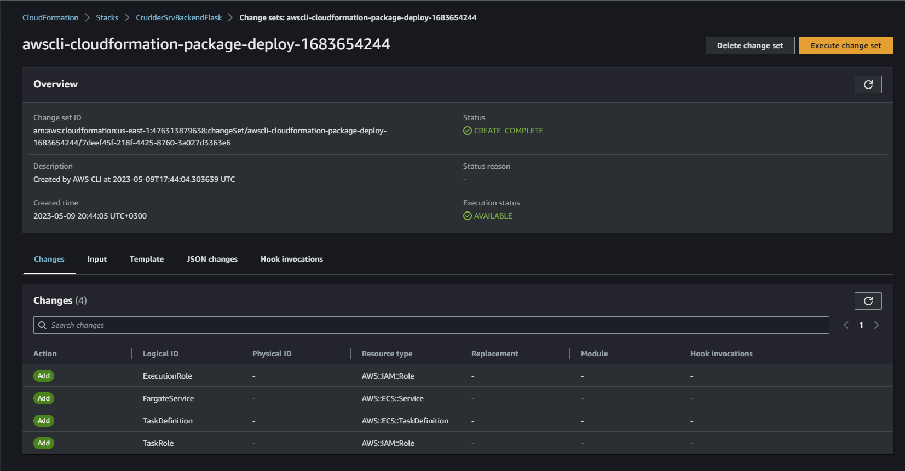
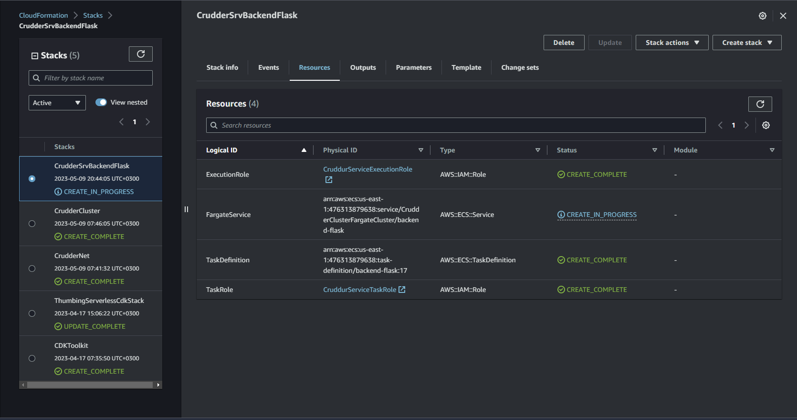

# Week 11 — CloudFormation Part 2

## AWS CloudFormation Backend-Flask Service Layer

See the cloudformation implementation for the service template [here](../aws/cfn/service/template.yaml)


This is a CloudFormation service template for deploying an AWS Fargate service. It defines various parameters and resources necessary for creating the service. Let's go through the template:

- The `AWSTemplateFormatVersion` specifies the CloudFormation version to use for the template.
- The `Description` provides a brief description of the template and its components.
- The `Parameters` section defines input parameters for the template that can be passed in at deployment time. These include networking and cluster stacks, service CPU and memory, container and task names, environment variables, and secrets.
- The `Resources` section defines the AWS resources to be created. In this case, it creates an ECS Fargate service and a task definition.
- The `FargateService` resource defines the ECS service configuration. It specifies the ECS cluster, Fargate launch type, desired count, and load balancer target group. It also defines the network configuration for the service, including subnets and security groups. Additionally, it specifies the service discovery configuration, including the service name, port name, and client aliases.
- The `TaskDefinition` resource defines the task definition for the ECS service. It specifies the task family, execution role, and task role. It also defines the container definitions, including the image, name, and essentiality. 

This template is just an example and may require modifications based on the specific requirements of the application being deployed.

**Parameters Section**

```yaml
Parameters:
  NetworkingStack:
    Type: String
    Description: This is our base layer of networking components eg. VPC, Subnets
    Default: CrudderNet
  ClusterStack:
    Type: String
    Description: This is our cluster layer eg. ECS Cluster, ALB
    Default: CrudderCluster
  ContainerPort:
    Type: Number
    Default: 4567
  ServiceCpu:
    Type: String
    Default: "256"
  ServiceMemory:
    Type: String
    Default: "512"
  ServiceName:
    Type: String
    Default: backend-flask
  ContainerName:
    Type: String
    Default: backend-flask
  TaskFamily:
    Type: String
    Default: backend-flask
  EcrImage:
    Type: String
    Default: "476313879638.dkr.ecr.us-east-1.amazonaws.com/backend-flask"
  EnvOtelServiceName:
    Type: String
    Default: backend-flask
  EnvOtelExporterOtlpEndpoint:
    Type: String
    Default: https://api.honeycomb.io
  EnvAWSCognitoUserPoolId:
    Type: String
    Default: us-east-1_Wp3vLvqrG
  EnvCognitoUserPoolClientId:
    Type: String
    Default: 46kqto49s5t8rabgl8gneburbu
  EnvFrontendUrl:
    Type: String
    Default: "https://cruddurcorecodecmdsystems.website"
  EnvBackendUrl:
    Type: String
    Default: "https://api.cruddurcorecodecmdsystems.website"
  SecretsAWSAccessKeyId:
    Type: String
    Default: "arn:aws:ssm:us-east-1:476313879638:parameter/cruddur/backend-flask/AWS_ACCESS_KEY_ID"
  SecretsSecretAccessKey:
    Type: String
    Default: "arn:aws:ssm:us-east-1:476313879638:parameter/cruddur/backend-flask/AWS_SECRET_ACCESS_KEY"
  SecretsDatabaseUrl:
    Type: String
    Default: "arn:aws:ssm:us-east-1:476313879638:parameter/cruddur/backend-flask/DATABASE_URL"
  SecretsRollbarAccessToken:
    Type: String
    Default: "arn:aws:ssm:us-east-1:476313879638:parameter/cruddur/backend-flask/ROLLBAR_ACCESS_TOKEN"
  SecretsOtelExporterOltpHeaders:
    Type: String
    Default: "arn:aws:ssm:us-east-1:476313879638:parameter/cruddur/backend-flask/OTEL_EXPORTER_OTLP_HEADERS"
```

The `Parameters` section in the provided CloudFormation template defines a set of configurable parameters that can be customized at the time of stack creation or update. The section includes several key-value pairs where each key corresponds to a unique identifier for a specific parameter, and the value specifies the default value for that parameter.

Here is a detailed explanation of each parameter in the `Parameters` section:

- `NetworkingStack`: This parameter specifies the name of the stack containing networking resources like VPC, subnets, and other components. The default value is set to `CrudderNet`, but it can be overridden at the time of stack creation or update.

- `ClusterStack`: This parameter specifies the name of the stack containing ECS cluster resources like ECS cluster and ALB. The default value is set to `CrudderCluster`, but it can be overridden at the time of stack creation or update.

- `ContainerPort`: This parameter specifies the port number used by the container to receive traffic. The default value is set to `4567`, but it can be overridden at the time of stack creation or update.

- `ServiceCpu`: This parameter specifies the CPU units to be allocated for the Fargate service. The default value is set to `256`, but it can be overridden at the time of stack creation or update.

- `ServiceMemory`: This parameter specifies the memory units to be allocated for the Fargate service. The default value is set to `512`, but it can be overridden at the time of stack creation or update.

- `ServiceName`: This parameter specifies the name of the Fargate service. The default value is set to `backend-flask`, but it can be overridden at the time of stack creation or update.

- `ContainerName`: This parameter specifies the name of the container used in the Fargate task definition. The default value is set to `backend-flask`, but it can be overridden at the time of stack creation or update.

- `TaskFamily`: This parameter specifies the family name of the Fargate task definition. The default value is set to `backend-flask`, but it can be overridden at the time of stack creation or update.

- `EcrImage`: This parameter specifies the ECR image to be used by the container in the Fargate task definition. The default value is set to `476313879638.dkr.ecr.us-east-1.amazonaws.com/backend-flask`, but it can be overridden at the time of stack creation or update.

- `EnvOtelServiceName`: This parameter specifies the name of the OpenTelemetry service. The default value is set to `backend-flask`, but it can be overridden at the time of stack creation or update.

- `EnvOtelExporterOtlpEndpoint`: This parameter specifies the OTLP endpoint for the OpenTelemetry exporter. The default value is set to `https://api.honeycomb.io`, but it can be overridden at the time of stack creation or update.

- `EnvAWSCognitoUserPoolId`: This parameter specifies the ID of the AWS Cognito user pool. The default value is set to `us-east-1_Wp3vLvqrG`, but it can be overridden at the time of stack creation or update.

- `EnvCognitoUserPoolClientId`: This parameter specifies the client ID of the AWS Cognito user pool. The default value is set to `46kqto49s5t8rabgl8gneburbu`, but it can be overridden at the time of stack creation or update.

- `EnvFrontendUrl`: This parameter specifies the URL of the frontend. The default value is set to `https://cruddurcorecodecmdsystems.website`, but it can be overridden at the time of stack creation or update.

- `EnvBackendUrl`: This parameter specifies the URL of the backend application. The default value is `https://api.cruddurcorecodecmdsystems.website`.

- `SecretsAWSAccessKeyId`: This parameter specifies the SSM parameter name for the AWS access key ID. The default value is `arn:aws:ssm:us-east-1:476313879638:parameter/cruddur/backend-flask/AWS_ACCESS_KEY_ID`.

- `SecretsSecretAccessKey`: This parameter specifies the SSM parameter name for the AWS secret access key. The default value is `arn:aws:ssm:us-east-1:476313879638:parameter/cruddur/backend-flask/AWS_SECRET_ACCESS_KEY`.

- `SecretsDatabaseUrl`: This parameter specifies the SSM parameter name for the database URL. The default value is `arn:aws:ssm:us-east-1:476313879638:parameter/cruddur/backend-flask/DATABASE_URL`.

- `SecretsRollbarAccessToken`: This parameter specifies the SSM parameter name for the Rollbar access token. The default value is `arn:aws:ssm:us-east-1:476313879638:parameter/cruddur/backend-flask/ROLLBAR_ACCESS_TOKEN`

- `SecretsOtelExporterOltpHeaders`: This parameter specifies the SSM parameter name for the OpenTelemetry exporter headers. The default value is `arn:aws:ssm:us-east-1:476313879638:parameter/cruddur/backend-flask/OTEL_EXPORTER_OTLP_HEADERS`

**FargetService Resource**

```yaml
FargateService:
    # https://docs.aws.amazon.com/AWSCloudFormation/latest/UserGuide/aws-resource-ecs-service.html
    Type: AWS::ECS::Service
    Properties:
      Cluster:
        Fn::ImportValue: !Sub "${ClusterStack}ClusterName"
      DeploymentController:
        Type: ECS
      DesiredCount: 1
      EnableECSManagedTags: true
      EnableExecuteCommand: true
      HealthCheckGracePeriodSeconds: 0
      LaunchType: FARGATE
      LoadBalancers:
        - TargetGroupArn:
            Fn::ImportValue: !Sub "${ClusterStack}BackendTGArn"
          ContainerName: "backend-flask"
          ContainerPort: !Ref ContainerPort
      NetworkConfiguration:
        AwsvpcConfiguration:
          AssignPublicIp: ENABLED
          SecurityGroups:
            - Fn::ImportValue: !Sub "${ClusterStack}ServiceSecurityGroupId"
          Subnets:
            Fn::Split:
              - ","
              - Fn::ImportValue: !Sub "${NetworkingStack}PublicSubnetIds"
      PlatformVersion: LATEST
      PropagateTags: SERVICE
      ServiceConnectConfiguration:
        Enabled: true
        Namespace: "cruddur"
        # TODO - If you want to log
        # LogConfiguration
        Services:
          - DiscoveryName: backend-flask
            PortName: backend-flask
            ClientAliases:
              - Port: !Ref ContainerPort
      #ServiceRegistries:
      #  - RegistryArn: !Sub 'arn:aws:servicediscovery:${AWS::Region}:${AWS::AccountId}:service/srv-cruddur-backend-flask'
      #    Port: !Ref ContainerPort
      #    ContainerName: 'backend-flask'
      #    ContainerPort: !Ref ContainerPort
      ServiceName: !Ref ServiceName
      TaskDefinition: !Ref TaskDefinition
```

The `FargateService` section under resources defines an Amazon ECS service using the Fargate launch type. 

Here is a breakdown of the properties defined in this section:

- `Type: AWS::ECS::Service`: This indicates that the resource being defined is an Amazon ECS service.

- `Cluster: Fn::ImportValue: !Sub "${ClusterStack}ClusterName"`: This specifies the Amazon ECS cluster name where the service should be deployed. The cluster name is retrieved from the output of another CloudFormation stack by using the `Fn::ImportValue` function.

- `DeploymentController: Type: ECS`: This specifies the type of deployment controller to use for the service. In this case, it is set to `ECS`.

- `DesiredCount: 1`: This sets the number of tasks that should be running in the service. In this case, it is set to 1.

- `EnableECSManagedTags: true`: This enables Amazon ECS to manage the resource tags for the service.

- `EnableExecuteCommand: true`: This enables the use of the ECS ExecuteCommand feature to run commands in a container.

- `HealthCheckGracePeriodSeconds: 0`: This sets the grace period for the health check of the container. In this case, it is set to 0.

- `LaunchType: FARGATE`: This specifies the launch type to use for the service. In this case, it is set to `FARGATE`.

- `LoadBalancers: ...`: This specifies the load balancer to use for the service. It includes the Target Group ARN, container name, and container port.

- `NetworkConfiguration: ...`: This specifies the network configuration to use for the service. It includes the VPC subnets and security group to use.

- `PlatformVersion: LATEST`: This specifies the latest version of the Fargate platform to use for the service.

- `PropagateTags: SERVICE`: This specifies that the service tags should be propagated to tasks and containers.

- `ServiceConnectConfiguration: ...`: This specifies the service discovery settings for the service. It includes the namespace, discovery name, and client aliases.

- `ServiceName: !Ref ServiceName`: This specifies the name of the service.

- `TaskDefinition: !Ref TaskDefinition`: This specifies the task definition to use for the service. It references the `TaskDefinition` resource defined earlier in the CloudFormation template.

**TaskDefinition Resource**

```yaml
TaskDefinition:
    # https://docs.aws.amazon.com/AWSCloudFormation/latest/UserGuide/aws-resource-ecs-taskdefinition.html
    Type: "AWS::ECS::TaskDefinition"
    Properties:
      Family: !Ref TaskFamily
      ExecutionRoleArn: !GetAtt ExecutionRole.Arn
      TaskRoleArn: !GetAtt TaskRole.Arn
      NetworkMode: "awsvpc"
      Cpu: !Ref ServiceCpu
      Memory: !Ref ServiceMemory
      RequiresCompatibilities:
        - "FARGATE"
      ContainerDefinitions:
        - Name: "xray"
          Image: "public.ecr.aws/xray/aws-xray-daemon"
          Essential: true
          User: "1337"
          PortMappings:
            - Name: "xray"
              ContainerPort: 2000
              Protocol: "udp"
        - Name: "backend-flask"
          Image: !Ref EcrImage
          Essential: true
          HealthCheck:
            Command:
              - "CMD-SHELL"
              - "python /backend-flask/bin/health-check"
            Interval: 30
            Timeout: 5
            Retries: 3
            StartPeriod: 60
          PortMappings:
            - Name: !Ref ContainerName
              ContainerPort: !Ref ContainerPort
              Protocol: "tcp"
              AppProtocol: "http"
          LogConfiguration:
            LogDriver: "awslogs"
            Options:
              awslogs-group: "cruddur"
              awslogs-region: !Ref AWS::Region
              awslogs-stream-prefix: !Ref ServiceName
          Environment:
            - Name: "OTEL_SERVICE_NAME"
              Value: !Ref EnvOtelServiceName
            - Name: "OTEL_EXPORTER_OTLP_ENDPOINT"
              Value: !Ref EnvOtelExporterOtlpEndpoint
            - Name: "AWS_COGNITO_USER_POOL_ID"
              Value: !Ref EnvAWSCognitoUserPoolId
            - Name: "AWS_COGNITO_USER_POOL_CLIENT_ID"
              Value: !Ref EnvCognitoUserPoolClientId
            - Name: "FRONTEND_URL"
              Value: !Ref EnvFrontendUrl
            - Name: "BACKEND_URL"
              Value: !Ref EnvBackendUrl
            - Name: "AWS_DEFAULT_REGION"
              Value: !Ref AWS::Region
          Secrets:
            - Name: "AWS_ACCESS_KEY_ID"
              ValueFrom: !Ref SecretsAWSAccessKeyId
            - Name: "AWS_SECRET_ACCESS_KEY"
              ValueFrom: !Ref SecretsSecretAccessKey
            - Name: "DATABASE_URL"
              ValueFrom: !Ref SecretsDatabaseUrl
            - Name: "ROLLBAR_ACCESS_TOKEN"
              ValueFrom: !Ref SecretsRollbarAccessToken
            - Name: "OTEL_EXPORTER_OTLP_HEADERS"
              ValueFrom: !Ref SecretsOtelExporterOltpHeaders
  ExecutionRole:
    # https://docs.aws.amazon.com/AWSCloudFormation/latest/UserGuide/aws-resource-iam-role.html
    Type: AWS::IAM::Role
    Properties:
      RoleName: CruddurServiceExecutionRole
      AssumeRolePolicyDocument:
        Version: "2012-10-17"
        Statement:
          - Effect: "Allow"
            Principal:
              Service: "ecs-tasks.amazonaws.com"
            Action: "sts:AssumeRole"
      Policies:
        - PolicyName: "cruddur-execution-policy"
          PolicyDocument:
            Version: "2012-10-17"
            Statement:
              - Sid: "VisualEditor0"
                Effect: "Allow"
                Action:
                  - "ecr:GetAuthorizationToken"
                  - "ecr:BatchCheckLayerAvailability"
                  - "ecr:GetDownloadUrlForLayer"
                  - "ecr:BatchGetImage"
                  - "logs:CreateLogStream"
                  - "logs:PutLogEvents"
                Resource: "*"
              - Sid: "VisualEditor1"
                Effect: "Allow"
                Action:
                  - "ssm:GetParameters"
                  - "ssm:GetParameter"
                Resource: !Sub "arn:aws:ssm:${AWS::Region}:${AWS::AccountId}:parameter/cruddur/${ServiceName}/*"
      ManagedPolicyArns:
        - arn:aws:iam::aws:policy/CloudWatchLogsFullAccess
```

The `TaskDefinition` section under `Resources` in this AWS CloudFormation template defines the task definition for the Fargate service that is being created. A task definition is a blueprint that describes the container and task configuration required to run a single instance of a task in Amazon ECS. 

The `Type` property specifies the type of AWS resource, which in this case is an `AWS::ECS::TaskDefinition`.

The `Properties` section contains various properties that define the task definition. 

- `Family`: Specifies the name of the family to which the task definition belongs, which is a string value and is specified in the `TaskFamily` parameter. 
- `ExecutionRoleArn`: Specifies the Amazon Resource Name (ARN) of the task execution role that grants the Amazon ECS container agent permission to make AWS API calls on your behalf. The ARN is obtained by calling the `!GetAtt` intrinsic function with the logical ID of the `ExecutionRole` resource, which is defined later in the CloudFormation template.
- `TaskRoleArn`: Specifies the ARN of the IAM role that the task requires to execute. The ARN is obtained by calling the `!GetAtt` intrinsic function with the logical ID of the `TaskRole` resource, which is defined later in the CloudFormation template.
- `NetworkMode`: Specifies the network mode to use for the task. In this case, `awsvpc` is specified, which is the recommended network mode for Fargate tasks.
- `Cpu`: Specifies the number of CPU units to reserve for the container. The value is obtained from the `ServiceCpu` parameter.
- `Memory`: Specifies the amount of memory (in MiB) to allocate to the container. The value is obtained from the `ServiceMemory` parameter.
- `RequiresCompatibilities`: Specifies the compatibility requirements for the task. In this case, `FARGATE` is specified, which means that the task can only run on AWS Fargate.
- `ContainerDefinitions`: Specifies an array of container definitions for the task. In this case, there is only one container definition, which is for the `backend-flask` container. 

  - `Name`: Specifies the name of the container, which is `backend-flask`.
  - `Image`: Specifies the Docker image to use for the container. The value is obtained from the `EcrImage` parameter.
  - `Essential`: Specifies whether the container is essential. In this case, `true` is specified, which means that if the container fails, the task fails.
  - `PortMappings`: Specifies an array of port mappings for the container. In this case, there is only one port mapping, which maps the container port to the host port. The container port is obtained from the `ContainerPort` parameter.
  - `Environment`: Specifies an array of environment variables for the container. In this case, there are several environment variables, such as `EnvOtelServiceName` and `EnvAWSCognitoUserPoolId`, which are obtained from the corresponding CloudFormation parameters.
  - `Secrets`: Specifies an array of secrets for the container. In this case, there are several secrets, such as `SecretsAWSAccessKeyId` and `SecretsSecretAccessKey`, which are obtained from the corresponding AWS Secrets Manager parameters.


**ExecutionRole Resource**

```yaml
ExecutionRole:
    # https://docs.aws.amazon.com/AWSCloudFormation/latest/UserGuide/aws-resource-iam-role.html
    Type: AWS::IAM::Role
    Properties:
      RoleName: CruddurServiceExecutionRole
      AssumeRolePolicyDocument:
        Version: "2012-10-17"
        Statement:
          - Effect: "Allow"
            Principal:
              Service: "ecs-tasks.amazonaws.com"
            Action: "sts:AssumeRole"
      Policies:
        - PolicyName: "cruddur-execution-policy"
          PolicyDocument:
            Version: "2012-10-17"
            Statement:
              - Sid: "VisualEditor0"
                Effect: "Allow"
                Action:
                  - "ecr:GetAuthorizationToken"
                  - "ecr:BatchCheckLayerAvailability"
                  - "ecr:GetDownloadUrlForLayer"
                  - "ecr:BatchGetImage"
                  - "logs:CreateLogStream"
                  - "logs:PutLogEvents"
                Resource: "*"
              - Sid: "VisualEditor1"
                Effect: "Allow"
                Action:
                  - "ssm:GetParameters"
                  - "ssm:GetParameter"
                Resource: !Sub "arn:aws:ssm:${AWS::Region}:${AWS::AccountId}:parameter/cruddur/${ServiceName}/*"
      ManagedPolicyArns:
        - arn:aws:iam::aws:policy/CloudWatchLogsFullAccess
```

The `ExecutionRole` section under `Resources` in this AWS CloudFormation service template defines an IAM role that will be assumed by the ECS task execution IAM role to grant permissions required for running the ECS task. The ECS task execution IAM role is used by the Amazon ECS service to run the containers in the task definition.

The `ExecutionRole` resource has a type of `AWS::IAM::Role`. It has a `Path` property that specifies the path for the role's ARN. The `AssumeRolePolicyDocument` property is used to define the permissions that allow the ECS task execution IAM role to assume this role. The `PolicyDocument` property defines the permissions that are granted to this role. 

In this template, the `ExecutionRole` resource has a `Path` property set to `/`. The `AssumeRolePolicyDocument` property is defined using an AWS policy language that allows the ECS task execution IAM role to assume this role. Specifically, the policy allows any AWS service to assume this role if the service includes `ecs-tasks.amazonaws.com` in its `Service` field.

The `PolicyDocument` property of the `ExecutionRole` resource defines permissions for the execution role. This policy allows the ECS task to write logs to CloudWatch Logs, pull Docker images from the Amazon ECR repository, and perform Amazon SSM operations to retrieve secrets from the AWS Systems Manager Parameter Store. It also includes permissions to allow the ECS task to send tracing information to AWS X-Ray.

In summary, the `ExecutionRole` section in this template is creating an IAM role that grants permissions to the ECS task execution IAM role to assume the role, and to perform necessary actions like writing logs, pulling Docker images, and retrieving secrets.


**TaskRole Resource**

```yaml
TaskRole:
    # https://docs.aws.amazon.com/AWSCloudFormation/latest/UserGuide/aws-resource-iam-role.html
    Type: AWS::IAM::Role
    Properties:
      RoleName: CruddurServiceTaskRole
      AssumeRolePolicyDocument:
        Version: "2012-10-17"
        Statement:
          - Effect: "Allow"
            Principal:
              Service: "ecs-tasks.amazonaws.com"
            Action: "sts:AssumeRole"
      Policies:
        - PolicyName: "cruddur-task-policy"
          PolicyDocument:
            Version: "2012-10-17"
            Statement:
              - Sid: "VisualEditor0"
                Effect: "Allow"
                Action:
                  - ssmmessages:CreateControlChannel
                  - ssmmessages:CreateDataChannel
                  - ssmmessages:OpenControlChannel
                  - ssmmessages:OpenDataChannel
                Resource: "*"
      ManagedPolicyArns:
        - arn:aws:iam::aws:policy/CloudWatchLogsFullAccess
        - arn:aws:iam::aws:policy/AWSXRayDaemonWriteAccess
```

In the provided CloudFormation service template, the `TaskRole` section under `Resources` defines an AWS Identity and Access Management (IAM) role that is used by the tasks launched by the ECS service to perform specific operations or access specific resources during their execution. 

Here is a breakdown of the properties and their functions:

- `Type`: The AWS CloudFormation resource type being created, which is `AWS::IAM::Role`.

- `Properties`: The properties for the `AWS::IAM::Role` resource.

  - `AssumeRolePolicyDocument`: A required property that specifies the permissions that the task role grants to the ECS task execution role to assume the task role. 

  - `Path`: An optional property that specifies the path in the IAM hierarchy where the role is created.

  - `Policies`: An optional property that specifies the policies that are attached to the role. 

    - `PolicyName`: The name of the policy. 

    - `PolicyDocument`: A JSON document that contains the permissions that are granted to the role.

In this template, the `TaskRole` resource allows the ECS tasks launched by the Fargate service to access the AWS Systems Manager (SSM) parameters that contain sensitive information, such as access keys and secrets, without granting them permissions to access the SSM service itself. The policy attached to the `TaskRole` resource grants permissions to read the specific SSM parameters containing the sensitive information. 

Overall, the `TaskRole` resource plays an important role in ensuring the security and integrity of the AWS resources accessed by the ECS tasks launched by the Fargate service.


**Deploying the Service layer**

```sh
./bin/cfn/service-deploy
```

Cloudfromation Service stack change set



Resources created after executing change-set


