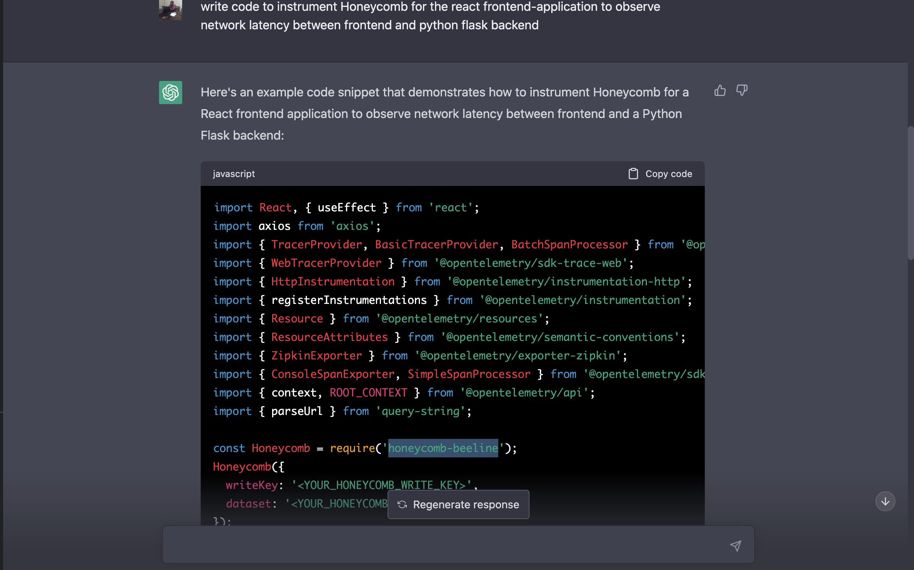
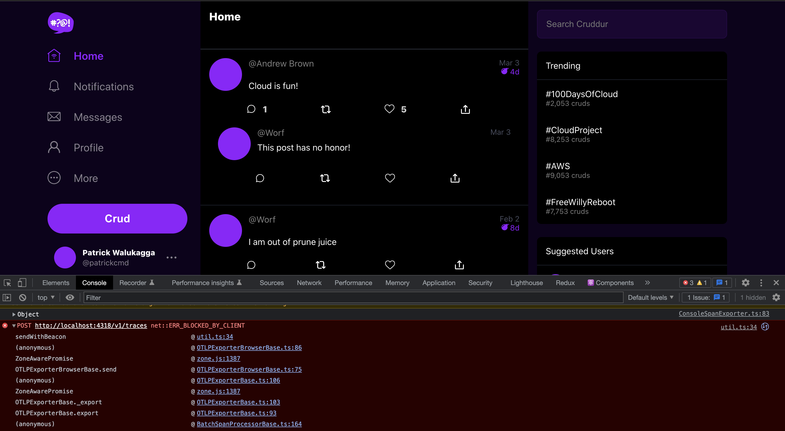

# Week 2 — Distributed Tracing

- Followed instructor's journal [here](https://github.com/omenking/aws-bootcamp-cruddur-2023/blob/week-2/journal/week2.md) and week-2 playlist to implement distributed tracing with different third parties, honeycomb, rollbar, aws cloudwatch logs and aws x-ray.
- Went through and read [Olley's blog](https://olley.hashnode.dev/aws-free-cloud-bootcamp-instrumenting-aws-x-ray-subsegments) to see how to implement AWS X-Ray segments and subsegments.

## Homework Challenges

### Instrument Honeycomb for the frontend-application to observe network latency between frontend and backend

I read through the honeycomb documentation on how to configure instrumentation for frontend-browser applications. I was able to configure and initialize the OpenTelemetry. I can see the trace objects sent in my console, though the dataset is not being sent to honeycomb. I get this error `POST http://localhost:4318/v1/traces net::ERR_BLOCKED_BY_CLIENT`.

- For setup and initialization I followed the instructions [here](https://docs.honeycomb.io/getting-data-in/opentelemetry/browser-js/) or also under your environment send data link.
- Also referenced a blog [here](https://blog.devgenius.io/measuring-react-performance-with-opentelemetry-and-honeycomb-2b20a7920335)
- Also did some research with the chatgpt openai to get a rough setup of honeycomb instrumentation for frontend applications.







#### Installing OpenTelemetry libraries for javascript

```sh
npm install --save \
    @opentelemetry/api \
    @opentelemetry/sdk-trace-web \
    @opentelemetry/exporter-trace-otlp-http \
    @opentelemetry/context-zone
```

```sh
npm install --save \
    @opentelemetry/instrumentation-xml-http-request \
    @opentelemetry/instrumentation-fetch \
    @opentelemetry/instrumentation-document-load \
    @opentelemetry/instrumentation-user-interaction \
    @opentelemetry/instrumentation-long-task \
```

- See [traceProvider.js](../frontend-react-js/src/traceProvider.js) for my implementation of trace provider for the honeycomb instrumentation on frontend.

- Also see [otel-collector-config.yaml](../frontend-react-js/src/otel-collector-config.yaml) for the implementation of my [OpenTelemetry Collector](https://docs.honeycomb.io/getting-data-in/otel-collector/) and you can find an example for honeycomb [here](https://aws-otel.github.io/docs/components/otlp-exporter#honeycomb)
