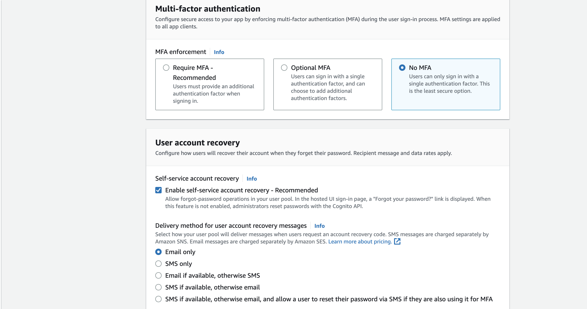
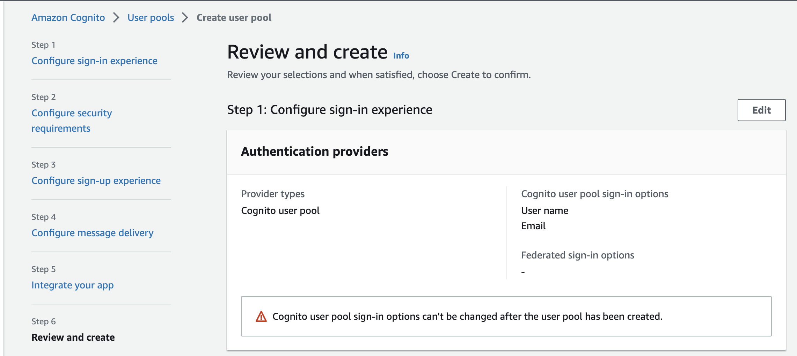
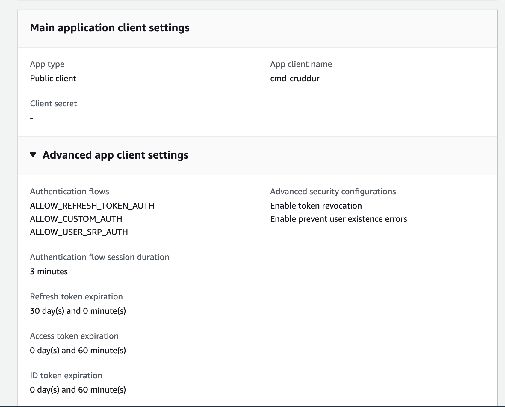
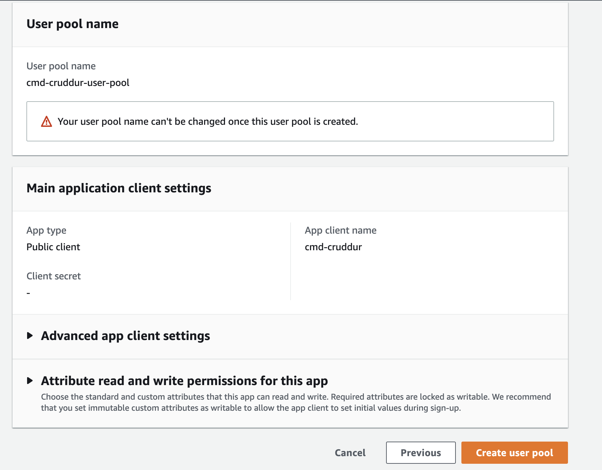

# Week 3 — Decentralized Authentication

## Setting up AWS Cognito and AWS User Pool via Web Console













Export these environment variables and also export them to the gitpod environment.

```sh
export AWS_USER_POOL_ID="us-east-1_ZpwVxxxx"
export AWS_APP_CLIENT_ID="40th30ihk7eoo34augvxxxxxxx"
gp env AWS_USER_POOL_ID=${AWS_USER_POOL_ID}
gp env AWS_APP_CLIENT_ID=${AWS_APP_CLIENT_ID}
```

Add the environment variables to the `frontend-react-js` service in the `docker-compose` file.

```sh
REACT_APP_AWS_PROJECT_REGION: ${AWS_DEFAULT_REGION}
REACT_APP_AWS_COGNITO_REGION: ${AWS_DEFAULT_REGION}
REACT_APP_AWS_USER_POOLS_ID: ${AWS_USER_POOL_ID}
REACT_APP_CLIENT_ID: ${AWS_APP_CLIENT_ID}
REACT_APP_AWS_USER_POOLS_WEB_CLIENT_ID: ${AWS_APP_CLIENT_ID}
```

Force password change AWS Cognito via aws cli

```sh
aws cognito-idp admin-set-user-password \
  --user-pool-id ${AWS_USER_POOL_ID} \
  --username patrickcmd \
  --password <password> \
  --permanent
```