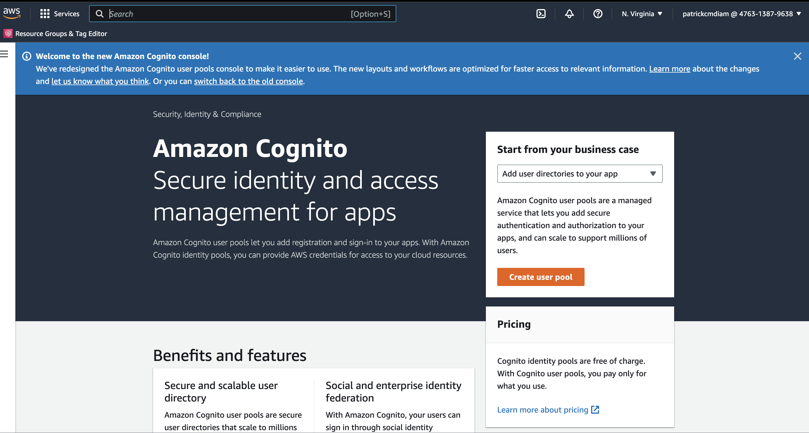
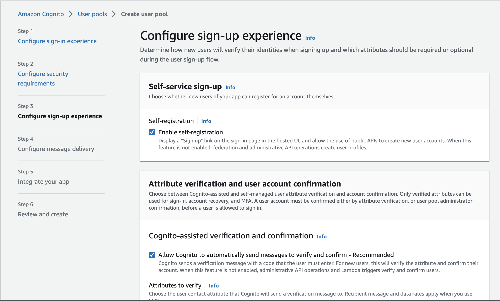
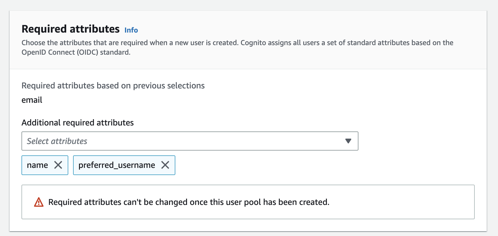

# Week 3 — Decentralized Authentication

Followed instructors's journal [here](https://github.com/omenking/aws-bootcamp-cruddur-2023/blob/week-3/journal/week3.md) and course playlist to be able to finish decentralized authentication.

## Setting up AWS Cognito and AWS User Pool via Web Console

### Install AWS Amplify

```sh
cd frontend-react-js
npm i aws-amplify --save
cd ../
```

### Provision Cognito User Group

Using the AWS Console to create a Cognito User Group










## Configure Amplify

Export these environment variables and also export them to the gitpod environment.

```sh
export AWS_USER_POOL_ID="us-east-1_ZpwVxxxx"
export AWS_APP_CLIENT_ID="40th30ihk7eoo34augvxxxxxxx"
gp env AWS_USER_POOL_ID=${AWS_USER_POOL_ID}
gp env AWS_APP_CLIENT_ID=${AWS_APP_CLIENT_ID}
```

Add the environment variables to the `frontend-react-js` service in the [docker-compose](../docker-compose.yml) file.

```sh
REACT_APP_AWS_PROJECT_REGION: ${AWS_DEFAULT_REGION}
REACT_APP_AWS_COGNITO_REGION: ${AWS_DEFAULT_REGION}
REACT_APP_AWS_USER_POOLS_ID: ${AWS_USER_POOL_ID}
REACT_APP_CLIENT_ID: ${AWS_APP_CLIENT_ID}
REACT_APP_AWS_USER_POOLS_WEB_CLIENT_ID: ${AWS_APP_CLIENT_ID}
```

Configure cognito amplify in [app.js](../frontend-react-js/src/App.js)

```js
import { Amplify } from 'aws-amplify';

Amplify.configure({
  "AWS_PROJECT_REGION": process.env.REACT_APP_AWS_PROJECT_REGION,
  "aws_cognito_region": process.env.REACT_APP_AWS_COGNITO_REGION,
  "aws_user_pools_id": process.env.REACT_APP_AWS_USER_POOLS_ID,
  "aws_user_pools_web_client_id": process.env.REACT_APP_CLIENT_ID,
  "oauth": {},
  Auth: {
    // We are not using an Identity Pool
    // identityPoolId: process.env.REACT_APP_IDENTITY_POOL_ID, // REQUIRED - Amazon Cognito Identity Pool ID
    region: process.env.REACT_APP_AWS_PROJECT_REGION,           // REQUIRED - Amazon Cognito Region
    userPoolId: process.env.REACT_APP_AWS_USER_POOLS_ID,         // OPTIONAL - Amazon Cognito User Pool ID
    userPoolWebClientId: process.env.REACT_APP_AWS_USER_POOLS_WEB_CLIENT_ID,   // OPTIONAL - Amazon Cognito Web Client ID (26-char alphanumeric string)
  }
});
```

### Conditionally show components based on logged in or logged out

Update the [HomeFeedPage.js](../frontend-react-js/src/pages/HomeFeedPage.js) to show certain content when user is logged.

```js
import { Amplify } from 'aws-amplify';

// check if we are authenicated
  const checkAuth = async () => {
    Auth.currentAuthenticatedUser({
      // Optional, By default is false. 
      // If set to true, this call will send a 
      // request to Cognito to get the latest user data
      bypassCache: false
    })
      .then((user) => {
        console.log('user', user);
        return Auth.currentAuthenticatedUser()
      }).then((cognito_user) => {
        setUser({
          display_name: cognito_user.attributes.name,
          handle: cognito_user.attributes.preferred_username
        })
      })
      .catch((err) => console.log(err));
  };
```

Updated `SignOut` in [ProfileInfo.js](../frontend-react-js/src/components/ProfileInfo.js) component to Cognito Amplify.

```js
import { Amplify } from 'aws-amplify';

const signOut = async () => {
    try {
        await Auth.signOut({ global: true });
        window.location.href = "/"
    } catch (error) {
        console.log('error signing out: ', error);
    }
  }
```

Force `password change` in AWS Cognito user pool via aws cli to be to test out the sign in process

- Stackoverflow reference [here](https://stackoverflow.com/questions/40287012/how-to-change-user-status-force-change-password)

```sh
aws cognito-idp admin-set-user-password \
  --user-pool-id ${AWS_USER_POOL_ID} \
  --username patrickcmd \
  --password <password> \
  --permanent
```


Also Edit user's `name` and `preferred_username` to be able to display them on frontend


Updated the [SigninPage](../frontend-react-js/src/pages/SigninPage.js) to use cognito amplify

```js
import { Auth } from 'aws-amplify';

const onsubmit = async (event) => {
    setErrors('')
    event.preventDefault();
    Auth.signIn(email, password)
      .then(user => {
        console.log(`User: ${user}`);
        localStorage.setItem("access_token", user.signInUserSession.accessToken.jwtToken)
        window.location.href = "/"
      })
      .catch(error => {
        if (error.code == 'UserNotConfirmedException') {
          window.location.href = "/confirm"
        }
        setErrors(error.message)
      });
    return false
  }
```


After completing the signin test, I disable and delete the user from the user pool so as to have the entire process be done from the client(`frontend-application`).

Updated the [SignupPage](../frontend-react-js/src/pages/SignupPage.js) to use `Cognito Amplify` when signing up a user.

```js
import { Auth } from 'aws-amplify';

const onsubmit = async (event) => {
    event.preventDefault();
    setErrors('')
    try {
      const { user } = await Auth.signUp({
        username: email,
        password: password,
        attributes: {
          name: name,
          email: email,
          preferred_username: username,
        },
        autoSignIn: { // optional - enables auto sign in after user is confirmed
          enabled: true,
        }
      });
      console.log(user);
      window.location.href = `/confirm?email=${email}`
    } catch (error) {
      console.log(error);
      setErrors(error.message)
    }
    return false
  }
```


Update the [Confirmation Page](../frontend-react-js/src/pages/ConfirmationPage.js) to use `cognito amplify` to confirm and verify user with the send verification code via email after sign up.

```js
const resend_code = async (event) => {
    setErrors('')
    try {
      await Auth.resendSignUp(email);
      console.log('code resent successfully');
      setCodeSent(true)
    } catch (err) {
      // does not return a code
      // does cognito always return english
      // for this to be an okay match?
      console.log(err)
      if (err.message == 'Username cannot be empty') {
        setErrors("You need to provide an email in order to send Resend Activiation Code")
      } else if (err.message == "Username/client id combination not found.") {
        setErrors("Email is invalid or cannot be found.")
      }
    }
  }

  const onsubmit = async (event) => {
    event.preventDefault();
    setErrors('')
    try {
      await Auth.confirmSignUp(email, code);
      window.location.href = "/"
    } catch (error) {
      setErrors(error.message)
    }
    return false
  }
```


Updated the [Recover page](../frontend-react-js/src/pages/RecoverPage.js) for a user to be able to reset forgotten password.

```js
const onsubmit_send_code = async (event) => {
  event.preventDefault();
  setErrors('')
  Auth.forgotPassword(username)
    .then((data) => setFormState('confirm_code'))
    .catch((err) => setErrors(err.message));
  return false
}

const onsubmit_confirm_code = async (event) => {
  event.preventDefault();
  setErrors('')
  if (password == passwordAgain) {
    Auth.forgotPasswordSubmit(username, code, password)
      .then((data) => setFormState('success'))
      .catch((err) => setErrors(err.message));
  } else {
    setErrors('Passwords do not match')
  }
  return false
}
```


Then test the complete sign in process to see that everything works as expected.


