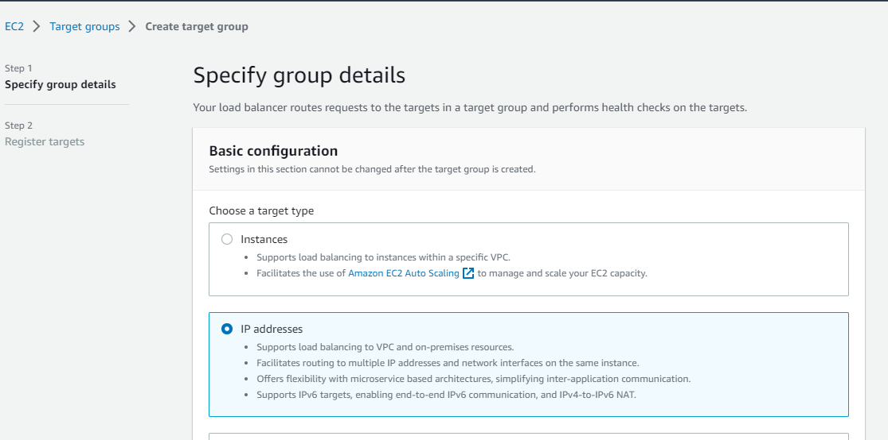
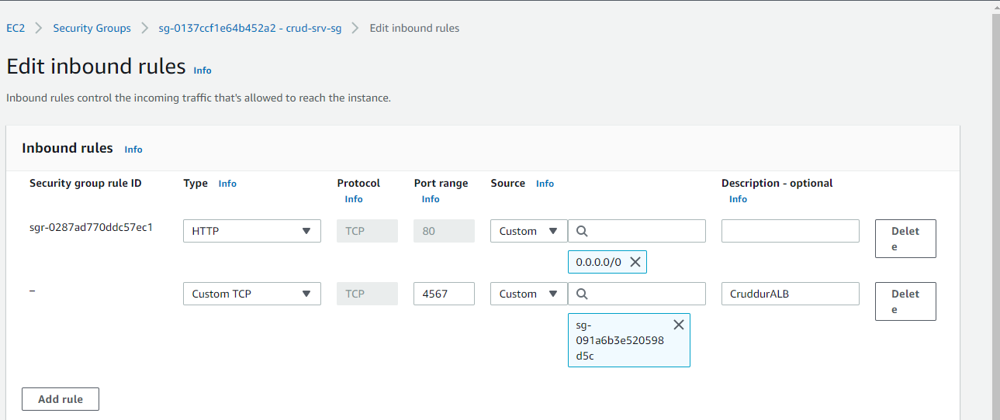

# Week 6 — Deploying Containers (Serverless Containers)

## AWS Containers

### Types of Container Services in AWS
1. Virtual Machines: Hosting containers in avirtual server (EC2)
2. Managed services
    - Amazon ECS (Elastic Container Service)
    - Fargate
    _ Amazon EKS (Elastic Kubernetes Service)

## Deploying an Application to a Container using AWS ECS
### Types of Launch types to AWS ECS
- Amazon EC2 architecture
- Amazon ECS architecture
- Fargate (serveless architecture)

### Amazon ECS Security Best Practices - AWS

**Resource**: https://www.youtube.com/watch?v=zz2FQAk1I28&list=PLBfufR7vyJJ7k25byhRXJldB5AiwgNnWv&index=58

- Cloud Control Plane Configuration - Access Control, Container Images etc
- Choosing the right Public or Private ECR for images.
- Amazon ECR Scan Images to `Scan on Push` using Basic or Enhanced(Inspector + Snyk)
- Use VPC Endpoints or Security Groups with known sources only
- Amazon Organizations SCP - to manage ECS Task deletion, ECS creation, region lock etc
- AWS CloudTrail is enabled and monitored to trigger alerts on malicious ECS behaviour by an identity in AWS.
- AWS Config Rules (as no GuardDuty (ECS) even in Mar'2023) is enabled in the account and region of ECS

### Amazon ECS Security Best Practices - Application
- Access Control - Roles or IAM Users for ECS Clusters/Services/Tasks
- Most recent version of ECR Agent daemon on EC@
- Container Control Plane Configuration - Root privileges, resource limitations etc
- No secrets/passwords in ECS Task Definitions e.d db password etc - Consider AWS Secret Manager
- Only use Trusted Containers from ECR with no HIGH/CRITICAL Vulnerabilities
- Limit ability to ssh into EC2 container to read only file systems - use APIs or GitOps to pull information for troubleshooting
- Amazon CloudWatch to monitor Malicious ECS Configuration Changes
- Only using Authorized Container Images (hopefully some Image signing in the future e.g sigstore)

## Test RDS Connecetion
Add this `test` script into `db` so we can easily check our connection from our container.

```python
#!/usr/bin/env python3

import psycopg
import os
import sys

connection_url = os.getenv("CONNECTION_URL")

conn = None
try:
  print('attempting connection')
  conn = psycopg.connect(connection_url)
  print("Connection successful!")
except psycopg.Error as e:
  print("Unable to connect to the database:", e)
finally:
  conn.close()
```

Make file executable and test with production RDS instance

```sh
cd ${THEIA_WORKSPACE_ROOT}/backend-flask
chmod u+x bin/db/test
./bin/db/test
cd $THEIA_WORKSPACE_ROOT
```

## Task Flask Script
Add the health-check endpoint for the flask app. See [app.py](../backend-flask/app.py)

```python
@app.route('/api/health-check')
def health_check():
  return {'success': True}, 200
```

Create a new bin script at `backend/bin/flask/health-check` for performing health checks against the backend flask app.

```python
#!/usr/bin/env python3

import urllib.request

response = urllib.request.urlopen('http://localhost:4567/api/health-check')
if response.getcode() == 200:
  print("[OK] Flask server is running")
  exit(0) # success
else:
  print("[BAD] Flask server is not running")
  exit(1) # false
```

Make file executable and test with production RDS instance

```sh
cd ${THEIA_WORKSPACE_ROOT}/backend-flask
chmod u+x bin/flask/health-check
./bin/flask/health-check
cd $THEIA_WORKSPACE_ROOT
```

**Output**
```
gitpod /workspace/aws-bootcamp-cruddur-2023 (week-6) $ ./backend-flask/bin/flask/health-check 
[OK] Flask server is running
gitpod /workspace/aws-bootcamp-cruddur-2023 (week-6)
```

## Create CloudWatch Log Group
```sh
aws logs create-log-group --log-group-name cruddur
aws logs put-retention-policy --log-group-name cruddur --retention-in-days 1
```

## Create ECS Cluster

```sh
aws ecs create-cluster \
--cluster-name cruddur \
--service-connect-defaults namespace=cruddur
```

**Output**

```
gitpod /workspace/aws-bootcamp-cruddur-2023 (week-6) $ aws ecs create-cluster --cluster-name cruddur --service-connect-defaults namespace=cruddur
{
    "cluster": {
        "clusterArn": "arn:aws:ecs:us-east-1:476313879638:cluster/cruddur",
        "clusterName": "cruddur",
        "status": "PROVISIONING",
        "registeredContainerInstancesCount": 0,
        "runningTasksCount": 0,
        "pendingTasksCount": 0,
        "activeServicesCount": 0,
        "statistics": [],
        "tags": [],
        "settings": [
            {
                "name": "containerInsights",
                "value": "disabled"
            }
        ],
        "capacityProviders": [],
        "defaultCapacityProviderStrategy": [],
        "attachments": [
            {
                "id": "d23cd9fb-ea6b-46e8-bb7d-25b3dfcf909d",
                "type": "sc",
                "status": "ATTACHING",
                "details": []
            }
        ],
        "attachmentsStatus": "UPDATE_IN_PROGRESS",
        "serviceConnectDefaults": {
            "namespace": "arn:aws:servicediscovery:us-east-1:476313879638:namespace/ns-v2krcvqtelpmtvtb"
        }
    }
}
gitpod /workspace/aws-bootcamp-cruddur-2023 (week-6) $ 
```


## For ECS EC2 launch type we need to perform the next two steps below.

- **But since we are using `fargate` these next two steps can be skipped**

### Create ECS Cluster Security Group (Need for EC2 launch type)

```sh
export CRUDDUR_ECS_CLUSTER_SG=$(aws ec2 create-security-group \
  --group-name cruddur-ecs-cluster-sg \
  --description "Security group for Cruddur ECS ECS cluster" \
  --vpc-id $DEFAULT_VPC_ID \
  --query "GroupId" --output text)
echo $CRUDDUR_ECS_CLUSTER_SG
```

### Get the Security Group ID (after its created) (Need for EC2 launch type)

```sh
export CRUDDUR_ECS_CLUSTER_SG=$(aws ec2 describe-security-groups \
--group-names cruddur-ecs-cluster-sg \
--query 'SecurityGroups[0].GroupId' \
--output text)
```

```sh
gp env CRUDDUR_ECS_CLUSTER_SG=$CRUDDUR_ECS_CLUSTER_SG
```

## Gaining Access to ECS Fargate Container
## Create ECR repo and push image

### For Base-image python

Create ECR repository for python

```sh
aws ecr create-repository \
  --repository-name cruddur-python \
  --image-tag-mutability MUTABLE
```

**Output**
```
gitpod /workspace/aws-bootcamp-cruddur-2023 (week-6) $ aws ecr create-repository \
>   --repository-name cruddur-python \
>   --image-tag-mutability MUTABLE
{
    "repository": {
        "repositoryArn": "arn:aws:ecr:us-east-1:476313879638:repository/cruddur-python",
        "registryId": "476313879638",
        "repositoryName": "cruddur-python",
        "repositoryUri": "476313879638.dkr.ecr.us-east-1.amazonaws.com/cruddur-python",
        "createdAt": "2023-03-31T19:01:47+00:00",
        "imageTagMutability": "MUTABLE",
        "imageScanningConfiguration": {
            "scanOnPush": false
        },
        "encryptionConfiguration": {
            "encryptionType": "AES256"
        }
    }
}
```

### Login to ECR (To be able to push docker containers to ECR)

```sh
aws ecr get-login-password --region $AWS_DEFAULT_REGION | docker login --username AWS --password-stdin "$AWS_ACCOUNT_ID.dkr.ecr.$AWS_DEFAULT_REGION.amazonaws.com"
```

Also created bash script for `ECR` login. Reference at [ecr/login](../backend-flask/bin/ecr/login)

### Set URL
```sh
export ECR_PYTHON_URL="$AWS_ACCOUNT_ID.dkr.ecr.$AWS_DEFAULT_REGION.amazonaws.com/cruddur-python"
echo $ECR_PYTHON_URL
gp env ECR_PYTHON_URL=$ECR_PYTHON_URL
```

### Pull Image from Docker Hub
```sh
docker pull python:3.10-slim-buster
```

### Tag Image
```sh
docker tag python:3.10-slim-buster $ECR_PYTHON_URL:3.10-slim-buster
```

```sh
docker images
```

**Output**
```
476313879638.dkr.ecr.us-east-1.amazonaws.com/cruddur-python   3.10-slim-buster   a8bd408e774a   8 days ago          118MB
python                                                        3.10-slim-buster   a8bd408e774a   8 days ago          118MB
```

### Push Image to ECR
```sh
docker push $ECR_PYTHON_URL:3.10-slim-buster
```

### For Backend Flask
In the backend flask dockerfile update the from to instead of using DockerHub's python image I use my own eg.

> remember to put the :latest tag on the end

### Create Repo
```sh
aws ecr create-repository \
  --repository-name backend-flask \
  --image-tag-mutability MUTABLE
```

### Set URL
```sh
export ECR_BACKEND_FLASK_URL="$AWS_ACCOUNT_ID.dkr.ecr.$AWS_DEFAULT_REGION.amazonaws.com/backend-flask"
echo $ECR_BACKEND_FLASK_URL
gp env ECR_BACKEND_FLASK_URL=$ECR_BACKEND_FLASK_URL
```

### Build Image
```sh
docker build -f ./backend-flask/Dockerfile.prod -t backend-flask-prod ./backend-flask/
```

### Tag Image
```sh
docker tag backend-flask-prod:latest $ECR_BACKEND_FLASK_URL:latest
```

### Push Image
```sh
docker push $ECR_BACKEND_FLASK_URL:latest
```

## Register Task Defintions
### Passing Senstive Data to Task Defintion
- https://docs.aws.amazon.com/AmazonECS/latest/developerguide/specifying-sensitive-data.html 
- https://docs.aws.amazon.com/AmazonECS/latest/developerguide/secrets-envvar-ssm-paramstore.html

```sh
aws ssm put-parameter --type "SecureString" --name "/cruddur/backend-flask/AWS_ACCESS_KEY_ID" --value $AWS_ACCESS_KEY_ID
aws ssm put-parameter --type "SecureString" --name "/cruddur/backend-flask/AWS_SECRET_ACCESS_KEY" --value $AWS_SECRET_ACCESS_KEY
aws ssm put-parameter --type "SecureString" --name "/cruddur/backend-flask/DATABASE_URL" --value $PROD_CONNECTION_URL
aws ssm put-parameter --type "SecureString" --name "/cruddur/backend-flask/ROLLBAR_ACCESS_TOKEN" --value $ROLLBAR_ACCESS_TOKEN
aws ssm put-parameter --type "SecureString" --name "/cruddur/backend-flask/OTEL_EXPORTER_OTLP_HEADERS" --value "x-honeycomb-team=$HONEYCOMB_API_KEY"
```
**Sample Output**
```
gitpod /workspace/aws-bootcamp-cruddur-2023 (week-6) $ aws ssm put-parameter --type "SecureString" --name "/cruddur/backend-flask/AWS_SECRET_ACCESS_KEY" --value $AWS_SECRET_ACCESS_KEY
{
    "Version": 1,
    "Tier": "Standard"
}
gitpod /workspace/aws-bootcamp-cruddur-2023 (week-6) $ aws ssm put-parameter --type "SecureString" --name "/cruddur/backend-flask/DATABASE_URL" --value $PROD_CONNECTION_URL
{
    "Version": 1,
    "Tier": "Standard"
}
```


### Create Task and Exection Roles for Task Defintion
#### Create ExecutionRole

```sh
aws iam create-role \
    --role-name CruddurServiceExecutionRole \
    --assume-role-policy-document "{
  \"Version\":\"2012-10-17\",
  \"Statement\":[{
    \"Action\":[\"sts:AssumeRole\"],
    \"Effect\":\"Allow\",
    \"Principal\":{
      \"Service\":[\"ecs-tasks.amazonaws.com\"]
    }
  }]
}"
```

```sh
aws iam create-role --role-name CruddurServiceExecutionPolicy --assume-role-policy-document "file://aws/policies/service-assume-role-execution-policy.json"
```

```sh
aws iam put-role-policy \
  --policy-name CruddurServiceExecutionPolicy \
  --role-name CruddurServiceExecutionRole \
  --policy-document "file://aws/policies/service-execution-policy.json"
```

```sh
aws iam attach-role-policy --policy-arn POLICY_ARN --role-name CruddurServiceExecutionRole
```

#### Create TaskRole

```sh
aws iam create-role \
    --role-name CruddurTaskRole \
    --assume-role-policy-document "{
  \"Version\":\"2012-10-17\",
  \"Statement\":[{
    \"Action\":[\"sts:AssumeRole\"],
    \"Effect\":\"Allow\",
    \"Principal\":{
      \"Service\":[\"ecs-tasks.amazonaws.com\"]
    }
  }]
}"

aws iam put-role-policy \
  --policy-name SSMAccessPolicy \
  --role-name CruddurTaskRole \
  --policy-document "{
  \"Version\":\"2012-10-17\",
  \"Statement\":[{
    \"Action\":[
      \"ssmmessages:CreateControlChannel\",
      \"ssmmessages:CreateDataChannel\",
      \"ssmmessages:OpenControlChannel\",
      \"ssmmessages:OpenDataChannel\"
    ],
    \"Effect\":\"Allow\",
    \"Resource\":\"*\"
  }]
}
"

aws iam attach-role-policy --policy-arn arn:aws:iam::aws:policy/CloudWatchFullAccess --role-name CruddurTaskRole
aws iam attach-role-policy --policy-arn arn:aws:iam::aws:policy/AWSXRayDaemonWriteAccess --role-name CruddurTaskRole
```

#### Create Task Definitions Json files
- Created a new folder called aws/task-defintions and placed the following files in there:
  - [backend-flask.json](../aws/task-definitions/backend-flask.json)
  - [frontend-react-js.json](../aws/task-definitions/frontend-react-js.json)

#### Register Task Defintion
```sh
aws ecs register-task-definition --cli-input-json file://aws/task-definitions/backend-flask.json
aws ecs register-task-definition --cli-input-json file://aws/task-definitions/frontend-react-js.json
```

### Create Default VPC

#### Defaults

```sh
export DEFAULT_VPC_ID=$(aws ec2 describe-vpcs \
--filters "Name=isDefault, Values=true" \
--query "Vpcs[0].VpcId" \
--output text)
echo $DEFAULT_VPC_ID
gp env DEFAULT_VPC_ID=$DEFAULT_VPC_ID
```

Get subnets under the cruddur default VPC

```sh
export DEFAULT_SUBNET_IDS=$(aws ec2 describe-subnets  \
 --filters Name=vpc-id,Values=$DEFAULT_VPC_ID \
 --query 'Subnets[*].SubnetId' \
 --output json | jq -r 'join(",")')
echo $DEFAULT_SUBNET_IDS
gp env DEFAULT_SUBNET_IDS=$DEFAULT_SUBNET_IDS
```

### Create Security Group

```sh
export CRUD_SERVICE_SG=$(aws ec2 create-security-group \
  --group-name "crud-srv-sg" \
  --description "Security group for Cruddur services on ECS" \
  --vpc-id $DEFAULT_VPC_ID \
  --query "GroupId" --output text)
echo $CRUD_SERVICE_SG
gp env CRUD_SERVICE_SG=$CRUD_SERVICE_SG
```

Authorize port `80`

```sh
aws ec2 authorize-security-group-ingress \
  --group-id $CRUD_SERVICE_SG \
  --protocol tcp \
  --port 80 \
  --cidr 0.0.0.0/0
```

Authorize port `4567`

```sh
aws ec2 authorize-security-group-ingress \
  --group-id $CRUD_SERVICE_SG \
  --protocol tcp \
  --port 4567 \
  --cidr 0.0.0.0/0
```

**Sample Output**
```
{
    "Return": true,
    "SecurityGroupRules": [
        {
            "SecurityGroupRuleId": "sgr-0287ad770ddc57ec1",
            "GroupId": "sg-0137ccf1e64b452a2",
            "GroupOwnerId": "476313879638",
            "IsEgress": false,
            "IpProtocol": "tcp",
            "FromPort": 80,
            "ToPort": 80,
            "CidrIpv4": "0.0.0.0/0"
        }
    ]
}
```

> If we need to get the sg group id again

```sh
export CRUD_SERVICE_SG=$(aws ec2 describe-security-groups \
  --filters Name=group-name,Values=crud-srv-sg \
  --query 'SecurityGroups[*].GroupId' \
  --output text)
```

### Create a load balancer


Create target groups for the load balancer both for backend and frontend




Edit inbound rules for crudder service security group to allow access from load balancer SG on port `4567`



### Update RDS SG to allow access for the last security group of Cruddur backend flask service

```sh
aws ec2 authorize-security-group-ingress \
  --group-id $DB_SG_ID \
  --protocol tcp \
  --port 5432 \
  --source-group $CRUD_SERVICE_SG \
```

### Create backend service

```sh
aws ecs create-service --cli-input-json file://aws/json/service-backend-flask.json
```

### Test health check and home activities endpoints

Test endpoints through load balancer and task service public IP.


## Not able to use Sessions Manager to get into cluster EC2 sintance

The instance can hang up for various reasons. You need to reboot and it will force a restart after 5 minutes So you will have to wait 5 minutes or after a timeout.

You have to use the AWS CLI. You can't use the AWS Console. it will not work as expected.

The console will only do a graceful shutdodwn The CLI will do a forceful shutdown after a period of time if graceful shutdown fails.

```
aws ec2 reboot-instances --instance-ids i-0d15aef0618733b6d
```

### Connection via Sessions Manaager (Fargate)
https://docs.aws.amazon.com/systems-manager/latest/userguide/session-manager-working-with-install-plugin.html#install-plugin-linux https://docs.aws.amazon.com/systems-manager/latest/userguide/session-manager-working-with-install-plugin.html#install-plugin-verify

Install for Ubuntu

```sh
curl "https://s3.amazonaws.com/session-manager-downloads/plugin/latest/ubuntu_64bit/session-manager-plugin.deb" -o "session-manager-plugin.deb"
sudo dpkg -i session-manager-plugin.deb
```

Verify its working

```sh
session-manager-plugin
```

Connect to the container

```sh
aws ecs execute-command  \
--region $AWS_DEFAULT_REGION \
--cluster cruddur \
--task 6c641661661449e7838cab029a117794 \
--container backend-flask \
--command "/bin/bash" \
--interactive
```

Using bash script

```sh
aws ecs list-tasks --cluster cruddur
```

```sh


```sh
docker run -rm \
-p 4567:4567 \
-e AWS_ENDPOINT_URL="http://dynamodb-local:8000" \
-e DATABASE_URL="postgresql://postgres:password@db:5432/cruddur" \
-e FRONTEND_URL="https://3000-${GITPOD_WORKSPACE_ID}.${GITPOD_WORKSPACE_CLUSTER_HOST}" \
-e BACKEND_URL="https://4567-${GITPOD_WORKSPACE_ID}.${GITPOD_WORKSPACE_CLUSTER_HOST}" \
-e OTEL_SERVICE_NAME='backend-flask' \
-e OTEL_EXPORTER_OTLP_ENDPOINT="https://api.honeycomb.io" \
-e OTEL_EXPORTER_OTLP_HEADERS="x-honeycomb-team=${HONEYCOMB_API_KEY}" \
-e AWS_XRAY_URL="*4567-${GITPOD_WORKSPACE_ID}.${GITPOD_WORKSPACE_CLUSTER_HOST}*" \
-e AWS_XRAY_DAEMON_ADDRESS="xray-daemon:2000" \
-e AWS_DEFAULT_REGION="${AWS_DEFAULT_REGION}" \
-e AWS_ACCESS_KEY_ID="${AWS_ACCESS_KEY_ID}" \
-e AWS_SECRET_ACCESS_KEY="${AWS_SECRET_ACCESS_KEY}" \
-e ROLLBAR_ACCESS_TOKEN="${ROLLBAR_ACCESS_TOKEN}" \
-e AWS_COGNITO_USER_POOL_ID="${AWS_COGNITO_USER_POOL_ID}" \
-e AWS_COGNITO_USER_POOL_CLIENT_ID="5b6ro31g97urk767adrbrdj1g5" \   
-it backend-flask-prod
```
