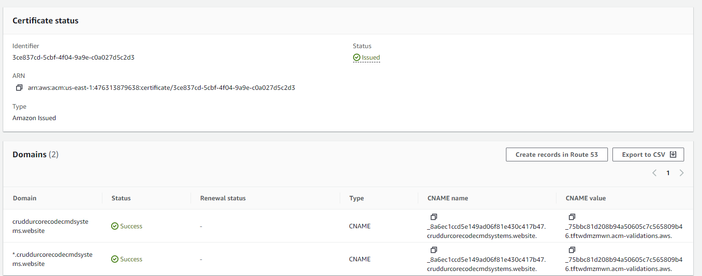

# Week 7 — Solving CORS with a Load Balancer and Custom Domain

## Custom Domains and Hosted Zones with Route 53

### Link domain to Amazon Web Services

In order to link my domain I registered with [namecheap](namecheap.com) I needed to created a hosted zone using AWS Route 53 service and then link the nameservers with my registered domain in namecheap as the `Custom DNS`

I read articles [here](https://techgenix.com/namecheap-aws-ec2-linux/) and [here](https://www.namecheap.com/support/knowledgebase/article.aspx/10371/2208/how-do-i-link-my-domain-to-amazon-web-services/?psafe_param=1&gclid=Cj0KCQjwuLShBhC_ARIsAFod4fIRfkCKnkNl1Cv5R9N4XX72JYeKck-YHvhgUi3XNPQ5ZYDHB5zeKc8aAk8iEALw_wcB) to properly to complete this setup.


## Create SSL Certificate and Create records in route 53

Use the cerificate manager to generate the SSL certificate and the create records in route 53.





### Create hosted zone records

Create records that point to the load balancer listening to both `backend` and `frontend`


## Update load balancer listeners

Add a listener to redirect `HTTP` request on port `80` to `HTTPS` on port `443`


### Modify listener rules


## Modify backend task definition environments

Update the environments for both the `frontend_url` and `backend_url` in the [backend-flask task definiton](../aws/task-definitions/backend-flask.json) with the correct values.

```json
{
    "name": "FRONTEND_URL",
    "value": "https://cruddurcorecodecmdsystems.website"
},
{
    "name": "BACKEND_URL",
    "value": "https://api.cruddurcorecodecmdsystems.website"
}
```

### Re-build frontend Image with correct `backend_url`

This helps to resolve the connection error as seen below


```sh
export REACT_APP_BACKEND_URL="api.cruddurcorecodecmdsystems.website"
gp env REACT_APP_BACKEND_URL=$REACT_APP_BACKEND_URL
```

```sh
docker build \
  --build-arg REACT_APP_BACKEND_URL="$REACT_APP_BACKEND_URL" \
  --build-arg REACT_APP_AWS_PROJECT_REGION="$AWS_DEFAULT_REGION" \
  --build-arg REACT_APP_AWS_COGNITO_REGION="$AWS_DEFAULT_REGION" \
  --build-arg REACT_APP_AWS_USER_POOLS_ID="$AWS_USER_POOL_ID" \
  --build-arg REACT_APP_CLIENT_ID="$AWS_APP_CLIENT_ID" \
  -t frontend-react-js \
  -f frontend-react-js/Dockerfile.prod \
  ./frontend-react-js/
```

### Re-tag Image

```sh
docker tag frontend-react-js:latest $ECR_FRONTEND_REACT_URL:latest
```

### Re-push Image to ECR

```sh
docker push $ECR_FRONTEND_REACT_URL:latest
```

### Register Task Defintions

```sh
aws ecs register-task-definition --cli-input-json file://aws/task-definitions/frontend-react-js.json
```

### Update backend service deployment

Forcefully update the backend service deployment to used the latest revision of the backend task definition.


