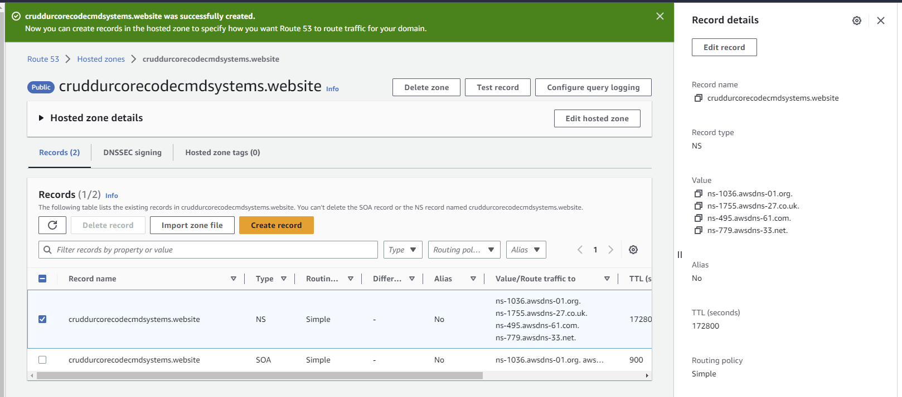
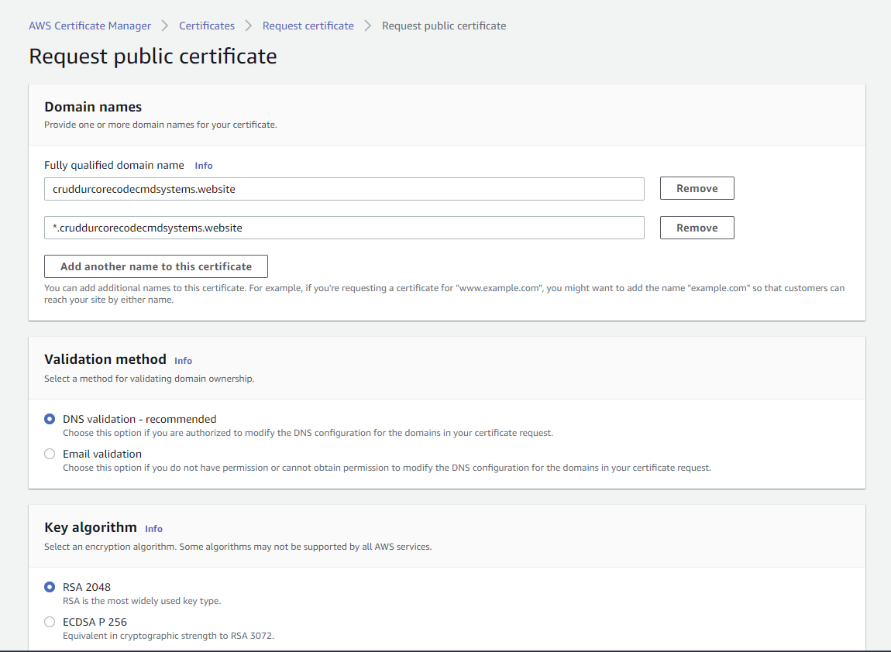

# Week 7 — Solving CORS with a Load Balancer and Custom Domain

## Custom Domains and Hosted Zones with Route 53

### Link domain to Amazon Web Services

In order to link my domain I registered with [namecheap](namecheap.com) I needed to created a hosted zone using AWS Route 53 service and then link the nameservers with my registered domain in namecheap as the `Custom DNS`

I read articles [here](https://techgenix.com/namecheap-aws-ec2-linux/) and [here](https://www.namecheap.com/support/knowledgebase/article.aspx/10371/2208/how-do-i-link-my-domain-to-amazon-web-services/?psafe_param=1&gclid=Cj0KCQjwuLShBhC_ARIsAFod4fIRfkCKnkNl1Cv5R9N4XX72JYeKck-YHvhgUi3XNPQ5ZYDHB5zeKc8aAk8iEALw_wcB) to properly to complete this setup.





## Create SSL Certificate and Create records in route 53

Use the cerificate manager to generate the SSL certificate and the create records in route 53.





### Create hosted zone records

Create records that point to the load balancer listening to both `backend` and `frontend`


## Update load balancer listeners

Add a listener to redirect `HTTP` request on port `80` to `HTTPS` on port `443`


### Modify listener rules


## Modify backend task definition environments

Update the environments for both the `frontend_url` and `backend_url` in the [backend-flask task definiton](../aws/task-definitions/backend-flask.json) with the correct values.

```json
{
    "name": "FRONTEND_URL",
    "value": "https://cruddurcorecodecmdsystems.website"
},
{
    "name": "BACKEND_URL",
    "value": "https://api.cruddurcorecodecmdsystems.website"
}
```

### Re-build frontend Image with correct `backend_url`

This helps to resolve the connection error as seen below


```sh
export REACT_APP_BACKEND_URL="https://api.cruddurcorecodecmdsystems.website"
gp env REACT_APP_BACKEND_URL=$REACT_APP_BACKEND_URL
```

```sh
docker build \
  --build-arg REACT_APP_BACKEND_URL="$REACT_APP_BACKEND_URL" \
  --build-arg REACT_APP_AWS_PROJECT_REGION="$AWS_DEFAULT_REGION" \
  --build-arg REACT_APP_AWS_COGNITO_REGION="$AWS_DEFAULT_REGION" \
  --build-arg REACT_APP_AWS_USER_POOLS_ID="$AWS_USER_POOL_ID" \
  --build-arg REACT_APP_CLIENT_ID="$AWS_APP_CLIENT_ID" \
  -t frontend-react-js \
  -f frontend-react-js/Dockerfile.prod \
  ./frontend-react-js/
```

### Re-tag Image

```sh
docker tag frontend-react-js:latest $ECR_FRONTEND_REACT_URL:latest
```

### Re-push Image to ECR

```sh
docker push $ECR_FRONTEND_REACT_URL:latest
```

### Register Task Defintions

```sh
aws ecs register-task-definition --cli-input-json file://aws/task-definitions/frontend-react-js.json
```

### Update backend service deployment

Forcefully update the backend service deployment to used the latest revision of the backend task definition.


### Run all commands at once

```sh
./bin/frontend/build
./bin/frontend/push
./bin/frontend/register
./bin/frontend/deploy
```


## Error backend url concatenated to frontend host

I had this error for almost two days and made me not make progress because everything seemed to me that I had that it right. But after having conversions with my colleagues on the `discord channel chat` and making research, reading and finding solution from this [stackoverflow question](https://stackoverflow.com/questions/73168767/why-doesnt-the-fetch-api-call-my-api-endpoint-i-created-in-express) as explained below, I found out that I was simply passing my backend url without the protocol and was merely being passed on as a `relative url` which was ending up being concatenated to the current frontend host and hence resulting into a wrong `request url` thus not getting data being displayed.


### Error pattern

This kind of error occurs when we send a request from the client-side to the server-side using a relative URL (`/characters` in this case). But the frontend app and the backend app run on 2 different ports. So on my side I was sending the backend url as `api.cruddurcorecodecmdsystems.website` and this was being concatenated to the frontend host `https://cruddurcorecodecmdsystems.website` forming a request url as `https://cruddurcorecodecmdsystems.website/api.cruddurcorecodecmdsystems.website` instead of `https://api.cruddurcorecodecmdsystems.website` meaning that I was not able to get the data from the backend.

### Reason

When we use relative URLs, the URL will be concatenated with the current host (the frontend host, not the backend). Usually, we receive a 404 error because the resource doesn't exist.

### Example

Backend app running on port 5000. React app running on port 3000 for development. In React app, if we send a request to /users, then the full URL is http://localhost:3000/users. The request goes to the React app, not the backend server. And we don't receive the desired output.

### Action

You should use an absolute URL, something like: http://localhost:5000/users to send the request to your backend app. Consider saving the host part (http://localhost:5000) in a global variable in order to use it in multiple places in your frontend code. When you have different environments for the backend (DEV/STAGING/PRODUCTION), you can change the backend host in only 1 place. So I had to change my backend url from `api.cruddurcorecodecmdsystems.website` to `https://api.cruddurcorecodecmdsystems.website`


## Securing Backend Flask

Some sample instructions to follow can be found in the flask documentation [here](https://flask.palletsprojects.com/en/2.2.x/debugging/)

### 1. Modify the inbound rules of the security group of the load balancer to work for ports `443` and `80` using only the IP from the load Balancer.

From


To


## Improve docker networking

### Create docker network

```sh
docker network create cruddur-net
```

Update the [docker-compose.yml](../docker-compose.yml) file for all services to have the `crudder-net` network created above.

```yml
networks:
  - cruddur-net
```

Also change the network section to a user defined network.

```yml
networks: 
  cruddur-net:
    driver: bridge
    name: cruddur-net
```

## Generate environment variables with ruby

Generate the `env` files for both backend and frontend

```sh
./bin/backend/generate-env
./bin/frontend/generate-env
```

Update both the `backend` and `frontend` services to use both the generated environment files in the [docker-compose](../docker-compose.yml) file.

```yml
backend-flask:
    env_file:
      - backend-flask.env
```

```yml
frontend-react-js:
    env_file:
      - frontend-react-js.env
```
