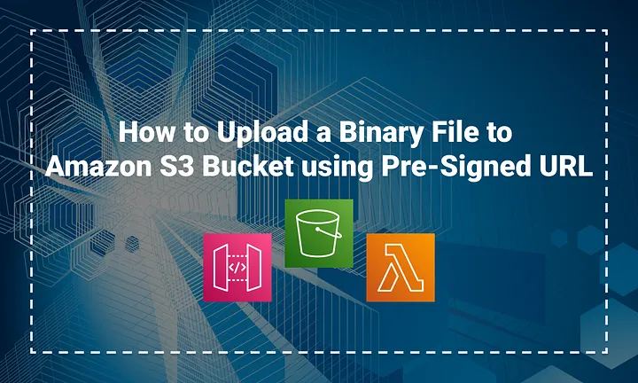

# Week 8 — Serverless Image Processing

## AWS CDK with TypeScript

### New Directory
Lets contain our cdk pipeline in a new top level directory called:

```sh
cd /workspace/aws-bootcamp-cruddur-2023
mkdir thumbing-serverless-cdk
```

### Install CDK globally
This is so we can use the AWS CDK CLI for anywhere.

```sh
npm install aws-cdk -g
```

We'll add the the install to our gitpod task file
```yml
  - name: cdk
    before: |
      npm install aws-cdk -g
```

### Initialize a new project
We'll initialize a new cdk project within the folder we created:

```sh
cdk init app --language typescript
```

### Add an S3 Bucket
Add the following code to your thumbing-serverless-cdk-stack.ts

```ts
import * as s3 from 'aws-cdk-lib/aws-s3';

const bucketName: string = process.env.THUMBING_BUCKET_NAME as string;

const bucket = new s3.Bucket(this, 'ThumbingBucket', {
  bucketName: bucketName,
  removalPolicy: cdk.RemovalPolicy.DESTROY,
});
```

```sh
export THUMBING_BUCKET_NAME="assets.cruddurcorecodecmdsystems.website"
gp env THUMBING_BUCKET_NAME="assets.cruddurcorecodecmdsystems.website"
```

- [Bucket Construct](https://docs.aws.amazon.com/cdk/api/v2/docs/aws-cdk-lib.aws_s3.Bucket.html)
- [Removal Policy](https://docs.aws.amazon.com/cdk/api/v1/docs/@aws-cdk_core.RemovalPolicy.html)

### Bootstrapping
> Deploying stacks with the AWS CDK requires dedicated Amazon S3 buckets and other containers to be available to AWS CloudFormation during deployment.

```sh
cdk bootstrap "aws://$AWS_ACCOUNT_ID/$AWS_DEFAULT_REGION"
```

### Build
We can use build to catch errors prematurely. This jsut builds tyescript

```sh
npm run build
```

### Synth
> The synth command is used to synthesize the AWS CloudFormation stack(s) that represent your infrastructure as code.

```sh
cdk synth
```

### Deploy

```sh
cdk deploy
```


### List Stacks

```sh
cdk ls
```

## Load Env Vars
  ```ts
import * as dotenv from 'dotenv';

dotenv.config();

const bucketName: string = process.env.THUMBING_BUCKET_NAME as string;
const folderInput: string = process.env.THUMBING_S3_FOLDER_INPUT as string;
const folderOutput: string = process.env.THUMBING_S3_FOLDER_OUTPUT as string;
const webhookUrl: string = process.env.THUMBING_WEBHOOK_URL as string;
const topicName: string = process.env.THUMBING_TOPIC_NAME as string;
const functionPath: string = process.env.THUMBING_FUNCTION_PATH as string;
console.log('bucketName',bucketName)
console.log('folderInput',folderInput)
console.log('folderOutput',folderOutput)
console.log('webhookUrl',webhookUrl)
console.log('topicName',topicName)
console.log('functionPath',functionPath)
```

## Create Bucket for storing resized processed uploaded images

```ts
import * as s3 from 'aws-cdk-lib/aws-s3';

const bucket = this.createBucket(bucketName)

createBucket(bucketName: string): s3.IBucket {
  const logicalName: string = 'ThumbingBucket';
  const bucket = new s3.Bucket(this, logicalName , {
    bucketName: bucketName,
    removalPolicy: cdk.RemovalPolicy.DESTROY,
  });
  return bucket;
}
```

## Create Lambda for uploading and resizing images images.

See full implementation [here](../aws/lambdas/process-images/)

```ts
import * as lambda from 'aws-cdk-lib/aws-lambda';

const lambda = this.createLambda(folderInput,folderOutput,functionPath,bucketName)

createLambda(folderIntput: string, folderOutput: string, functionPath: string, bucketName: string): lambda.IFunction {
  const logicalName = 'ThumbLambda';
  const code = lambda.Code.fromAsset(functionPath)
  const lambdaFunction = new lambda.Function(this, logicalName, {
    runtime: lambda.Runtime.NODEJS_18_X,
    handler: 'index.handler',
    code: code,
    environment: {
      DEST_BUCKET_NAME: bucketName,
      FOLDER_INPUT: folderIntput,
      FOLDER_OUTPUT: folderOutput,
      PROCESS_WIDTH: '512',
      PROCESS_HEIGHT: '512'
    }
  });
  return lambdaFunction;
}
```

## Create SNS Topic

SNS topic to subscribe to by a lambda function when an image is uploaded to an `AWS S3` bucket.

```ts
import * as sns from 'aws-cdk-lib/aws-sns';

const snsTopic = this.createSnsTopic(topicName)

createSnsTopic(topicName: string): sns.ITopic{
  const logicalName = "Topic";
  const snsTopic = new sns.Topic(this, logicalName, {
    topicName: topicName
  });
  return snsTopic;
}
```

## Create an SNS Subscription

```ts
import * as s3n from 'aws-cdk-lib/aws-s3-notifications';

this.createSnsSubscription(snsTopic,webhookUrl)

createSnsSubscription(snsTopic: sns.ITopic, webhookUrl: string): sns.Subscription {
  const snsSubscription = snsTopic.addSubscription(
    new subscriptions.UrlSubscription(webhookUrl)
  )
  return snsSubscription;
}
```

## Create S3 Event Notification to SNS

```ts
this.createS3NotifyToSns(folderOutput,snsTopic,bucket)

createS3NotifyToSns(prefix: string, snsTopic: sns.ITopic, bucket: s3.IBucket): void {
  const destination = new s3n.SnsDestination(snsTopic)
  bucket.addEventNotification(
    s3.EventType.OBJECT_CREATED_PUT, 
    destination,
    {prefix: prefix}
  );
}
```

## Create S3 Event Notification to Lambda

```ts
this.createS3NotifyToLambda(folderInput,laombda,bucket)

createS3NotifyToLambda(prefix: string, lambda: lambda.IFunction, bucket: s3.IBucket): void {
  const destination = new s3n.LambdaDestination(lambda);
    bucket.addEventNotification(s3.EventType.OBJECT_CREATED_PUT,
    destination,
    {prefix: prefix}
  )
}
```

## Create Policy for Bucket Access

```ts
const s3ReadWritePolicy = this.createPolicyBucketAccess(bucket.bucketArn)
```

## Create Policy for SNS Publishing

```ts
const snsPublishPolicy = this.createPolicySnSPublish(snsTopic.topicArn)
```

## Attach the Policies to the Lambda Role

```ts
lambda.addToRolePolicy(s3ReadWritePolicy);
lambda.addToRolePolicy(snsPublishPolicy);
```

## Serving Images Via CloudFront (AWS CDN)


### Test image upload via CLI

```sh
./bin/avatar/upload
```


### Clear image uploaded and processed via CLI

```sh
./bin/avatar/clear
```

## Upload a Binary File to Amazon S3 Bucket using Pre-Signed URL via an API Gateway



Always people/developers are facing an issue in uploading a binary file from their REST API to the Amazon S3 Bucket. In every web and mobile application, it’s common and good to provide users with the feature of upload binary files such as PDFs, Images, Videos, GIFs, etc to the S3 Bucket of our application.

> Normally, all server-based applications or server-side technologies are providing this kind of facility, but usually, binary files are quite larger than text-based files, so the upload process of binary files may take up network I/O and CPU time of your server. And in these cases, you need to keep track of the state transfer of the upload process — whether it failed, succeeded or needs to be re-uploaded.

> In the end, the result of these types of processes may take your application down or result in a late response in case of high traffic on your applications. So finally, your customers might be unhappy.

So you might have the question — is it possible to avoid proxy of those requests through your application server or is there any serverless solution for this? Reference a medium read [here](https://aws.plainenglish.io/how-you-can-upload-binary-file-to-amazon-s3-bucket-via-api-gateway-f12c11d2b365)

Yes, there is one serverless solution: you can upload your binary file directly to the Amazon S3 Bucket. Here a user needs to upload an avatar/image when editing their profiles. Our serverless solution is to upload an image to amazon S3 using pre-signed url via an API Gateway by a `Cognito user` through using Lambda functions.
The solution though is a mixture of different programming languages; `Ruby`, `Python` and `Javascript`. Javascript is a better choice working with images because it has a better library [sharp](https://sharp.pixelplumbing.com/) for resizing images and it's light.

### Implement Lambda Function to return Pre-Signed URL using Ruby

First we start by implementing a lambda function with `Ruby` which returns a `pre-signed url` via an `API Gateway` and later used to upload an image to an `AWS S3` bucket. See full implementation for lambda function [here](../aws/lambdas/cruddur-upload-avatar/function.rb)


Set an `UPLOADS_BUCKET_NAME` environment variable which is required by the lambda function.


#### Publish lambda layer for ruby-jwt 2.7 runtime
The lambda function requires `jwt` for decoding an `authorization token` sent via the API Gateway but seemed not be present in the launched lambda via the the console. So a need to create and publish a custom layer on top of the lambda function. See script [here](../bin/lambda-layers/ruby-jwt)

```sh
./bin/lambda-layers/ruby-jwt
```


### Configure API Gateway and Lambda Authorizer
Implement a lambda function authorizer with Javascript which determines whether the `Cognito user` that has triggered the `API Gateway` from the application is authorized. See full implementation [here](../aws/lambdas/lambda-authorizer/index.js)


Also set the required environment variables `USER_POOL_ID` and `CLIENT_ID` for the function to work.


#### Implement API GateWay Route `Avatar/key_upload` and attach Lambda Authorizer.


Create proxy route to allow `Preflight` requests through the API Gateway


Add host zone record via Route53


#### Configure API Gateway CORS
CORS can become a big problem, so the example below is a CORS configuration to allow origins from anywhere (**I don't think this is the best solution for this configuration**).


### Test edit profile and render avatars via cloudfront


