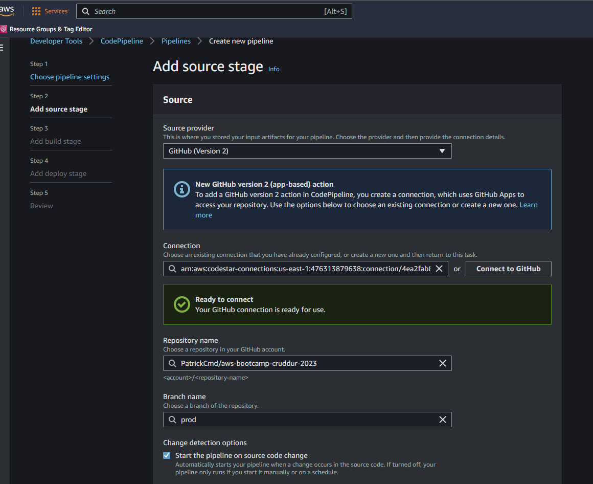
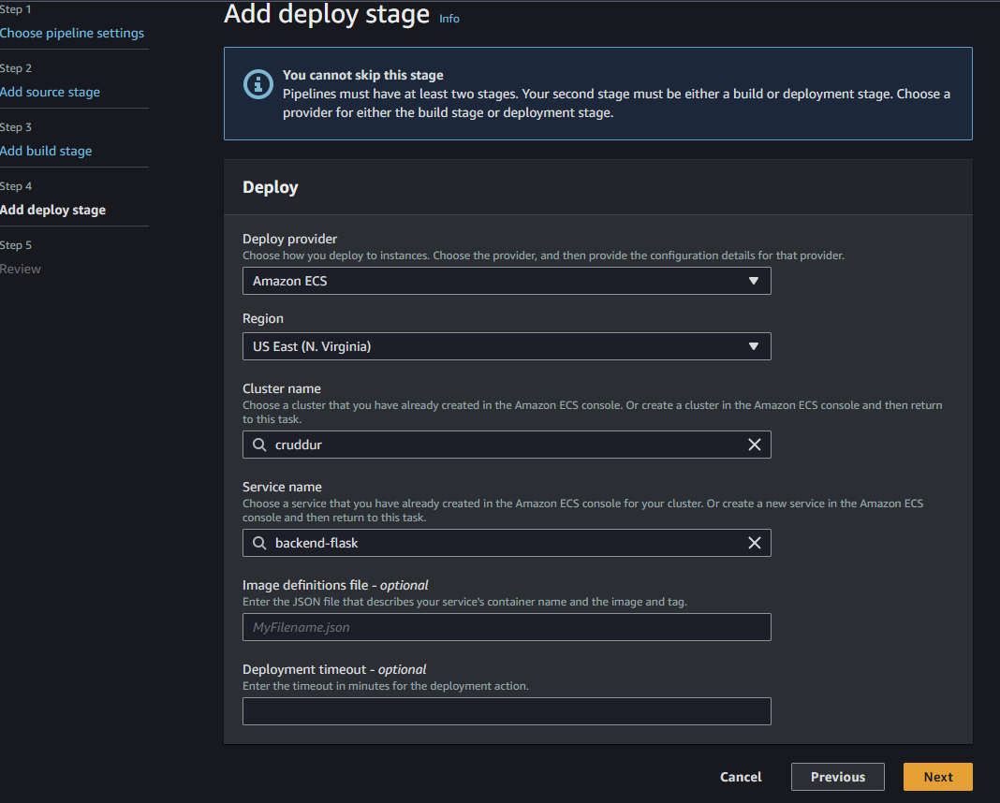

# Week 9 — CI/CD with CodePipeline, CodeBuild and CodeDeploy

- AWS CodePipeline is a fully managed continuous delivery service that enables you to automate your software release processes for applications and infrastructure changes. 
- It is designed to help you build, test, and deploy your code changes quickly and reliably.

- With AWS CodePipeline, you can define and automate the different stages of your release process, such as building, testing, and deploying your code. 
- You can also integrate with a variety of AWS services and third-party tools to customize and extend your pipeline.

- AWS CodePipeline supports many different types of source code repositories, including AWS CodeCommit, GitHub, and Bitbucket, and it can integrate with many different build and deployment tools, including AWS CodeBuild, AWS CodeDeploy, AWS Elastic Beanstalk, and AWS Lambda.

- By using AWS CodePipeline, you can improve the efficiency and consistency of your release process, reduce manual errors and time-consuming manual tasks, and increase the frequency of your software releases, ultimately improving your organization's agility and ability to respond to changing business needs.

## CI/CD Pipeline and Security explained for AWS
**Resources**: 
- [Cloud Security Podcast- CI/CD Pipeline Security explained for AWS](https://www.youtube.com/watch?v=-8zEyHdBJDA&list=PLBfufR7vyJJ7k25byhRXJldB5AiwgNnWv&index=84)
- [Create a CI/CD pipeline on AWS using CodeCommit, CodeBuild - Ahmed Elfakharany](https://www.youtube.com/watch?v=C99ps_cWp9Y)
- [AWS: Real-world Codepipeline CI/CD Examples - Cloudonaut](https://www.youtube.com/watch?v=MNt2HGxClZ0)

### What is a CI/CD Pipeline?
A CI/CD pipeline is a software engineering practice that combines continuous integration (CI) and continuous delivery/deployment (CD) in order to automate the building, testing, and deployment of software changes. The goal of a CI/CD pipeline is to deliver software changes more frequently and with greater confidence and reliability.

Continuous integration is the practice of continuously merging code changes from multiple developers into a single shared code repository and automatically building and testing the resulting code. The purpose of continuous integration is to detect and resolve issues early in the development process, before they become more difficult and expensive to fix.

Continuous delivery/deployment is the practice of automating the deployment of software changes to production environments. The purpose of continuous delivery/deployment is to make the process of releasing software changes faster, more reliable, and less error-prone.

A typical CI/CD pipeline includes multiple stages, such as building, testing, and deploying software changes. Each stage in the pipeline is automated and triggered by the completion of the previous stage. The pipeline is designed to provide feedback to developers as quickly as possible, allowing them to address issues and make improvements in real-time.

Overall, a well-designed CI/CD pipeline can improve software development by reducing the time and effort required to deliver software changes, increasing the reliability and quality of those changes, and enabling teams to respond more quickly to changing customer needs and market conditions. By automating many of the manual and error-prone tasks involved in software delivery, CI/CD pipelines help organizations to achieve more predictable and consistent outcomes while also freeing up valuable resources to focus on higher-value work. Additionally, CI/CD pipelines can help to foster a culture of collaboration and continuous improvement by providing developers with immediate feedback on their code changes and enabling them to learn from and build upon each other's work.

### What is a Source Code Repository?
A source code repository is a centralized location where software developers store and manage the source code of their applications. It is an essential tool for version control, collaboration, and code management.

A source code repository tracks changes to the source code over time, enabling developers to keep track of different versions of their code, collaborate with other developers, and easily roll back changes if needed. It also provides a central location for developers to manage the different branches of their code, such as development, staging, and production.

There are several popular source code repository options available, including:

1. Git: Git is a distributed version control system that is widely used for managing source code repositories. It is known for its speed, flexibility, and support for branching and merging. Some popular Git hosting platforms include GitHub, GitLab, and Bitbucket.

2. Subversion (SVN): Subversion is a centralized version control system that is commonly used in enterprise environments. It has a simple and user-friendly interface and supports versioning of files and directories. Some popular SVN hosting platforms include Apache Subversion and Assembla.

3. Mercurial (Hg): Mercurial is another distributed version control system that is similar to Git in many ways. It is known for its ease of use and fast performance. Some popular Mercurial hosting platforms include Bitbucket and SourceForge.

Overall, a source code repository is an essential tool for software development teams of all sizes, allowing them to collaborate, manage, and track changes to their code over time.

### What AWS Services can help achieve this?
AWS offers a wide range of services that can help teams manage their source code repositories and implement CI/CD pipelines. Here are some AWS services that can be used to achieve these goals:

1. AWS CodeCommit: AWS CodeCommit is a fully managed source control service that enables teams to store and manage their source code in a secure and scalable manner. It supports Git repositories and provides features such as code reviews, pull requests, and branch management.

2. AWS CodeBuild: AWS CodeBuild is a fully managed build service that compiles source code, runs tests, and produces software packages that are ready for deployment. It integrates with many source code repositories, including AWS CodeCommit, GitHub, and Bitbucket.

3. AWS CodePipeline: AWS CodePipeline is a fully managed continuous delivery service that automates software release processes, including building, testing, and deploying code changes. It integrates with many AWS services, including AWS CodeCommit, AWS CodeBuild, and AWS Elastic Beanstalk.

4. AWS Elastic Beanstalk: AWS Elastic Beanstalk is a fully managed service that makes it easy to deploy and scale web applications and services. It supports a variety of programming languages and frameworks, and integrates with AWS CodePipeline for automated deployments.

5. AWS Lambda: AWS Lambda is a serverless computing service that allows developers to run code without provisioning or managing servers. It can be used to execute code in response to events, such as changes to a source code repository or an API call.

By using these AWS services, teams can create a powerful and scalable CI/CD pipeline that enables them to rapidly and reliably deliver software changes. They can also take advantage of the scalability, flexibility, and security of the AWS cloud to reduce costs and improve their overall software delivery process.

### OWASP Top 10  CI/CD Pipeline Security

### Amazon CI/CD Pipeline - Security Best Practices - AWS
- Compliance standard is what your business requires from a CI/CD service and is available in the region you operate in.
- Amazon Organizations SCP - to restrict actions like creation, deletion, modification of production CI/CD pipelines services etc.
- AWS CloudTrail is enabled and monitored to trigger alerts for malicious activities e.g changes to Production CodePipeline, etc.
- GuardDuty is enabled for monitoring suspicious DNS comms (e.g Crypto-mining etc) and automated for auto-remediation.
- AWS Config Rules is enabled in the account and region of CodeBuild - performance pack for any other CI/CD service.

### Amazon CI/CD Pipeline - Security Best Practices - Application
- Access Control - Roles or IAM for making changes in Mazon CI/CD services especially production related repositories, pipeline, build services.
- Security of the CI/CD Pipeline - source control, secret management, container registry, CI/CD service (if not the AWSS service), IAM etc.
- Security in the CI/CD Pipeline - Code Security Best Practices - SCA, SAST, Secret Scanner, DAST implemented in the CI/CD Pipeline.
- Security of the CI/CD Pipeliene entry points e.g - no bypass of CI/CD to make production changes.
- Enable Encryption in Transit using TLS/SSL certification e.g HTTPS
- Only use Trusted Source Control for sending changes to CI/CD Pipeline
- Develop process for continously verifying if there is a change that may comprise the known state of a CI/CD pipeline.

## The steps to create an AWS CodePipeline that uses GitHub as the source, AWS CodeBuild in the build stage, and deploys to AWS ECS using AWS management console:

1. Sign in to the AWS Management Console and navigate to the AWS CodePipeline console.

2. Click on the "Create pipeline" button to create a new pipeline.

3. In the "Pipeline settings" page, enter a name for the pipeline and select the "GitHub" option as the source provider.

4. Connect your GitHub account and select the repository and branch you want to use as the source for the pipeline.

5. Click on the "Next" button to configure the build stage.

6. In the "Build provider" section, select "AWS CodeBuild" as the build provider and choose a CodeBuild project you have already created or create a new one.

7. Configure the build settings as necessary, including the build environment, build commands, and environment variables.

For the `buildspec.yml` see file [here](../backend-flask/buildspec.yml)

8. Click on the "Next" button to configure the deployment stage.

9. In the "Deployment provider" section, select "Amazon ECS" as the deployment provider.

10. Choose the ECS cluster and service you want to deploy to and configure the deployment settings as necessary, including the container name and image.

11. Click on the "Next" button to review and create the pipeline.

12. Review the pipeline settings and click on the "Create pipeline" button to create the pipeline.

The AWS CodePipeline that uses GitHub as the source, AWS CodeBuild in the build stage, and deploys to AWS ECS is now ready to use. You can start the pipeline manually or configure it to start automatically when changes are made to the source code in the GitHub repository.
